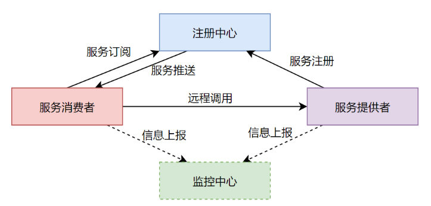

# 核心注解的设计

## 1、设计服务提供者注解
### 1.1、服务提供者注解设计的逻辑

一个极简的服务提供者注册到注册中心的元数据应该包含如下几部分：服务名称、服务版本号、服务地址、服务端口号、服务分组信息。

- 服务名称：服务的名称往往是提供服务的接口的完整类名。
- 服务版本号：标识当前服务的版本号，以版本号的形式来区分不同版本所提供的不同服务。
- 服务地址：服务提供者发布的服务所在的网络地址，往往是一个IP地址或者域名。
- 服务端口号：服务提供者发布的服务所监听的端口号。
- 服务分组：对不同的服务进行分组，达到服务隔离的效果。

接下来，我们再次思考下，其实对于一个应用程序来说，启动后一个应用程序监听一个IP地址/域名和端口就足够了，而不需要为同一个应用程序中的每一个RPC服务都单独去监听一个IP地址/域名和端口，我们只需要为服务提供者所在的项目工程统一配置服务监听的IP地址/域名和端口号即可。又因为对于一个较完备的RPC框架来说，需要支持多种不同的注册中心，同时，针对同一个服务提供者来说，往往会将其服务统一注册到同一种类型的注册中心上，所以，注册中心的地址和类型以及负载均衡类型也都可以在项目工程中统一配置。

所以，在我们设计的服务提供者的注解中，可以不包含服务地址和服务端口号。

大家可以再仔细思考下，为什么不需要在注解中提供服务地址和服务端口号。

所以，在我们设计的服务提供者注解中就只剩下了服务名称、服务版本号和服务分组三个核心属性，并且这三个核心属性可以确定一个唯一的服务提供者。