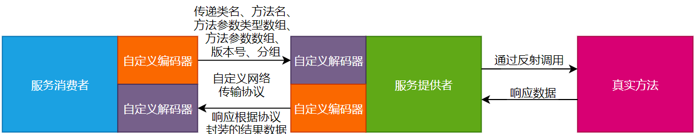
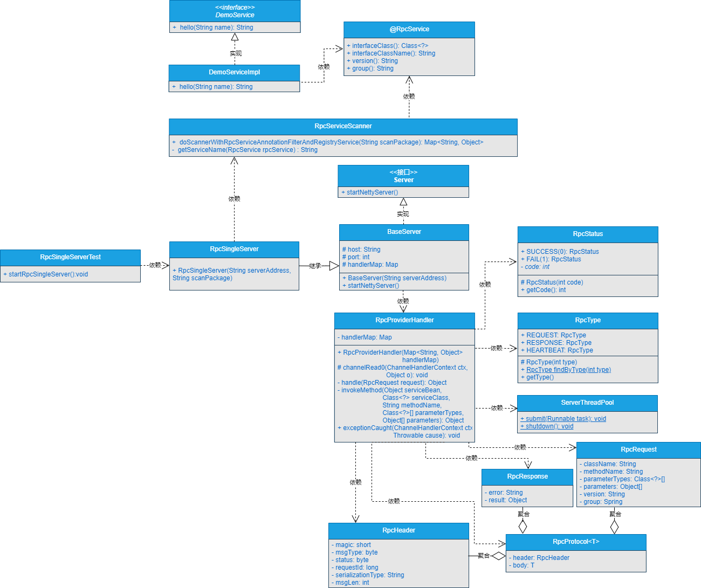
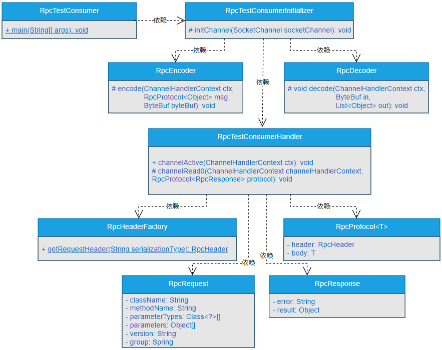

## 一、前言
> 既然你说实现了RPC框架的服务提供者调用真实方法的逻辑，不测试下怎么行？

在前面的章节中，服务提供者通过反射技术实现了调用真实方法的功能，这也是RPC能够实现调用远程方法的必不可少的基础功能之一。那既然实现了服务提供者调用真实方法的功能，不测试下怎么行？不测试下怎么就知道写的逻辑到底对不对呢？

## 二、目标
> 服务提供者实现了调用真实方法的能力，要测试下，看到效果，大家才会相信的！

有句话说的非常好：实践是检验真理的唯一标准。

既然前面的章节中，实现了服务提供者调用真实方法的逻辑，但不测试，看不到效果，大家谁会相信你写的服务提供者的代码就一定会调用真实的方法呢？一切都要以数据和效果说话的。

本章，就主要通过模拟服务消费者与服务提供者之间的数据交互来验证服务提供者是否真正调用了真实方法。如果服务提供者调用了真实方法，则测试通过。否则，测试不通过，我们就继续改代码。

## 三、设计
> 如果让你独立设计测试流程和测试代码，你该如何设计呢？

这里，使用的测试用例还是在前面章节中大家起来的测试用例，并且在之前测试用例的基础上进行稍许的改动。

测试过程中服务消费者与服务提供者之间，服务提供者与真实方法之间的数据交互与第9章中的图9-2相同，这里再次将这个图展示给大家。



服务消费者与服务提供者之间，服务提供者与真实方法之间的数据交互的具体说明大家就参考第9章的内容了，我就不再赘述了。

## 四、实现

> 说了这么多，测试服务提供者调用真实方法的代码改如何实现呢？

### 1.工程结构

- gxl-rpc-annotation：实现gxl-rpc框架的核心注解工程。
- gxl-rpc-codec：实现gxl-rpc框架的自定义编解码功能。
- gxl-rpc-common：实现gxl-rpc框架的通用工具类，包含服务提供者注解与服务消费者注解的扫描器。
- gxl-rpc-constants：存放实现gxl-rpc框架通用的常量类。
- gxl-rpc-protocol：实现gxl-rpc框架的自定义网络传输协议的工程。
- gxl-rpc-provider：服务提供者父工程。
  - gxl-rpc-provider-common：服务提供者通用工程。
  - gxl-rpc-provider-native：以纯Java方式启动gxl-rpc框架的工程。
- gxl-rpc-serialization：实现gxl-rpc框架序列化与反序列化功能的父工程。
  - gxl-rpc-serialization-api：实现gxl-rpc框架序列化与反序列化功能的通用接口工程。
  - gxl-rpc-serialization-jdk：以JDK的方式实现序列化与反序列化功能。
- gxl-rpc-test：测试gxl-rpc框架的父工程。
  - gxl-rpc-test-api：测试的通用Servcie接口工程（第10章新增的测试子工程）
  - gxl-rpc-test-provider：测试服务提供者的工程。
  - gxl-rpc-test-consumer：测试服务消费者的工程
  - gxl-rpc-test-consumer-codec：测试服务消费者基于自定义网络协议与编解码与服务提供者进行数据交互
  - gxl-rpc-test-scanner：测试扫描器的工程。

### 2.核心类实现关系

（1）测试服务提供者调用真实方法时，服务提供者核心类之间的关系如图10-1所示。



可以看到，在服务提供者端类之间的关系还是比较复杂的，大家重点理解类与类之间的逻辑关系即可。整个服务提供者的启动入口类就是RpcSingleServerTest。

（2）测试服务提供者调用真实方法时，服务消费者核心类之间的关系如图10-2所示。



可以看到，在服务消费者端RpcTestConsumer类是启动整个服务消费者程序的入口，并且核心类之间主要以依赖关系为主。

### 3.实现DemoService测试通用接口

DemoService接口位于gxl-rpc-test-api工程下的io.gxl.rpc.test.api.DemoService，源码如下所示。

```java
public interface DemoService {
  String hello(String name);
}
```

可以看到，DemoService接口的源码比较简单，只是定义了一个返回类型为String的hello()方法，参数会传入一个String类型的name。

### 4.修改测试服务提供者的ProviderDemoServiceImpl类

ProviderDemoServiceImpl类位于gxl-rpc-test-provider工程下的io.gxl.rpc.test.provider.service.impl.ProviderDemoServiceImpl，源码如下所示。

```java
@RpcService(interfaceClass = DemoService.class, 
            interfaceClassName = "io.gxl.rpc.test.api.DemoService", 
            version = "1.0.0", 
            group = "gxl")
public class ProviderDemoServiceImpl implements DemoService {
    private final Logger logger = LoggerFactory.getLogger(ProviderDemoServiceImpl.class);
    @Override
    public String hello(String name) {
        logger.info("调用hello方法传入的参数为===>>>{}", name);
        return "hello " + name;
    }
}
```
在前面的章节中，实现过ProviderDemoServiceImpl类，由于测试服务提供者调用真实方法的逻辑，需要对ProviderDemoServiceImpl类进行修改，使ProviderDemoServiceImpl类继承新创建的DemoService接口，并实现hello()方法，在hello()方法中打印调用hello方法传入的参数。并且将@RpcService注解内的interfaceClassName属性的值修改为io.gxl.rpc.test.api.DemoService。

### 5.修改测试服务消费者的RpcTestConsumerHandler类
RpcTestConsumerHandler类位于gxl-rpc-test-consumer-codec工程下的io.gxl.rpc.test.consumer.codec.handler.RpcTestConsumerHandler，源码如下所示。
```java
public class RpcTestConsumerHandler extends SimpleChannelInboundHandler<RpcProtocol<RpcResponse>> {
    private final Logger logger = LoggerFactory.getLogger(RpcTestConsumerHandler.class);
    @Override
    public void channelActive(ChannelHandlerContext ctx) throws Exception {
        logger.info("发送数据开始...");
        //模拟发送数据
        RpcProtocol<RpcRequest> protocol = new RpcProtocol<RpcRequest>();
        protocol.setHeader(RpcHeaderFactory.getRequestHeader("jdk"));
        RpcRequest request = new RpcRequest();
        request.setClassName("io.gxl.rpc.test.api.DemoService");
        request.setGroup("gxl");
        request.setMethodName("hello");
        request.setParameters(new Object[]{"gxl"});
        request.setParameterTypes(new Class[]{String.class});
        request.setVersion("1.0.0");
        request.setAsync(false);
        request.setOneway(false);
        protocol.setBody(request);
        logger.info("服务消费者发送的数据===>>>{}", JSONObject.toJSONString(protocol));
        ctx.writeAndFlush(protocol);
        logger.info("发送数据完毕...");
    }

    @Override
    protected void channelRead0(ChannelHandlerContext channelHandlerContext, RpcProtocol<RpcResponse> protocol) throws Exception {
        logger.info("服务消费者接收到的数据===>>>{}", JSONObject.toJSONString(protocol));
    }
}
```
在SimpleChannelInboundHandler类中，主要是修改了channelActive()方法中request中的参数，将className属性的值修改为io.gxl.rpc.test.api.DemoService。

至此，测试服务提供者调用真实方法的逻辑实现完毕。

## 五、测试

> 测一测gxl-rpc框架的服务提供者调用真实方法的效果！

具体的测试步骤如下所示。

（1）启动服务提供者，具体就是启动gxl-rpc-test-provider工程下的io.gxl.rpc.test.provider.single.RpcSingleServerTest类，如果能输出如下信息就证明服务提供者启动成功。

```
16:57:30,656  INFO BaseServer:65 - Server started on 127.0.0.1:27880
```
（2）启动服务消费者，并向服务提供者发送调用真实方法的参数。具体就是启动gxl-rpc-test-consumer-codec工程下的io.gxl.rpc.test.consumer.codec.RpcTestConsumer类的main()方法，启动后输出的信息如下所示。
```
16:58:12,256  INFO RpcTestConsumerHandler:24 - 发送数据开始...
16:58:12,347  INFO RpcTestConsumerHandler:38 - 服务消费者发送的数据===>>>{"body":{"async":false,"className":"io.gxl.rpc.test.api.DemoService","group":"gxl","methodName":"hello","oneway":false,"parameterTypes":["java.lang.String"],"parameters":["gxl"],"version":"1.0.0"},"header":{"magic":16,"msgLen":0,"msgType":1,"requestId":1,"serializationType":"jdk","status":1}}
16:58:12,387  INFO RpcTestConsumerHandler:40 - 发送数据完毕...
16:58:12,434  INFO RpcTestConsumerHandler:45 - 服务消费者接收到的数据===>>>{"body":{"async":false,"oneway":false,"result":"hello gxl"},"header":{"magic":16,"msgLen":202,"msgType":2,"requestId":1,"serializationType":"jdk","status":0}}
```
可以看到，启动服务消费者时，向服务提供者自动发送了调用真实方法的参数，并接收到服务提供者响应回来的数据。

在服务消费者发送的数据的日志中，在消息体body中存在如下日志信息。
```
"parameterTypes":["java.lang.String"],"parameters":["gxl"],
```

可以得知，gxl-rpc框架调用真实方法返回的结果信息是hello gxl。

结合gxl-rpc-test-provider工程下的io.gxl.rpc.test.provider.service.impl.ProviderDemoServiceImpl类的源码得知，服务提供者向服务消费者返回的结果信息符合预期的效果。

（3）再次查看服务提供者控制台输出的信息，如下所示。
```
16:58:12,417  INFO ProviderDemoServiceImpl:18 - 调用hello方法传入的参数为===>>>gxl
```

可以看到，服务提供者成功触发了gxl-rpc-test-provider工程下的io.gxl.rpc.test.provider.service.impl.ProviderDemoServiceImpl类中hello()方法的调用。

整个过程符合预期的效果，测试服务提供者调用真实方法完毕。

## 六、总结

RPC框架中服务提供者具备调用真实方法的能力后，整个RPC框架才能具备调用远程方法的能力。本章，我们一起验证了gxl-rpc框架的服务提供者已经具备了调用真实方法的能力，也就是说，gxl-rpc框架已经初步具备调用远程方法的能力。


在设计和实现一个通用性框架的过程中，JDK中提供的反射技术是会被经常使用的技术，除了反射技术外，还有例如字节码编程等更加高效的技术来实现动态代理和方法调用等功能。