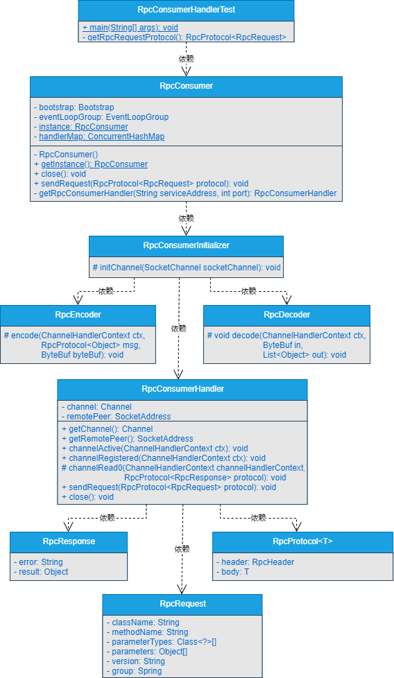

## 一、前言

> 不想用测试模块模拟的服务消费者，那样调用服务提供者的服务就显得太low了！

在前面的章节中，服务提供者实现了根据自定义协议和数据的编解码来接收服务消费者发送过来的数据，对数据进行解析后，能够基于Java反射和CGLib两种方式实现真实方法的调用。

但是，有个美中不足的地方就是服务消费者是通过在测试模块模拟出来的，并且启动服务消费者的底层Netty代码直接写在了测试的main()方法中。实际上，任何一个RPC框架都不会自己动手写启动Netty服务的代码，所以，这部分逻辑要是重构的。一方面是要对外屏蔽底层复杂的代码，一方面是让用户使用起来尽量简洁。

所以，我们要对服务消费者下手了。

## 二、目标

> 我想在使用服务消费者时，只需要传递必要的参数，就能与服务提供者通信！

在使用RPC框架开发分布式系统时，你见过哪个RPC框架需要开发者自己手动写Netty客户端连接服务端的代码吗？反正我是没见过，就拿Dubbo来说吧，我们不需要关注底层的通信细节，只需要进行简单的配置或者在类和字段上标注简单的注解即可实现远程过程调用。

这一章，先不实现配置化和注解化，我们先屏蔽掉服务消费者与服务提供者进行通信时，对外需要自己手动写Netty客户端连接服务端的逻辑代码。启动服务消费者之后，服务消费者连接服务提供者，向服务提供者发送必要的参数，并接收服务提供者返回的结果数据。

好了，目标就是这个，开始干吧。

## 三、设计

> 如果让你屏蔽掉RPC服务消费者基于Netty连接服务提供者的细节，并实现二者之间的通信，你会怎么设计呢？

服务消费者对外屏蔽掉基于Netty连接服务提供者的细节后，与服务提供者之间基于自定义的网络传输协议和数据编解码实现数据通信的过程如图12-1所示。


由图12-1可以看出，服务消费者与服务提供者之间的通信过程如下所示。

（1）服务消费者会屏蔽基于Netty连接服务提供者的细节。

（2）服务消费者基于自定义网络传输协议和数据编解码对数据进行编码处理，向服务提供者发送数据。

（3）服务提供者接收到服务消费者发送过来的数据后，根据自定义网络协议和数据编解码解析数据，对数据进行解码处理，对解码后的数据进行逻辑处理。

（4）服务提供者处理完逻辑后，会将结果数据根据自定义的网络传输协议和数据编解码进行编码，响应给服务消费者。

（5）服务消费者接收到服务提供者响应的数据后，根据自定义的网络传输协议和数据编解码对数据进行解码操作，并对解码后的数据进行进一步处理。

## 四、实现

> 说了这么多，到底该如何实现呢？

### 1.工程结构

- gxl-rpc-annotation：实现gxl-rpc框架的核心注解工程。
- gxl-rpc-codec：实现gxl-rpc框架的自定义编解码功能。
- gxl-rpc-common：实现gxl-rpc框架的通用工具类，包含服务提供者注解与服务消费者注解的扫描器。
- gxl-rpc-constants：存放实现gxl-rpc框架通用的常量类。
- gxl-rpc-consumer：服务消费者父工程（第12章新增）
  - gxl-rpc-consumer-common：服务消费者通用工程（第12章新增）
- gxl-rpc-protocol：实现gxl-rpc框架的自定义网络传输协议的工程。
- gxl-rpc-provider：服务提供者父工程。
  - gxl-rpc-provider-common：服务提供者通用工程。
  - gxl-rpc-provider-native：以纯Java方式启动gxl-rpc框架的工程。
- gxl-rpc-serialization：实现gxl-rpc框架序列化与反序列化功能的父工程。
  - gxl-rpc-serialization-api：实现gxl-rpc框架序列化与反序列化功能的通用接口工程。
  - gxl-rpc-serialization-jdk：以JDK的方式实现序列化与反序列化功能。
- gxl-rpc-test：测试gxl-rpc框架的父工程。
  - gxl-rpc-test-api：测试的通用Servcie接口工程
  - gxl-rpc-test-provider：测试服务提供者的工程。
  - gxl-rpc-test-consumer：测试服务消费者的工程
  - gxl-rpc-test-consumer-codec：测试服务消费者基于自定义网络协议与编解码与服务提供者进行数据交互
  - gxl-rpc-test-consumer-handler：测试屏蔽服务消费者基于Netty与服务提供者建立连接的细节后，与服务提供者进行数据通信（第12章新增）
  - gxl-rpc-test-scanner：测试扫描器的工程。

### 2.核心类实现关系

服务消费者对外屏蔽掉基于Netty连接服务提供者的细节后，与服务提供者之间基于自定义的网络传输协议和数据编解码实现数据通信的核心类关系如图12-2所示。



由图12-2可以看出，核心类之间的逻辑关系还是比较简单的。

### 3.RPC消费者处理器RpcConsumerHandler类的实现

RpcConsumerHandler类位于gxl-rpc-consumer-common工程下的io.gxl.rpc.consumer.common.handler.RpcConsumerHandler，源码如下所示。

```java
public class RpcConsumerHandler extends SimpleChannelInboundHandler<RpcProtocol<RpcResponse>> {
    private final Logger logger = LoggerFactory.getLogger(RpcConsumerHandler.class);
    private volatile Channel channel;
    private SocketAddress remotePeer;

    public Channel getChannel() {
        return channel;
    }

    public SocketAddress getRemotePeer() {
        return remotePeer;
    }

    @Override
    public void channelActive(ChannelHandlerContext ctx) throws Exception {
        super.channelActive(ctx);
        this.remotePeer = this.channel.remoteAddress();
    }

    @Override
    public void channelRegistered(ChannelHandlerContext ctx) throws Exception {
        super.channelRegistered(ctx);
        this.channel = ctx.channel();
    }

    @Override
    protected void channelRead0(ChannelHandlerContext channelHandlerContext, RpcProtocol<RpcResponse> protocol) throws Exception {
        logger.info("服务消费者接收到的数据===>>>{}", JSONObject.toJSONString(protocol));
    }

    /**
     * 服务消费者向服务提供者发送请求
     */
    public void sendRequest(RpcProtocol<RpcRequest> protocol){
        logger.info("服务消费者发送的数据===>>>{}", JSONObject.toJSONString(protocol));
        channel.writeAndFlush(protocol);
    }

    public void close() {
        channel.writeAndFlush(Unpooled.EMPTY_BUFFER).addListener(ChannelFutureListener.CLOSE);
    }
}
```
可以看到，RpcConsumerHandler类的实现还是比较简单的，首先定义了Channel类型的成员变量channel和SocketAddress类型的成员变量remotePeer，提供一个获取channel成员变量的getChannel()方法和一个获取remotePeer成员变量的getRemotePeer()方法，两个成员。

channel成员变量会在Netty注册连接的channelRegistered()方法中进行赋值，remotePeer成员变量会在Netty激活连接的channelActive()方法中赋值。在Netty接收数据的channelRead0()方法中打印服务消费者接收到的数据。并且在RpcConsumerHandler类中单独定义了发送数据的方法sendRequest()，并对外提供了关闭连接的close()方法。

服务消费者会调用RpcConsumerHandler类中的sendRequest()方法向服务提供者发送数据，而服务消费者会通过RpcConsumerHandler类中的channelRead0()方法接收服务提供者响应的数据。

### 4.RPC消费者初始化管道RpcConsumerInitializer类的实现

RpcConsumerInitializer类位于gxl-rpc-consumer-common工程下的io.gxl.rpc.consumer.common.initializer.RpcConsumerInitializer，源码如下所示。

```java
public class RpcConsumerInitializer extends ChannelInitializer<SocketChannel> {
    @Override
    protected void initChannel(SocketChannel channel) throws Exception {
        ChannelPipeline cp = channel.pipeline();
        cp.addLast(new RpcEncoder());
        cp.addLast(new RpcDecoder());
        cp.addLast(new RpcConsumerHandler());
    }
}
```
### 5.RPC消费者RpcConsumer类的实现

RpcConsumer类位于gxl-rpc-consumer-common工程下的io.gxl.rpc.consumer.common.RpcConsumer，源码如下所示。

```java
public class RpcConsumer {
    private final Logger logger = LoggerFactory.getLogger(RpcConsumer.class);
    private final Bootstrap bootstrap;
    private final EventLoopGroup eventLoopGroup;

    private static volatile RpcConsumer instance;

    private static Map<String, RpcConsumerHandler> handlerMap = new ConcurrentHashMap<>();

    private RpcConsumer() {
        bootstrap = new Bootstrap();
        eventLoopGroup = new NioEventLoopGroup(4);
        bootstrap.group(eventLoopGroup).channel(NioSocketChannel.class)
                .handler(new RpcConsumerInitializer());
    }

    public static RpcConsumer getInstance(){
        if (instance == null){
            synchronized (RpcConsumer.class){
                if (instance == null){
                    instance = new RpcConsumer();
                }
            }
        }
        return instance;
    }

    public void close(){
        eventLoopGroup.shutdownGracefully();
    }

    public void sendRequest(RpcProtocol<RpcRequest> protocol) throws Exception {
        //TODO 暂时写死，后续在引入注册中心时，从注册中心获取
        String serviceAddress = "127.0.0.1";
        int port = 27880;
        String key = serviceAddress.concat("_").concat(String.valueOf(port));
        RpcConsumerHandler handler = handlerMap.get(key);
        //缓存中无RpcClientHandler
        if (handler == null){
            handler = getRpcConsumerHandler(serviceAddress, port);
            handlerMap.put(key, handler);
        }else if (!handler.getChannel().isActive()){  //缓存中存在RpcClientHandler，但不活跃
            handler.close();
            handler = getRpcConsumerHandler(serviceAddress, port);
            handlerMap.put(key, handler);
        }
        handler.sendRequest(protocol);
    }

    /**
     * 创建连接并返回RpcClientHandler
     */
    private RpcConsumerHandler getRpcConsumerHandler(String serviceAddress, int port) throws InterruptedException {
        ChannelFuture channelFuture = bootstrap.connect(serviceAddress, port).sync();
        channelFuture.addListener((ChannelFutureListener) listener -> {
            if (channelFuture.isSuccess()) {
                logger.info("connect rpc server {} on port {} success.", serviceAddress, port);
            } else {
                logger.error("connect rpc server {} on port {} failed.", serviceAddress, port);
                channelFuture.cause().printStackTrace();
                eventLoopGroup.shutdownGracefully();
            }
        });
        return channelFuture.channel().pipeline().get(RpcConsumerHandler.class);
    }
}
```

**注意：在sendRequest()方法中写死了服务提供者的IP和端口，后续引入注册中心后，服务提供者的IP和端口会从注册中心获取。**

至此，对外屏蔽服务消费者基于Netty连接服务提供者的实现细节完毕。

## 五、测试

### 1.RpcConsumerHandlerTest测试类的实现

RpcConsumerHandlerTest类位于gxl-rpc-test-consumer-handler工程下的io.gxl.rpc.test.consumer.handler.RpcConsumerHandlerTest，源码如下所示。

```java
public class RpcConsumerHandlerTest {
    public static void main(String[] args) throws Exception {
        RpcConsumer consumer = RpcConsumer.getInstance();
        consumer.sendRequest(getRpcRequestProtocol());
        Thread.sleep(2000);
        consumer.close();
    }
    private static RpcProtocol<RpcRequest> getRpcRequestProtocol(){
        //模拟发送数据
        RpcProtocol<RpcRequest> protocol = new RpcProtocol<RpcRequest>();
        protocol.setHeader(RpcHeaderFactory.getRequestHeader("jdk"));
        RpcRequest request = new RpcRequest();
        request.setClassName("io.gxl.rpc.test.api.DemoService");
        request.setGroup("gxl");
        request.setMethodName("hello");
        request.setParameters(new Object[]{"gxl"});
        request.setParameterTypes(new Class[]{String.class});
        request.setVersion("1.0.0");
        request.setAsync(false);
        request.setOneway(false);
        protocol.setBody(request);
        return protocol;
    }
}
```
可以看到，在RpcConsumerHandlerTest类中，在main()方法中获取RpcConsumer单例对象consumer，调用consumer对象的sendRequest()方法向服务提供者发送数据。为了避免在服务消费者与服务提供者进行数据交互的过程中，服务消费者关闭了与服务提供者之间的连接，休眠2秒后，再关闭连接。

另外，getRpcRequestProtocol()方法用来构建服务消费者向服务提供者发送的数据。

### 2.测试数据交互

（1）启动gxl-rpc-test-provider工程下的io.gxl.rpc.test.provider.single.RpcSingleServerTest类，输出的结果信息如下所示。
```shell
INFO BaseServer:82 - Server started on 127.0.0.1:27880
```

（2）启动gxl-rpc-test-consumer-handler工程下的io.gxl.rpc.test.consumer.handler.RpcConsumerHandlerTest类，输出的结果信息如下所示。

```shell
10:26:50,321  INFO RpcConsumer:81 - connect rpc server 127.0.0.1 on port 27880 success.
10:26:50,431  INFO RpcConsumerHandler:56 - 服务消费者发送的数据===>>>{"body":{"async":false,"className":"io.gxl.rpc.test.api.DemoService","group":"gxl","methodName":"hello","oneway":false,"parameterTypes":["java.lang.String"],"parameters":["gxl"],"version":"1.0.0"},"header":{"magic":16,"msgLen":0,"msgType":1,"requestId":1,"serializationType":"jdk","status":1}}
10:26:50,547  INFO RpcConsumerHandler:49 - 服务消费者接收到的数据===>>>{"body":{"async":false,"oneway":false,"result":"hello gxl"},"header":{"magic":16,"msgLen":202,"msgType":2,"requestId":1,"serializationType":"jdk","status":0}}
```
可以看到，启动RpcConsumerHandlerTest类后，服务消费者与服务提供者成功建立了连接，并且服务消费者向服务提供者传递的参数是gxl。服务提供者向服务消费者响应的结果数据是hello gxl，服务结果的预期。

（3）再次查看服务提供者输出的信息，如下所示。
```shell
10:26:50,527  INFO RpcProviderHandler:115 - use jdk reflect type invoke method...
10:26:50,528  INFO ProviderDemoServiceImpl:18 - 调用hello方法传入的参数为===>>>gxl
```
可以看到，服务提供者基于CGLib方式调用了真实方法，并在方法中打印了传递的参数为gxl。符合预期的效果。

## 六、总结

> 学完知识不总结下怎么行？

实际使用RPC框架时，没人会愿意手动写基于Netty连接服务提供者的细节代码，所以，一个好的RPC框架一定要对外屏蔽掉这些细节信息。尽量让用户用最简单的配置或最简单的注解来使用RPC框架。

