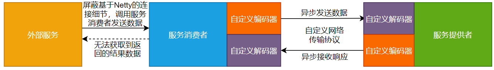
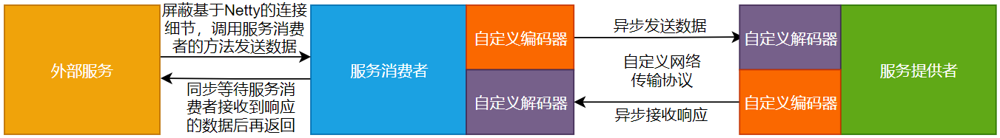

## 一、前言
在前面的章节中，我们重构了服务消费者的代码，使服务消费者对外屏蔽了基于Netty连接服务提供者的实现细节，开发人员不用再手动维护这些复杂的Netty代码了。

但是，还存在一个问题，就是在测试代码中调用服务消费者向服务提供者发送数据的方法时，不能直接获取到返回的结果数据。

也就是说，目前在使用这个RPC框架时，外部调用服务消费者向服务提供者发送数据的方法时，无法获取到结果数据，只能在服务消费者的数据处理器类中的channelRead0()方法中打印服务提供者返回的结果数据。

这显然不符合一个RPC框架的需求，这部分，还要改。咋办？干就完了。。。

## 二、目标

一个好的RPC框架如果使用Java原生的方式调用远程方法时，要支持直接返回数据结果，就像下面的代码片段一样。

```
RpcConsumer consumer = RpcConsumer.getInstance();
Object result = consumer.sendRequest(rpcRequestProtocol);
LOGGER.info("从服务消费者获取到的数据===>>>" + result.toString());
consumer.close();
```
在使用Netty构建服务消费者和服务提供者时，服务消费者与服务提供者之间的交互本身是异步的，上面代码片段中调用consumer的sendRequest()方法时，很显然是在同步获取返回的结果数据，这就涉及到如何将异步调用转化为同步调用的问题了。咋办？撸起袖子干呗。

## 三、设计

> 如果是让你设计如何将服务消费者与服务提供者之间的交互由异步转化成同步，你会怎么设计？

RPC框架底层的数据通信依赖的是Netty，服务消费者与服务提供者之间进行数据交互时，本身是基于异步的方式进行的。这也是在前面的章节中为何在服务消费者向服务提供者发送数据后，只能在服务消费者的数据处理器类中打印结果数据，而不能在调用服务消费者发送数据的方法时，直接获取结果数据的原因。如图13-1所示。


由图13-1可以看出，目前实现的RPC框架中，服务消费者向服务提供者异步发送数据，并异步接收服务提供者响应的结果数据。这就会造成外部服务在调用服务消费者发送数据的方法时，无法直接获取到最终的结果数据。

需要重新设计服务消费者与服务提供者之间的数据交互过程，将外部服务调用服务消费者发送数据的方法，设计成等待服务消费者异步接收到服务提供者响应的结果数据后再返回，这样就能够在外部服务调用服务消费者发送数据的方法时，直接获取到返回的结果数据。如图13-2所示。



由图13-2可以看出，进行异步转同步设计后，外部服务调用服务消费者的方法发送数据后，同步等待服务消费者接收到响应的数据后再返回，就能够实现立即获取到响应的结果数据。

## 四、实现

### 1.工程结构
- gxl-rpc-annotation：实现gxl-rpc框架的核心注解工程。
- gxl-rpc-codec：实现gxl-rpc框架的自定义编解码功能。
- gxl-rpc-common：实现gxl-rpc框架的通用工具类，包含服务提供者注解与服务消费者注解的扫描器。
- gxl-rpc-constants：存放实现gxl-rpc框架通用的常量类。
- gxl-rpc-consumer：服务消费者父工程
    - gxl-rpc-consumer-common：服务消费者通用工程
- gxl-rpc-protocol：实现gxl-rpc框架的自定义网络传输协议的工程。
- gxl-rpc-provider：服务提供者父工程。
    - gxl-rpc-provider-common：服务提供者通用工程。
    - gxl-rpc-provider-native：以纯Java方式启动gxl-rpc框架的工程。
- gxl-rpc-serialization：实现gxl-rpc框架序列化与反序列化功能的父工程。
    - gxl-rpc-serialization-api：实现gxl-rpc框架序列化与反序列化功能的通用接口工程。
    - gxl-rpc-serialization-jdk：以JDK的方式实现序列化与反序列化功能。
- gxl-rpc-test：测试gxl-rpc框架的父工程。
    - gxl-rpc-test-api：测试的通用Servcie接口工程
    - gxl-rpc-test-provider：测试服务提供者的工程。
    - gxl-rpc-test-consumer：测试服务消费者的工程
      - gxl-rpc-test-consumer-codec：测试服务消费者基于自定义网络协议与编解码与服务提供者进行数据交互
      - gxl-rpc-test-consumer-handler：测试屏蔽服务消费者基于Netty与服务提供者建立连接的细节后，与服务提供者进行数据通信（第12章新增）
    - gxl-rpc-test-scanner：测试扫描器的工程。

### 2.核心类实现关系

服务消费者对外屏蔽掉基于Netty连接服务提供者的细节后，与服务提供者之间基于自定义的网络传输协议和数据编解码实现数据通信，并且实现异步转同步设计后的核心类关系如图13-3所示。


由图13-3可以看出，核心类之间的逻辑关系还是比较简单的。

### 3.修改服务消费者RpcConsumerHandler数据处理器类

RpcConsumerHandler类位于gxl-rpc-consumer-common工程下的io.gxl.rpc.consumer.common.handler.RpcConsumerHandler，对于RpcConsumerHandler类的修改是实现异步转同步的关键所在，具体修改步骤如下所示。

（1）添加Map类型的字段
在RpcConsumerHandler类中添加Map类型的成员变量pendingResponse，源码如下所示。
```java
//存储请求ID与RpcResponse协议的映射关系
private Map<Long, RpcProtocol<RpcResponse>> pendingResponse = new ConcurrentHashMap<>();
```
pendingResponse成员变量是实现异步转同步的关键所在。pendingResponse成员变量中存储的是请求ID与RpcResponse协议对象的映射关系。pendingResponse成员变量的具体作用如下所示。

- 当调用RpcConsumerHandler类中的sendRequest()方法向服务提供者发送数据后，解析RpcRequest协议对象中的header，并获取到header中的requestId，在一个while(true)循环中，不断检测pendingResponse成员变量中是否存在以requestId为Key的RpcResponse协议对象，如果不存在，则继续循环检测，如果存在，则直接获取返回的结果数据。


- pendingResponse成员变量中的数据是在RpcConsumerHandler类中的channelRead0()方法中进行填充的，也就是说，服务消费者接收到服务提供者响应的结果数据RpcResponse协议对象后，就会解析RpcResponse协议对象，获取到header中的requestId，将requestId作为Key，RpcResponse协议对象作为Value存储到pendingResponse成员变量中。


- 当pendingResponse成员变量中存储了与sendRequest()方法中获取的相同requestId的RpcResponse协议对象时，sendRequest()方法就会获取到pendingResponse成员变量中的数据，从而退出while(true)循环并返回结果数据。

pendingResponse成员变量是实现异步转同步的关键所在。

（2）修改sendRequest()方法

sendRequest()方法修改后的源码如下所示。

```java
public Object sendRequest(RpcProtocol<RpcRequest> protocol){
    logger.info("服务消费者发送的数据===>>>{}", JSONObject.toJSONString(protocol));
    channel.writeAndFlush(protocol);
    RpcHeader header = protocol.getHeader();
    long requestId = header.getRequestId();
    //异步转同步
    while (true){
        RpcProtocol<RpcResponse> responseRpcProtocol = pendingResponse.remove(requestId);
        if (responseRpcProtocol != null){
            return responseRpcProtocol.getBody().getResult();
        }
    }
}
```

在sendRequest()方法中，向服务提供者发送数据后，解析RpcRequest协议对象中的header，并获取到header中的requestId，在一个while(true)循环中，不断检测pendingResponse成员变量中是否存在以requestId为Key的RpcResponse协议对象，如果不存在，则继续循环检测，如果存在，则直接获取返回的结果数据，这样就能够做到直到有与requestId对应的响应结果数据时，sendRequest()方法再返回。

sendRequest()方法还有一个修改的细节，就是将之前的void返回类型，修改成了Object返回类型。

（3）修改channelRead0()方法

channelRead0()方法修改后的源码如下所示。

```java
@Override
protected void channelRead0(ChannelHandlerContext channelHandlerContext, RpcProtocol<RpcResponse> protocol) throws Exception {
    if (protocol == null){
        return;
    }
    logger.info("服务消费者接收到的数据===>>>{}", JSONObject.toJSONString(protocol));
    RpcHeader header = protocol.getHeader();
    long requestId = header.getRequestId();
    pendingResponse.put(requestId, protocol);
}
```
在channelRead0()方法中，服务消费者接收到服务提供者响应的结果数据RpcResponse协议对象后，就会解析RpcResponse协议对象，获取到header中的requestId，将requestId作为Key，RpcResponse协议对象作为Value存储到pendingResponse成员变量中。这样sendRequest()方法在while(true)循环中就能获取到对应的数据，从而退出while(true)循环并返回结果数据。

### 4.修改RpcConsumer服务消费者类
RpcConsumer类位于gxl-rpc-consumer-common工程下的io.gxl.rpc.consumer.common.RpcConsumer，对于RpcConsumer类的修改比较简单，就是将sendRequest()方法的返回类型由void类型修改成Object类型，修改后的代码片段如下所示。
```java
public Object sendRequest(RpcProtocol<RpcRequest> protocol) throws Exception {
    //#############省略其他代码#################
    return handler.sendRequest(protocol);
}
```
至此，对于RPC异步转同步的核心代码就修改完毕了。

## 五、实现

> 写好的程序不测试下怎么行？

（1）修改RpcConsumerHandlerTest测试类
RpcConsumerHandlerTest类位于gxl-rpc-test-consumer-handler工程下的io.gxl.rpc.test.consumer.handler.RpcConsumerHandlerTest，对于RpcConsumerHandlerTest类的修改，主要就是修改main()方法，修改后的代码如下所示。

```java
public static void main(String[] args) throws Exception {
    RpcConsumer consumer = RpcConsumer.getInstance();
    Object result = consumer.sendRequest(getRpcRequestProtocol());
    LOGGER.info("从服务消费者获取到的数据===>>>" + result.toString());
    consumer.close();
}
```

可以看到，在修改后的main()方法中，使用Object类型的局部变量result接收consumer的sendRequest()方法返回的结果数据，并打印返回的结果数据。

（2）启动服务提供者

启动gxl-rpc-test-provider工程下的io.gxl.rpc.test.provider.single.RpcSingleServerTest类，输出的信息如下所示。

```java
INFO BaseServer:82 - Server started on 127.0.0.1:27880
```

可以看到，服务提供者启动成功。

（3）启动服务消费者

启动gxl-rpc-test-consumer-handler工程下的io.gxl.rpc.test.consumer.handler.RpcConsumerHandlerTest类，输出的结果信息如下所示。
```java
15:11:51,699  INFO RpcConsumer:97 - connect rpc server 127.0.0.1 on port 27880 success.
15:11:51,815  INFO RpcConsumerHandler:83 - 服务消费者发送的数据===>>>{"body":{"async":false,"className":"io.guoxl.rpc.test.api.DemoService","group":"binghe","methodName":"hello","oneway":false,"parameterTypes":["java.lang.String"],"parameters":["guoxl"],"version":"1.0.0"},"header":{"magic":16,"msgLen":0,"msgType":1,"requestId":1,"serializationType":"jdk","status":1}}
15:11:51,982  INFO RpcConsumerHandler:73 - 服务消费者接收到的数据===>>>{"body":{"async":false,"oneway":false,"result":"hello guoxl"},"header":{"magic":16,"msgLen":211,"msgType":2,"requestId":1,"serializationType":"jdk","status":0}}
15:11:51,983  INFO RpcConsumerHandlerTest:37 - 从服务消费者获取到的数据===>>>hello guoxl
```
可以看到，在服务消费者输出的信息中，除了向服务提供者发送的数据与接收服务提供者响应的数据外，还在RpcConsumerHandlerTest类的main()方法中打印出了获取的最终结果数据为hello guoxl。符合预期的效果。

（4）再次查看服务提供者日志

再次查看服务提供者输出的日志信息，如下所示。

```java
15:11:51,897  INFO RpcProviderHandler:132 - use cglib reflect type invoke method...
15:11:51,956  INFO ProviderDemoServiceImpl:33 - 调用hello方法传入的参数为===>>>guoxl
```

可以看到，服务提供者使用CGLib的方式调用了真实的方法。

至此，测试完毕。

## 六、总结

> 实现了功能不总结下怎么行？

使用RPC框架时，如果RPC框架不支持调用服务消费者向服务提供者发送数据的方法直接获取远程方法的返回结果，那这个RPC框架是不符合实际需求的。本章，我们就在服务消费者端实现了异步转同步的调用逻辑，使得外部服务调用服务消费者发送数据的方法，能够直接获取到远程方法的返回结果。