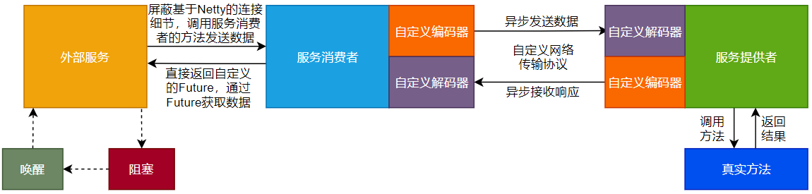
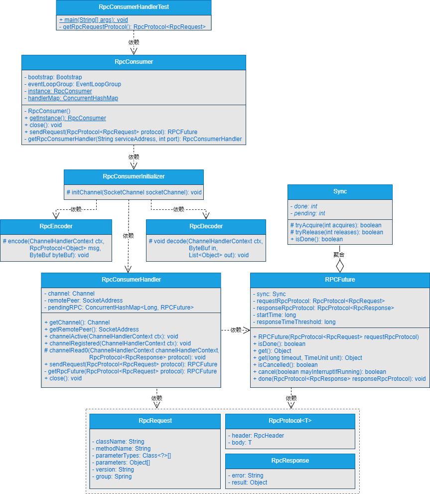

## 一、前言
> while(true)循环实现异步转同步，不仅low，还极大的占用CPU资源，换，必须换！

在前面的章节中，我们在服务消费者一端基于while(true)循环的方式实现了异步转同步的调用方式，能够在服务消费者屏蔽掉基于Netty连接服务提供者的实现细节的前提下，直接获取服务提供者调用真实方法的结果。

但是，这里存在着一个很明显的问题，就是：服务消费者端实现异步转同步时，使用的是while(true)循环的方式，也就是使用了一个死循环，代码如下所示。

```java
public Object sendRequest(RpcProtocol<RpcRequest> protocol){
    //################省略其他代码#####################
    //异步转同步
    while (true){
        RpcProtocol<RpcResponse> responseRpcProtocol = pendingResponse.remove(requestId);
        if (responseRpcProtocol != null){
            return responseRpcProtocol.getBody().getResult();
        }
    }
}
```
上述代码会不断尝试去获取数据，如果未获取到数据，则一直尝试，如果获取到数据，直接返回。如果在使用RPC框架调用远程服务的过程中，出现了网络延迟或者远程服务不可用时，则while(true)死循环会一直尝试获取数据，并且调用sendRequest()方法向服务提供者发送数据时，都会在死循环中一直进行尝试，进而导致程序不可用。

基础好一点的小伙伴可能会想到使用超时，比如类似下面代码的方式。

```java
public Object sendRequest(RpcProtocol<RpcRequest> protocol){
    //################省略其他代码#####################
    int startTime = System.currentTimeMillis();
    //异步转同步
    while (true){
        //模拟5秒后超时退出
        if(System.currentTimeMillis() - startTime >= 5000){
            break;
        }
        RpcProtocol<RpcResponse> responseRpcProtocol = pendingResponse.remove(requestId);
        if (responseRpcProtocol != null){
            return responseRpcProtocol.getBody().getResult();
        }
    }
}
```

这种方式在一定程度上能够缓解while(true)死循环带来的问题，但是还是那句话，Low不Low啊？真实RPC框架里谁会这么搞呢？不行，换，必须换！！

## 二、目标

> 异步转同步，换掉while(true)循环，使用CompletableFuture搞定！


其实，在Java中提供了很多类似异步转同步的实现方式，比如JDK中提供的Future接口，在某种程度上来说，就可以实现异步转同步的功能，例如下面的代码片段所示。

```java
ExecutorService threadPool = Executors.newFixedThreadPool(3);
Future<String> future = threadPool.submit(() -> {
    return "guoxl";
});
System.out.println(future.get());
```

将任务提交到线程池后，返回一个Future对象，通过Future对象的get()方法就能够获取到线程池中任务的返回结果。


这里，调用Future的get()方法就会被阻塞，直到线程池中的任务返回结果数据为止。从Java的JDK1.8版本开始，提供了功能更为强大的CompletableFuture类，CompletableFuture类实现了Future接口。

本章，我们就基于Java中的CompletableFuture类和AQS实现服务消费者异步转同步的升级。

## 三、设计

> 如果让你基于Java中的CompletableFuture类和AQS实现服务消费者异步转同步的升级，你会怎么设计呢？

服务消费者真正实现异步转同步时，会基于Java中的CompletableFuture类实现自定义的Future，并结合AQS实现，设计流程如图14-1所示。
RPC框架底层的数据通信依赖的是Netty，服务消费者与服务提供者之间进行数据交互时，本身是基于异步的方式进行的。这也是在前面的章节中为何在服务消费者向服务提供者发送数据后，只能在服务消费者的数据处理器类中打印结果数据，而不能在调用服务消费者发送数据的方法时，直接获取结果数据的原因。如图13-1所示。


由图14-1可以看出：

（1）外部服务调用服务消费者的方法向服务提供者发送数据时，依旧屏蔽了基于Netty的连接细节，外部服务调用消费者发送数据的方法后，立刻接收一个自定义的Future，通过Future的get()方法获取真实数据。

（2）服务消费者向服务提供者传递必要的参数，发起异步请求，如果外部服务调用了自定义Future的get()方法，则外部服务的线程会阻塞。

（3）服务提供者接收到服务消费者发送过来的数据后，调用真实方法，并接收真实方法返回的结果数据。

（4）服务提供者接收到真实方法返回的结果数据后，向服务消费者响应结果数据。

（5）服务消费者接收到服务提供者响应的结果数据后，唤醒阻塞的线程，并向外部服务响应结果数据。

（6）外部服务会通过自定义Future的get()方法获取到最终的结果数据。


**注意：通过自定义的Future获取结果数据时，支持阻塞获取和超时阻塞获取两种方式。**

## 四、实现

说了这么多，异步转同步的升级要怎么实现呢？

### 1.工程结构
- gxl-rpc-annotation：实现gxl-rpc框架的核心注解工程。
- gxl-rpc-codec：实现gxl-rpc框架的自定义编解码功能。
- gxl-rpc-common：实现gxl-rpc框架的通用工具类，包含服务提供者注解与服务消费者注解的扫描器。
- gxl-rpc-constants：存放实现gxl-rpc框架通用的常量类。
- gxl-rpc-consumer：服务消费者父工程
    - gxl-rpc-consumer-common：服务消费者通用工程
- gxl-rpc-protocol：实现gxl-rpc框架的自定义网络传输协议的工程。
- gxl-rpc-provider：服务提供者父工程。
    - gxl-rpc-provider-common：服务提供者通用工程。
    - gxl-rpc-provider-native：以纯Java方式启动gxl-rpc框架的工程。
- gxl-rpc-serialization：实现gxl-rpc框架序列化与反序列化功能的父工程。
    - gxl-rpc-serialization-api：实现gxl-rpc框架序列化与反序列化功能的通用接口工程。
    - gxl-rpc-serialization-jdk：以JDK的方式实现序列化与反序列化功能。
- gxl-rpc-test：测试gxl-rpc框架的父工程。
    - gxl-rpc-test-api：测试的通用Servcie接口工程
    - gxl-rpc-test-provider：测试服务提供者的工程。
    - gxl-rpc-test-consumer：测试服务消费者的工程
      - gxl-rpc-test-consumer-codec：测试服务消费者基于自定义网络协议与编解码与服务提供者进行数据交互
      - gxl-rpc-test-consumer-handler：测试屏蔽服务消费者基于Netty与服务提供者建立连接的细节后，与服务提供者进行数据通信（第12章新增）
    - gxl-rpc-test-scanner：测试扫描器的工程。

### 2.核心类实现关系

基于自定义Future和AQS实现异步转同步的核心类关系如图14-2所示。



### 3.自定义RPCFuture类的实现

RPCFuture类位于gxl-rpc-consumer-common工程下的io.gxl.rpc.consumer.common.future.RPCFuture。RPCFuture类继承自Java中的CompletableFuture，在CompletableFuture类的内部存在一个Sync内部类，主要是实现自定义的AQS功能。源码如下所示。

```java
public class RPCFuture extends CompletableFuture<Object> {
  private static final Logger LOGGER = LoggerFactory.getLogger(RPCFuture.class);

  private Sync sync;
  private RpcProtocol<RpcRequest> requestRpcProtocol;
  private RpcProtocol<RpcResponse> responseRpcProtocol;
  private long startTime;

  private long responseTimeThreshold = 5000;

  public RPCFuture(RpcProtocol<RpcRequest> requestRpcProtocol) {
    this.sync = new Sync();
    this.requestRpcProtocol = requestRpcProtocol;
    this.startTime = System.currentTimeMillis();
  }

  @Override
  public boolean isDone() {
    return sync.isDone();
  }

  @Override
  public Object get() throws InterruptedException, ExecutionException {
    sync.acquire(-1);
    if (this.responseRpcProtocol != null) {
      return this.responseRpcProtocol.getBody().getResult();
    } else {
      return null;
    }
  }

  @Override
  public Object get(long timeout, TimeUnit unit) throws InterruptedException, ExecutionException, TimeoutException {
    boolean success = sync.tryAcquireNanos(-1, unit.toNanos(timeout));
    if (success) {
      if (this.responseRpcProtocol != null) {
        return this.responseRpcProtocol.getBody().getResult();
      } else {
        return null;
      }
    } else {
      throw new RuntimeException("Timeout exception. Request id: " + this.requestRpcProtocol.getHeader().getRequestId()
              + ". Request class name: " + this.requestRpcProtocol.getBody().getClassName()
              + ". Request method: " + this.requestRpcProtocol.getBody().getMethodName());
    }
  }

  @Override
  public boolean isCancelled() {
    throw new UnsupportedOperationException();
  }

  @Override
  public boolean cancel(boolean mayInterruptIfRunning) {
    throw new UnsupportedOperationException();
  }

  public void done(RpcProtocol<RpcResponse> responseRpcProtocol) {
    this.responseRpcProtocol = responseRpcProtocol;
    sync.release(1);
    // Threshold
    long responseTime = System.currentTimeMillis() - startTime;
    if (responseTime > this.responseTimeThreshold) {
      LOGGER.warn("Service response time is too slow. Request id = " + responseRpcProtocol.getHeader().getRequestId() + ". Response Time = " + responseTime + "ms");
    }
  }

  static class Sync extends AbstractQueuedSynchronizer {

    private static final long serialVersionUID = 1L;

    //future status
    private final int done = 1;
    private final int pending = 0;

    protected boolean tryAcquire(int acquires) {
      return getState() == done;
    }

    protected boolean tryRelease(int releases) {
      if (getState() == pending) {
        if (compareAndSetState(pending, done)) {
          return true;
        }
      }
      return false;
    }

    public boolean isDone() {
      getState();
      return getState() == done;
    }
  }
}

```

RPCFuture类的源码相对比较长，接下来，对RPCFuture类的源码进行分解说明。

（1）内部类Sync

Sync内部类继承了AbstractQueuedSynchronizer，也就是Java中的AQS，实现了tryAcquire()方法和tryRelease()方法，并且提供了isDone()方法。

（2）成员变量

在RPCFuture类中，定义了如下成员变量。

```java
private Sync sync;
private RpcProtocol<RpcRequest> requestRpcProtocol;
private RpcProtocol<RpcResponse> responseRpcProtocol;
private long startTime;
private long responseTimeThreshold = 5000;
```
- sync：内部类Sync的实例对象。
- requestRpcProtocol：RpcRequest类型的协议对象。
- responseRpcProtocol：RpcResponse类型的协议对象。
- startTime：开始时间。
- responseTimeThreshold：默认的超时时间。

（3）构造方法

RPCFuture类的构造方法，主要是传入了一个RpcRequest类型的协议对象，并在构造方法中为必要的成员变量赋值，源码如下所示。

```java
public RPCFuture(RpcProtocol<RpcRequest> requestRpcProtocol) {
        this.sync = new Sync();
        this.requestRpcProtocol = requestRpcProtocol;
        this.startTime = System.currentTimeMillis();
        }
```

（4）isDone()方法

直接调用Sync类中的isDone()方法，源码如下所示。

```java
@Override
public boolean isDone() {
    return sync.isDone();
}
```

（5）get()方法

get()方法主要是阻塞获取responseRpcProtocol协议对象中的实际结果数据。源码如下所示。

```java
@Override
    public Object get() throws InterruptedException, ExecutionException {
        sync.acquire(-1);
        if (this.responseRpcProtocol != null) {
            return this.responseRpcProtocol.getBody().getResult();
        } else {
            return null;
        }
    }
```

（6）get(long timeout, TimeUnit unit)方法

get(long timeout, TimeUnit unit)方法主要是超时阻塞获取responseRpcProtocol协议对象中的实际结果数据。源码如下所示。

```java
@Override
public Object get(long timeout, TimeUnit unit) throws InterruptedException, ExecutionException, TimeoutException {
        boolean success = sync.tryAcquireNanos(-1, unit.toNanos(timeout));
        if (success) {
        if (this.responseRpcProtocol != null) {
        return this.responseRpcProtocol.getBody().getResult();
        } else {
        return null;
        }
        } else {
        throw new RuntimeException("Timeout exception. Request id: " + this.requestRpcProtocol.getHeader().getRequestId()
        + ". Request class name: " + this.requestRpcProtocol.getBody().getClassName()
        + ". Request method: " + this.requestRpcProtocol.getBody().getMethodName());
        }
        }
```

（7）done()方法

当服务消费者接收到服务提供者响应的结果数据时，就会调用done()方法，并传入RpcResponse类型的协议对象，此时会唤醒阻塞的线程获取响应的结果数据，源码如下所示。
```java
public void done(RpcProtocol<RpcResponse> responseRpcProtocol) {
        this.responseRpcProtocol = responseRpcProtocol;
        sync.release(1);
        long responseTime = System.currentTimeMillis() - startTime;
        if (responseTime > this.responseTimeThreshold) {
        LOGGER.warn("Service response time is too slow. Request id = " + responseRpcProtocol.getHeader().getRequestId() + ". Response Time = " + responseTime + "ms");
        }
        }
```

### 4.修改RpcConsumerHandler处理器类

RpcConsumerHandler类位于gxl-rpc-consumer-common工程下的io.gxl.rpc.consumer.common.handler.RpcConsumerHandler，具体修改步骤如下所示。

（1）新增pendingRPC成员变量

在RpcConsumerHandler类中，新增ConcurrentHashMap<Long, RPCFuture>类型的成员变量pendingRPC，删除pendingResponse成员变量，源码如下所示。

（2）修改channelRead0()方法

在channelRead0()方法中，主要是修改成从pendingRPC中获取自定义的RPCFuture对象，如果RPCFuture对象不为空，则调用RPCFuture对象的done()方法，传入服务消费者接收到的RpcResponse类型的协议对象，唤醒阻塞的线程获取结果数据。源码如下所示。

```java
protected void channelRead0(ChannelHandlerContext channelHandlerContext, RpcProtocol<RpcResponse> protocol) throws Exception {
    if (protocol == null){
        return;
    }
    logger.info("服务消费者接收到的数据===>>>{}", JSONObject.toJSONString(protocol));
    RpcHeader header = protocol.getHeader();
    long requestId = header.getRequestId();
    RPCFuture rpcFuture = pendingRPC.remove(requestId);
    if (rpcFuture != null){
        rpcFuture.done(protocol);
    }
}
```

（3）修改sendRequest()方法

将sendRequest()方法的返回值修改成RPCFuture，通过传入的RpcRequest类型的协议对象来构建RPCFuture对象，向服务提供者发送数据后，返回RPCFuture对象，源码如下所示。

```java
public RPCFuture sendRequest(RpcProtocol<RpcRequest> protocol){
    logger.info("服务消费者发送的数据===>>>{}", JSONObject.toJSONString(protocol));
    RPCFuture rpcFuture = this.getRpcFuture(protocol);
    channel.writeAndFlush(protocol);
    return rpcFuture;
}
```

（4）新增getRpcFuture()方法

getRpcFuture()方法的作用主要是根据传入的RpcRequest类型的协议对象，构建自定义的RpcFuture对象，并将其添加到pendingRPC中，最终，返回构建好的自定义RpcFuture对象，源码如下所示。

```java
private RPCFuture getRpcFuture(RpcProtocol<RpcRequest> protocol) {
    RPCFuture rpcFuture = new RPCFuture(protocol);
    RpcHeader header = protocol.getHeader();
    long requestId = header.getRequestId();
    pendingRPC.put(requestId, rpcFuture);
    return rpcFuture;
}
```

### 5.修改RpcConsumer服务消费者类


RpcConsumer类位于gxl-rpc-consumer-common工程下的io.gxl.rpc.consumer.common.RpcConsumer，修改RpcConsumer类中的sendRequest()方法，将返回值的类型修改为RPCFuture，源码如下所示。

```java
public RPCFuture sendRequest(RpcProtocol<RpcRequest> protocol) throws Exception {
    //###############
    return handler.sendRequest(protocol);
}
```

至此，基于自定义Future和AQS实现异步转同步升级的核心类和方法修改完毕。

## 五、测试

> 写好的程序不测试下怎么行？

（1）修改RpcConsumerHandlerTest测试类
RpcConsumerHandlerTest类位于gxl-rpc-test-consumer-handler工程下的io.gxl.rpc.test.consumer.handler.RpcConsumerHandlerTest，对于RpcConsumerHandlerTest类的修改，主要就是修改main()方法，修改后的代码如下所示。

```java
public static void main(String[] args) throws Exception {
    RpcConsumer consumer = RpcConsumer.getInstance();
    RPCFuture future = consumer.sendRequest(getRpcRequestProtocol());
    LOGGER.info("从服务消费者获取到的数据===>>>" + future.get());
    consumer.close();
}
```

可以看到，调用consumer的sendRequest()方法返回的结果数据类型为RPCFuture，然后再通过RPCFuture对象的get()方法获取最终的结果数据。

（2）启动服务提供者

启动gxl-rpc-test-provider工程下的io.gxl.rpc.test.provider.single.RpcSingleServerTest类，输出的信息如下所示。

```java
INFO BaseServer:82 - Server started on 127.0.0.1:27880
```

可以看到，服务提供者启动成功。

（3）启动服务消费者

启动gxl-rpc-test-consumer-handler工程下的io.gxl.rpc.test.consumer.handler.RpcConsumerHandlerTest类，输出的结果信息如下所示。
```java
15:11:51,699  INFO RpcConsumer:97 - connect rpc server 127.0.0.1 on port 27880 success.
15:11:51,815  INFO RpcConsumerHandler:83 - 服务消费者发送的数据===>>>{"body":{"async":false,"className":"io.guoxl.rpc.test.api.DemoService","group":"binghe","methodName":"hello","oneway":false,"parameterTypes":["java.lang.String"],"parameters":["guoxl"],"version":"1.0.0"},"header":{"magic":16,"msgLen":0,"msgType":1,"requestId":1,"serializationType":"jdk","status":1}}
15:11:51,982  INFO RpcConsumerHandler:73 - 服务消费者接收到的数据===>>>{"body":{"async":false,"oneway":false,"result":"hello guoxl"},"header":{"magic":16,"msgLen":211,"msgType":2,"requestId":1,"serializationType":"jdk","status":0}}
15:11:51,983  INFO RpcConsumerHandlerTest:37 - 从服务消费者获取到的数据===>>>hello guoxl
```
可以看到，在服务消费者输出的信息中，除了向服务提供者发送的数据与接收服务提供者响应的数据外，还在RpcConsumerHandlerTest类的main()方法中打印出了获取的最终结果数据为hello guoxl。符合预期的效果。

（4）再次查看服务提供者日志

再次查看服务提供者输出的日志信息，如下所示。

```java
15:11:51,897  INFO RpcProviderHandler:132 - use cglib reflect type invoke method...
15:11:51,956  INFO ProviderDemoServiceImpl:33 - 调用hello方法传入的参数为===>>>guoxl
```

可以看到，服务提供者使用CGLib的方式调用了真实的方法。

至此，测试完毕。

## 六、总结

> 实现了功能不总结下怎么行？

前面章节以while(true)死循环的方式实现同步转异步的方式，确实是太low了，本章，我们通过自定义Future并结合AQS的方式实现了异步转同步的核心逻辑，可以说，自定义Future并结合AQS实现异步转同步的方式在网络编程中使用的还是比较多的。建议大家深入理解这种方式并彻底掌握它。