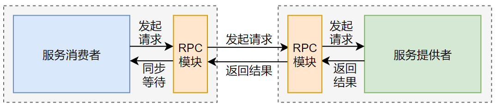
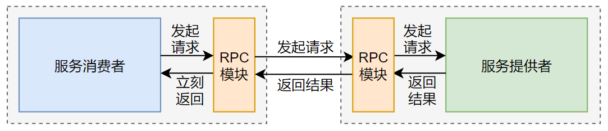
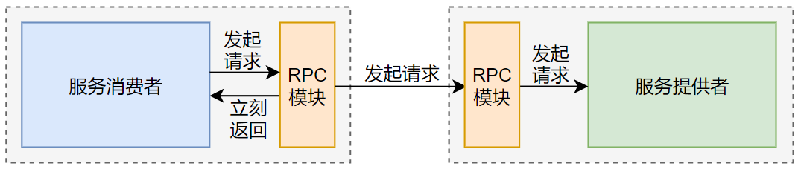
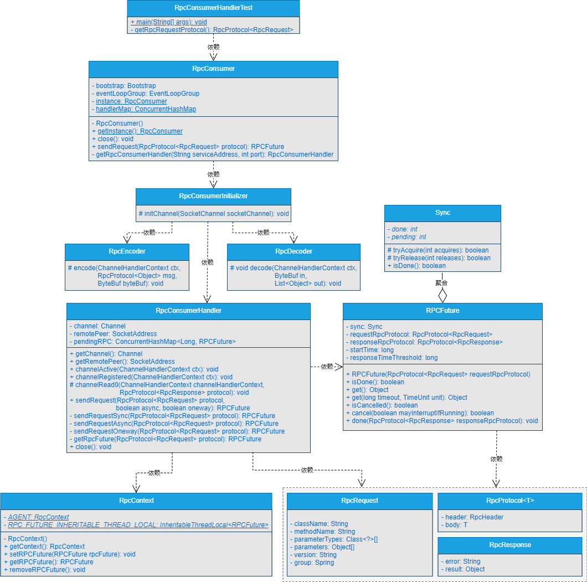

## 一、前言
> 我使用你开发的RPC框架时，想让服务消费者以同步、异步、单向调用的方式与服务提供者进行交互，可以实现吗？

在前面的章节中，实现了服务消费者屏蔽掉基于Netty连接服务提供者的实现细节的前提下，以异步转同步的方式调用服务提供者。在外部服务调用服务消费者向服务提供者发送数据的方法时，能够直接获取到服务提供者调用真实方法返回的结果数据。

那RPC框架只支持同步调用的话，在高并发环境下肯定会出现性能问题，我想让RPC框架支持同步、异步和单向调用，这也是很多优秀的RPC框架都支持的功能，这个有办法实现吗？

我：安排。。。

## 二、目标

> 服务消费者必须支持同步、异步和单向调用！

在服务提供者一端实现了按照自定义网络传输协议和数据编解码对接收到的数据进行解析，并且能够将解析到的数据作为参数调用真实方法，并接收真实方法返回的结果数据，通过自定义网络协议和数据编解码，将数据编码成二进制字节流，传输给服务消费者。

在服务消费者一端实现了按照自定义的网络传输协议和数据编解码，将数据编码成二进制字节流发送给服务提供者，能够接收到服务提供者响应回来的二进制字节流数据，并且能够根据自定义网络传输协议和数据编解码，将接收到的二进制字节流数据解码成对应的明文数据，接下来，进行进一步处理。

同时，服务消费者支持在屏蔽掉基于Netty连接服务提供者的实现细节的前提下，使得外部服务调用服务消费者向服务提供者发送数据的方法时，能够直接获取到服务提供者调用真实方法返回的结果数据。

做到这里，已经初步实现了RPC框架最基本的功能。这还远远不够，服务消费者除了能够以同步的方式调用服务提供者，也要支持异步调用和单向调用，看看人家Dubbo，做的是真特么牛逼。

好了，不羡慕人家，我们自己踏踏实实手撸吧，本章，我们就实现服务消费者以同步、异步、单向调用的方式与服务提供者进行交互。

## 三、设计

> 如果让你设计服务消费者基于同步、异步、单向调用的方式与服务提供者进行交互，你会怎么设计呢？

服务消费者与服务提供者之间基于同步、异步和单向调用的设计图分别如图15-1~15-3所示。

- 同步调用

- 异步调用

- 单向调用


通过图15-1~15-2可以看出：

（1）同步调用的方式，服务消费者发起数据请求后，会同步等待返回结果。

（2）异步调用的方式，服务消费者发起数据请求后，会立刻返回，后续会通过异步的方式获取数据。

（3）单向调用的方式，服务消费者发起数据请求后，会立刻返回，不必关注后续数据的处理结果。

可以看到，从设计上还是比较简单的，接下来，我们就一起实现它。

## 四、实现

说了这么多，具体要怎么实现呢？

### 1.工程结构
- gxl-rpc-annotation：实现gxl-rpc框架的核心注解工程。
- gxl-rpc-codec：实现gxl-rpc框架的自定义编解码功能。
- gxl-rpc-common：实现gxl-rpc框架的通用工具类，包含服务提供者注解与服务消费者注解的扫描器。
- gxl-rpc-constants：存放实现gxl-rpc框架通用的常量类。
- gxl-rpc-consumer：服务消费者父工程
    - gxl-rpc-consumer-common：服务消费者通用工程
- gxl-rpc-protocol：实现gxl-rpc框架的自定义网络传输协议的工程。
- gxl-rpc-provider：服务提供者父工程。
    - gxl-rpc-provider-common：服务提供者通用工程。
    - gxl-rpc-provider-native：以纯Java方式启动gxl-rpc框架的工程。
- gxl-rpc-serialization：实现gxl-rpc框架序列化与反序列化功能的父工程。
    - gxl-rpc-serialization-api：实现gxl-rpc框架序列化与反序列化功能的通用接口工程。
    - gxl-rpc-serialization-jdk：以JDK的方式实现序列化与反序列化功能。
- gxl-rpc-test：测试gxl-rpc框架的父工程。
    - gxl-rpc-test-api：测试的通用Servcie接口工程
    - gxl-rpc-test-provider：测试服务提供者的工程。
    - gxl-rpc-test-consumer：测试服务消费者的工程
      - gxl-rpc-test-consumer-codec：测试服务消费者基于自定义网络协议与编解码与服务提供者进行数据交互
      - gxl-rpc-test-consumer-handler：测试屏蔽服务消费者基于Netty与服务提供者建立连接的细节后，与服务提供者进行数据通信（第12章新增）
    - gxl-rpc-test-scanner：测试扫描器的工程。

### 2.核心类实现关系

服务消费者与服务提供者之间基于同步、异步和单向调用的实现类关系如图15-4所示。



可以看到，核心类之间的实现关系还是比较清晰的。

### 3.RPC上下文RpcContext类的实现

RpcContext类位于gxl-rpc-consumer-common工程下的io.gxl.rpc.consumer.common.context.RpcContext，源码如下所示。


```java
public class RpcContext {

  private RpcContext(){
  }

  /**
   * RpcContext实例
   */
  private static final RpcContext AGENT = new RpcContext();

  /**
   * 存放RPCFuture的InheritableThreadLocal
   */
  private static final InheritableThreadLocal<RPCFuture> RPC_FUTURE_INHERITABLE_THREAD_LOCAL = new InheritableThreadLocal<>();

  /**
   * 获取上下文
   * @return RPC服务的上下文信息
   */
  public static RpcContext getContext(){
    return AGENT;
  }

  /**
   * 将RPCFuture保存到线程的上下文
   * @param rpcFuture
   */
  public void setRPCFuture(RPCFuture rpcFuture){
    RPC_FUTURE_INHERITABLE_THREAD_LOCAL.set(rpcFuture);
  }

  /**
   * 获取RPCFuture
   */
  public RPCFuture getRPCFuture(){
    return RPC_FUTURE_INHERITABLE_THREAD_LOCAL.get();
  }

  /**
   * 移除RPCFuture
   */
  public void removeRPCFuture(){
    RPC_FUTURE_INHERITABLE_THREAD_LOCAL.remove();
  }
}
```

可以看到，在RpcContext类中主要是通过InheritableThreadLocal<RPCFuture>在维护RPCFuture，并且每个线程维护RPCFuture时，都是相互隔离的。RpcContext类中维护的RPCFuture会在RPC框架全局有效。

#### 4.修改消费者RpcConsumerHandler处理器类

RpcConsumerHandler类位于gxl-rpc-consumer-common工程下的io.gxl.rpc.consumer.common.handler.RpcConsumerHandler，具体修改步骤如下所示。

（1）新增sendRequestSync()方法
```java
private RPCFuture sendRequestSync(RpcProtocol<RpcRequest> protocol) {
    RPCFuture rpcFuture = this.getRpcFuture(protocol);
    channel.writeAndFlush(protocol);
    return rpcFuture;
}
```
可以看到，在sendRequestSync()方法中，调用channel的writeAndFlush()方法发送数据后，会返回RPCFuture对象。

（2）新增sendRequestAsync()方法

sendRequestAsync()方法表示异步调用的方法，源码如下所示。
```java
private RPCFuture sendRequestAsync(RpcProtocol<RpcRequest> protocol) {
        RPCFuture rpcFuture = this.getRpcFuture(protocol);
        //如果是异步调用，则将RPCFuture放入RpcContext
        RpcContext.getContext().setRPCFuture(rpcFuture);
        channel.writeAndFlush(protocol);
        return null;
        }
```
可以看到，sendRequestAsync()方法中，会将RPCFuture对象放入RpcContext上下文中，最终返回null。外部服务调用服务消费者向服务提供者发送数据后，会通过RpcContext获取到RPCFuture对象，进而通过RPCFuture对象获取最终结果数据。

（3）新增sendRequestOneway()方法

sendRequestOneway()方法表示单向调用的方法，源码如下所示。

```java
private RPCFuture sendRequestOneway(RpcProtocol<RpcRequest> protocol) {
        channel.writeAndFlush(protocol);
        return null;
        }
```

可以看到，单向调用方法并不关心返回结果。sendRequestOneway()方法直接调用channel的writeAndFlush()方法，并返回null。

（4）修改sendRequest()方法

在sendRequest()方法的参数中新增是否是异步调用的async参数和是否是单向调用的oneway参数，以这些参数来判断是执行同步调用、异步调用还是单向调用，源码如下所示。

```java
public RPCFuture sendRequest(RpcProtocol<RpcRequest> protocol, boolean async, boolean oneway){
        logger.info("服务消费者发送的数据===>>>{}", JSONObject.toJSONString(protocol));
        return oneway ? this.sendRequestOneway(protocol) : async ?
        sendRequestAsync(protocol) : this.sendRequestSync(protocol);
        }
```

### 5.修改RpcConsumer服务消费者类

RpcConsumer类位于gxl-rpc-consumer-common工程下的io.gxl.rpc.consumer.common.RpcConsumer，主要是修改RpcConsumer类中的sendRequest()方法，调用RpcConsumerHandler处理器类的sendRequest()方法时，需要传递是否是异步调用async的标识和是否是单向调用oneway的标识，源码如下所示。

```java
public RPCFuture sendRequest(RpcProtocol<RpcRequest> protocol) throws Exception {
        //################省略其他代码################
        RpcRequest request = protocol.getBody();
        return handler.sendRequest(protocol, request.getAsync(), request.getOneway());
        }
```

## 五、测试

> 写好的程序不测试下怎么行？

### 1.启动服务提供者

启动gxl-rpc-test-provider工程下的io.gxl.rpc.test.provider.single.RpcSingleServerTest类，输出的信息如下所示。

```java
INFO BaseServer:82 - Server started on 127.0.0.1:27880
```

可以看到，服务提供者启动成功。

### 2.测试同步调用

（1）修改同步调用的main()方法
修改gxl-rpc-test-consumer-handler工程下的io.gxl.rpc.test.consumer.handler.RpcConsumerHandlerTest类的main()方法，源码如下所示。

```java
public static void main(String[] args) throws Exception {
    RpcConsumer consumer = RpcConsumer.getInstance();
    RPCFuture future = consumer.sendRequest(getRpcRequestProtocol());
    LOGGER.info("从服务消费者获取到的数据===>>>" + future.get());
    consumer.close();
}
```

可以看到，同步调用时，会直接回去方法调用的结果数据。

（2）启动服务消费者
（3）再次查看服务提供者日志
可以看到，服务提供者使用CGLib的方式调用了真实的方法


### 3.测试异步调用

（1）修改异步调用的main()方法
修改gxl-rpc-test-consumer-handler工程下的io.gxl.rpc.test.consumer.handler.RpcConsumerHandlerTest类的main()方法，源码如下所示。

```java
public static void main(String[] args) throws Exception {
    RpcConsumer consumer = RpcConsumer.getInstance();
    consumer.sendRequest(getRpcRequestProtocol());
    RPCFuture future = RpcContext.getContext().getRPCFuture();
    LOGGER.info("从服务消费者获取到的数据===>>>" + future.get());
    consumer.close();
}
```

可以看到，执行异步调用时，并没有从调用consumer的sendRequest()方法直接获取返回的RPCFuture结果数据，而是通过RpcContext上下文获取到RPCFuture对象，再由RPCFuture对象获取结果数据。

（2）修改构建RpcProtocol<RpcRequest>对象的方法
修改getRpcRequestProtocol()方法中构建RpcRequest的方法参数，将是否是异步调用的参数设置为true，源码如下所示。
```java
private static RpcProtocol<RpcRequest> getRpcRequestProtocol(){
    //模拟发送数据
    RpcProtocol<RpcRequest> protocol = new RpcProtocol<RpcRequest>();
    //################省略其他代码##########################
    request.setAsync(true);
    request.setOneway(false);
    protocol.setBody(request);
    return protocol;
}
```
（3）启动服务消费者
（4）再次查看服务提供者日志

### 3.测试单向调用
```java
public static void main(String[] args) throws Exception {
    RpcConsumer consumer = RpcConsumer.getInstance();
    consumer.sendRequest(getRpcRequestProtocol());
    LOGGER.info("无需获取返回的结果数据");
    consumer.close();
}
```

（2）修改构建RpcProtocol<RpcRequest>对象的方法
修改getRpcRequestProtocol()方法中构建RpcRequest的方法参数，将是否是异步调用的参数设置为true，源码如下所示。
```java
private static RpcProtocol<RpcRequest> getRpcRequestProtocol(){
        //模拟发送数据
        //#############省略其他代码#################
        request.setAsync(false);
        request.setOneway(true);
        protocol.setBody(request);
        return protocol;
        }
```
（3）启动服务消费者
（4）再次查看服务提供者日志
至此，测试完毕。

## 六、总结

> 实现了功能不总结下怎么行？

目前实现的RPC框架以Java原生进程的方式启动后，能够实现服务消费者以同步、异步和单向调用的方式与服务提供者之间进行数据交互。至此，我们写的RPC框架的功能又进一步得到了增强。

我们写的RPC框架正在一步步实现它该有的功能。