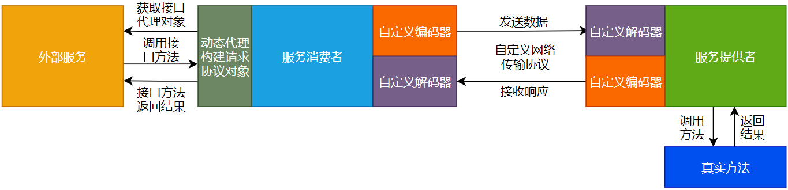
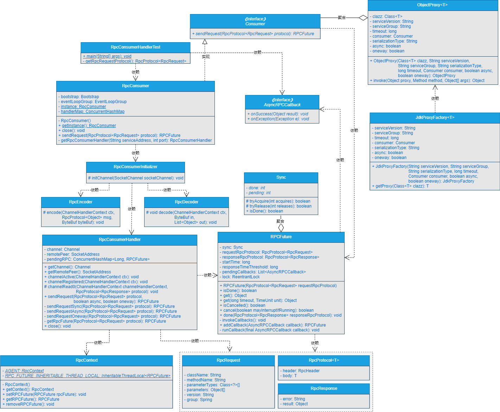

使用RPC框架调用远程方法时，我不想自己手动构建RpcRequest请求协议对象，怎么办呢？


## **一、前言**


> 目前RPC框架实现的功能不少了，但是在发送RPC请求时，还要自己手动构建RpcRequest请求协议对象，这个就有点low了！


在前面的章节中，我们不仅实现了服务消费者与服务提供者之间进行同步、异步、单向和回调调用，并且在外部服务调用服务消费者时，服务消费者也屏蔽了底层Netty通信的细节信息。但是，还有一点是不太令人满意的，那就是在发起RPC请求时，需要在外部服务自己手动构建RpcRequest请求协议对象。


如果使用过Dubbo或者其他RPC框架的小伙伴，一定会发现这些成熟的RPC框架不会让使用者自己手动去构建请求协议对象的，这些都是要屏蔽到框架里的功能。那这个功能怎么实现呢？


## **二、目标**


> 撸起袖子加油干，我们要屏蔽掉构建请求协议对象的细节，让用户像调用本地方法一样调用远程方法。


目前，RPC框架存在的一个很明显的问题就是，在每次发起RPC请求时，都需要自己手动去构建请求协议对象，这对用户来说是非常不友好的。如果一个RPC框架设计成这样，那这个框架肯定会没多少人使用的。


对外大量暴露框架内部的实现细节是一个框架非常不成熟、不完备的体现。在使用RPC框架时，用户肯定更愿意像调用本地方法一样调用远程方法，最好是看起来直接调用了接口的方法，就能够调用远程方法的实现。


本章，我们就实现用户像调用本地方法一样调用远程方法的第一步：在消费者端实现动态代理功能，使用动态代理屏蔽掉构建请求协议对象的细节信息。


## **三、设计**


> 如果设计服务消费者端的动态代理功能，你会怎么设计呢？


服务消费者实现动态代理功能屏蔽请求协议对象的细节流程图如图17-1所示。




由图17-1可以看出，大致的流程如下所示：


（1）外部服务获取接口代理对象。

（2）外部服务调用接口方法，实际上是调用的接口代理对象里的方法来调用远程方法。

（3）服务消费者端的动态代理模块，会根据外部服务传递过来的参数构建请求协议对象，这样就在RPC框架层面对外屏蔽了构建请求协议对象的细节。

（4）服务消费端代理模块构建完请求协议对象后，会通过自定义网络传输协议和数据编解码对数据编码成二进制字节流，传输到服务提供者。

（5）服务提供者接收到二进制数据流后，通过自定义网络传输协议和数据编解码对数据进行解码，将解码出的数据作为参数调用真实方法。

（6）真实方法经过业务逻辑处理后，会将结果数据返回给服务提供者。

（7）服务提供者接收到真实方法返回的结果数据后，会通过自定义网络传输协议和数据编解码对数据进行编码，将数据编码成二进制字节流后传输给服务消费者。

（8）服务消费者接收到服务提供者响应的二进制流数据后，通过自定义网络传输协议和数据编解码对数据进行解码，将数据解码成明文数据，再通过接口的动态代理对象将最终的结果返回给外部服务。


## **四、实现**


> 说了这么多，具体要怎么实现呢？


### **1.工程结构**


1. gxl-rpc-annotation：实现gxl-rpc框架的核心注解工程。
2. gxl-rpc-codec：实现gxl-rpc框架的自定义编解码功能。
3. gxl-rpc-common：实现gxl-rpc框架的通用工具类，包含服务提供者注解与服务消费者注解的扫描器。
4. gxl-rpc-constants：存放实现gxl-rpc框架通用的常量类。
5. gxl-rpc-consumer：服务消费者父工程
6. gxl-rpc-consumer-common：服务消费者通用工程
7. gxl-rpc-protocol：实现gxl-rpc框架的自定义网络传输协议的工程。
8. gxl-rpc-provider：服务提供者父工程。
9. gxl-rpc-provider-common：服务提供者通用工程。
10. gxl-rpc-provider-native：以纯Java方式启动gxl-rpc框架的工程。
11. gxl-rpc-proxy：服务消费者端动态代理父工程。
12. gxl-rpc-proxy-api：服务消费者端动态代理的通用接口工程。
13. gxl-rpc-proxy-jdk：服务消费者端基于JDK动态代理的工程。
14. gxl-rpc-serialization：实现gxl-rpc框架序列化与反序列化功能的父工程。
15. gxl-rpc-serialization-api：实现gxl-rpc框架序列化与反序列化功能的通用接口工程。
16. gxl-rpc-serialization-jdk：以JDK的方式实现序列化与反序列化功能。
17. gxl-rpc-test：测试gxl-rpc框架的父工程。
18. gxl-rpc-test-api：测试的通用Servcie接口工程
19. gxl-rpc-test-provider：测试服务提供者的工程。
20. gxl-rpc-test-consumer：测试服务消费者的工程
21. gxl-rpc-test-consumer-codec：测试服务消费者基于自定义网络协议与编解码与服务提供者进行数据交互
22. gxl-rpc-test-consumer-handler：测试屏蔽服务消费者基于Netty与服务提供者建立连接的细节后，与服务提供者进行数据通信
23. gxl-rpc-test-scanner：测试扫描器的工程。


### **2.核心类实现关系**


服务消费者实现动态代理功能屏蔽构建请求协议对象细节的实现类关系如图17-2所示。





可以看到，核心类之间的实现关系还是比较清晰的。


### **3.迁移AsyncRPCCallback回调接口**


将位于gxl-rpc-consumer-common工程下的[io.gxl.rpc.proxy.api.callback.AsyncRPCCallback](http://io.gxl.rpc.consumer.common.callback.asyncrpccallback/)接口迁移到gxl-rpc-proxy-api工程下的[io.gxl.rpc.proxy.api.callback.AsyncRPCCallback](http://io.gxl.rpc.proxy.api.callback.asyncrpccallback/)，源码不变，如下所示。


```java
public interface AsyncRPCCallback {

/**

\* 成功后的回调方法

*/

void onSuccess(Object result);

/**

\* 异常的回调方法

*/

void onException(Exception e);

}
```


### **4.迁移RPCFuture类**


将位于gxl-rpc-consumer-common工程下的[io.gxl.rpc.proxy.api.future.RPCFuture](http://io.gxl.rpc.consumer.common.future.rpcfuture/)迁移到gxl-rpc-proxy-api工程下的[io.gxl.rpc.proxy.api.future.RPCFuture](http://io.gxl.rpc.proxy.api.future.rpcfuture/)，源码不变，大家自行查看项目源码。


### **5.新增Consumer接口**


Consumer接口位于gxl-rpc-proxy-api工程下的[io.gxl.rpc.proxy.api.consumer.Consumer](http://io.gxl.rpc.proxy.api.consumer.consumer/)，源码如下所示。


```java
public interface Consumer {

/**

\* 消费者发送 request 请求

*/

RPCFuture sendRequest(RpcProtocol<RpcRequest> protocol) throws Exception;

}
```


可以看到，在Consumer接口中，定义了一个发送请求的方法。


### **6.修改服务消费者类**


RpcConsumer类位于gxl-rpc-consumer-common工程下的[io.gxl.rpc.consumer.common.RpcConsumer](http://io.gxl.rpc.consumer.common.rpcconsumer/)，使RpcConsumer类实现Consumer接口，修改后的RpcConsumer类的定义如下所示。


public class RpcConsumer implements Consumer {

}


可以看到，对RpcConsumer类的修改只是让其实现了Consumer接口，其他的代码没有改动。


### **7.新增对象的动态代理执行类**


ObjectProxy类是动态代理的执行类，位于gxl-rpc-proxy-api工程下的[io.gxl.rpc.proxy.api.object.ObjectProxy](http://io.gxl.rpc.proxy.api.object.objectproxy/)，ObjectProxy类主要是实现了[java.lang.reflect.InvocationHandler](http://java.lang.reflect.invocationhandler/)接口，并实现了InvocationHandler接口的invoke()方法，当以动态代理的方式调用RPC服务时，就会执行ObjectProxy类中实现的invoke()方法。


```java

public class ObjectProxy <T> implements InvocationHandler{
    private static final Logger LOGGER = LoggerFactory.getLogger(ObjectProxy.class);
    /**
    * 接口的Class对象
    */
    private Class<T> clazz;
    /**
    * 服务版本号
    */
    private String serviceVersion;
    /**
    * 服务分组
    */
    private String serviceGroup;
    /**
    * 超时时间，默认15s
    */
    private long timeout = 15000;
    /**
    * 服务消费者
    */
    private Consumer consumer;
    /**
    * 序列化类型
    */
    private String serializationType;
    
    /**
    * 是否异步调用
    */
    private boolean async;
    
        /**
    * 是否单向调用
    */
    private boolean oneway;

    public ObjectProxy(Class<T> clazz) {
        this.clazz = clazz;
    }

    public ObjectProxy(Class<T> clazz, String serviceVersion, String serviceGroup, String serializationType, long timeout, Consumer consumer, boolean async, boolean oneway) {
        this.clazz = clazz;
        this.serviceVersion = serviceVersion;
        this.timeout = timeout;
        this.serviceGroup = serviceGroup;
        this.consumer = consumer;
        this.serializationType = serializationType;
        this.async = async;
        this.oneway = oneway;
    }

    @Override
    public Object invoke(Object proxy, Method method, Object[] args) throws Throwable {
        if (Object.class == method.getDeclaringClass()) {
            String name = method.getName();
            if ("equals".equals(name)) {
                return proxy == args[0];
            } else if ("hashCode".equals(name)) {
                return System.identityHashCode(proxy);
            } else if ("toString".equals(name)) {
                return proxy.getClass().getName() + "@" +
                        Integer.toHexString(System.identityHashCode(proxy)) +
                        ", with InvocationHandler " + this;
            } else {
                throw new IllegalStateException(String.valueOf(method));
            }
        }
        RpcProtocol<RpcRequest> requestRpcProtocol = new RpcProtocol<RpcRequest>();
        requestRpcProtocol.setHeader(RpcHeaderFactory.getRequestHeader(serializationType));
        RpcRequest request = new RpcRequest();
        request.setVersion(this.serviceVersion);
        request.setClassName(method.getDeclaringClass().getName());
        request.setMethodName(method.getName());
        request.setParameterTypes(method.getParameterTypes());
        request.setGroup(this.serviceGroup);
        request.setParameters(args);
        request.setAsync(async);
        request.setOneway(oneway);
        requestRpcProtocol.setBody(request);
        // Debug
        LOGGER.debug(method.getDeclaringClass().getName());
        LOGGER.debug(method.getName());

        if (method.getParameterTypes() != null && method.getParameterTypes().length > 0){
            for (int i = 0; i < method.getParameterTypes().length; ++i) {
                LOGGER.debug(method.getParameterTypes()[i].getName());
            }
        }
        if (args != null && args.length > 0){
            for (int i = 0; i < args.length; ++i) {
                LOGGER.debug(args[i].toString());
            }
        }
        RPCFuture rpcFuture = this.consumer.sendRequest(requestRpcProtocol);
        return rpcFuture == null ? null : timeout > 0 ? rpcFuture.get(timeout, TimeUnit.MILLISECONDS) : rpcFuture.get();
    }
}
```


### **8.新增JDK动态代理工厂类**


JdkProxyFactory类位于gxl-rpc-proxy-jdk工程下的[io.gxl.rpc.proxy.jdk.JdkProxyFactory](http://io.gxl.rpc.proxy.jdk.jdkproxyfactory/)，源码如下所示。


```java
public class JdkProxyFactory<T> {
    /**
    * 服务版本号
    */
    private String serviceVersion;
    /**
    * 服务分组
    */
    private String serviceGroup;
    /**
    * 超时时间，默认15s
    */
    private long timeout = 15000;
    /**
    * 服务消费者
    */
    private Consumer consumer;
    /**
    * 序列化类型
    */
    private String serializationType;
    
        /**
    * 是否异步调用
    */
    private boolean async;
    /**
    * 是否单向调用
    */
    private boolean oneway;

    public JdkProxyFactory(String serviceVersion, String serviceGroup, String serializationType, long timeout, Consumer consumer, boolean async, boolean oneway) {
        this.serviceVersion = serviceVersion;
        this.timeout = timeout;
        this.serviceGroup = serviceGroup;
        this.consumer = consumer;
        this.serializationType = serializationType;
        this.async = async;
        this.oneway = oneway;
    }
    public <T> T getProxy(Class<T> clazz) {
        return (T) Proxy.newProxyInstance(
                clazz.getClassLoader(),
                new Class<?>[]{clazz},
                new ObjectProxy<T>(clazz, serviceVersion, serviceGroup, serializationType, timeout, consumer, async, oneway)
        );
    }
}

```


可以看到，在JdkProxyFactory类中的构造方法中，主要是为成员变量赋值，最核心的就是通过getProxy()方法获取JDK动态代理对象。


## **五、测试**


本章写好了具体动态代理的逻辑，下一章，整合到服务消费者之后，统一进行测试。


## **六、总结**


> 实现了功能不总结下怎么行？


目前实现的RPC框架以Java原生进程的方式启动后，能够实现服务消费者以同步、异步和单向调用以及回调的方式与服务提供者之间进行数据交互，并且通过回调方法，服务消费者会主动将数据传递给外部服务。在此基础上我们进一步在服务消费者端新增了动态代理模块，在下一章中，将动态代理模块整合进服务消费者的流程中，进行统一测试。


我们写的RPC框架正在一步步实现它该有的功能。