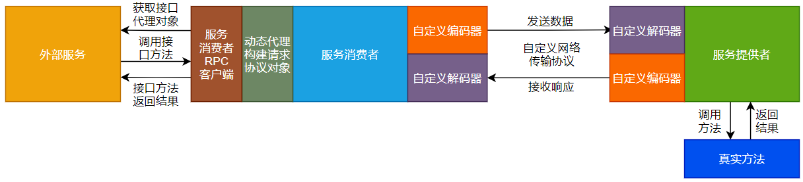
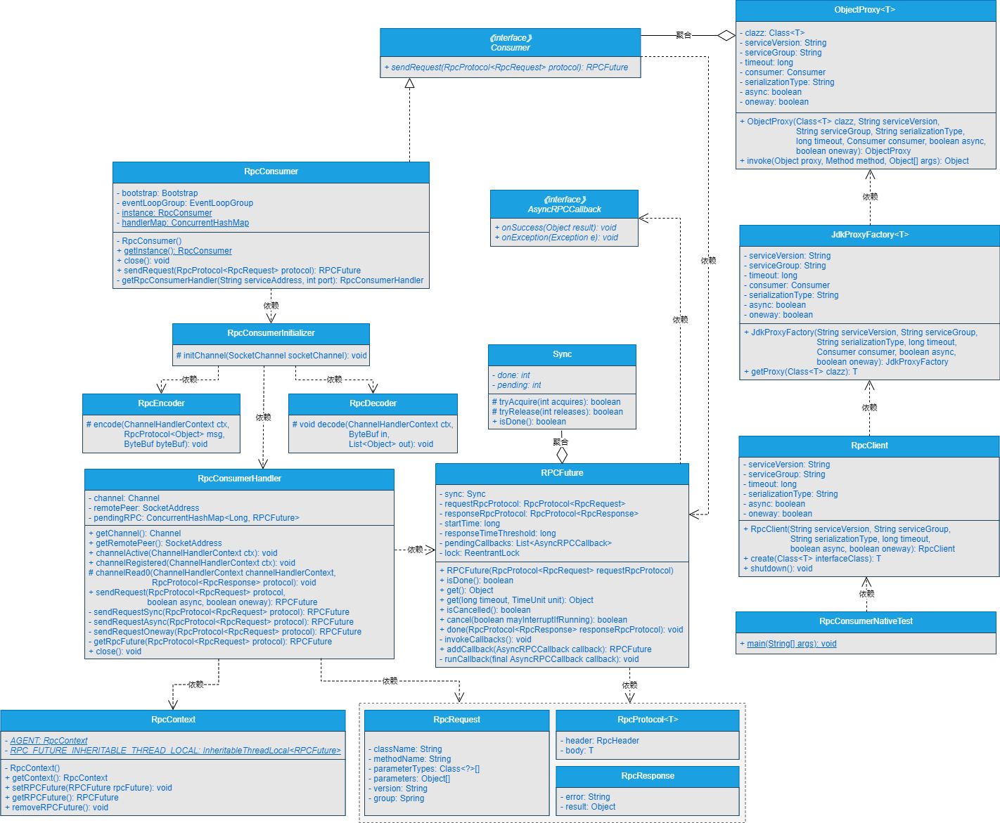

## **一、前言**


> 我就想直接调用某个接口实现RPC远程调用，这个可以吗？


在前面的章节中，我们不仅实现了服务消费者与服务提供者之间进行同步、异步、单向和回调调用，并且在外部服务调用服务消费者时，服务消费者也屏蔽了底层Netty通信的细节信息。更进一步地，我们再次实现了在服务消费者端基于动态代理的功能屏蔽了构建请求协议对象的细节。


但是在服务消费者端基于动态代理的功能屏蔽了构建请求协议对象的细节，目前还没有正式整合到服务消费者端。


本章，我们就在服务消费者端整合动态代理功能实现直接调用接口返回结果数据。


## **二、目标**


> 目标很明确：就是在服务消费者端整合动态代理实现直接调用接口返回结果数据。


很多成熟的RPC框架，都是直接在本地调用某个接口的方法就实现了远程过程调用，使用起来都是贼简单的。我们写的这个RPC框架也要实现这个功能。无需复杂的构建请求协议对象的细节，无需关注RPC框架底层远程通信的细节。调用远程方法就像调用本地接口方法一样丝滑和顺畅。


本章，我们就要实现在在服务消费者端整合动态代理实现直接调用接口返回结果数据。


## **三、设计**


> 如果让你设计整合服务消费者端的动态代理功能，你会怎么设计呢？


消费者整合动态代理实现直接调用接口返回结果数据的流程如图18-1所示。




由图18-1可以看出，消费者整合动态代理实现直接调用接口返回结果数据的大致流程如下所示：


（1）外部服务通过服务消费者RPC客户端获取接口代理对象。

（2）外部服务调用接口方法，实际上是调用的接口代理对象里的方法来调用远程方法。

（3）服务消费者端的动态代理模块，会根据外部服务传递过来的参数构建请求协议对象，这样就在RPC框架层面对外屏蔽了构建请求协议对象的细节。

（4）服务消费端代理模块构建完请求协议对象后，会通过自定义网络传输协议和数据编解码对数据编码成二进制字节流，传输到服务提供者。

（5）服务提供者接收到二进制数据流后，通过自定义网络传输协议和数据编解码对数据进行解码，将解码出的数据作为参数调用真实方法。

（6）真实方法经过业务逻辑处理后，会将结果数据返回给服务提供者。

（7）服务提供者接收到真实方法返回的结果数据后，会通过自定义网络传输协议和数据编解码对数据进行编码，将数据编码成二进制字节流后传输给服务消费者。

（8）服务消费者接收到服务提供者响应的二进制流数据后，通过自定义网络传输协议和数据编解码对数据进行解码，将数据解码成明文数据，再通过接口的动态代理对象将最终的结果返回给外部服务。


本章的图18-1与第17章的图17-1类似，只是在外部服务与动态代理构建请求协议对象之间增加了服务消费者RPC客户端，这个服务消费者RPC客户端内部会屏蔽构建代理对象的细节，是本章要重点实现的部分。


## **四、实现**


> 说了这么多，具体要怎么实现呢？


### **1.工程结构**


1. gxl-rpc-annotation：实现gxl-rpc框架的核心注解工程。
2. gxl-rpc-codec：实现gxl-rpc框架的自定义编解码功能。
3. gxl-rpc-common：实现gxl-rpc框架的通用工具类，包含服务提供者注解与服务消费者注解的扫描器。
4. gxl-rpc-constants：存放实现gxl-rpc框架通用的常量类。
5. gxl-rpc-consumer：服务消费者父工程
6. gxl-rpc-consumer-common：服务消费者通用工程
7. gxl-rpc-consumer-native：以纯Java方式启动gxl-rpc框架服务消费者的工程 **（第18章新增）**
8. gxl-rpc-protocol：实现gxl-rpc框架的自定义网络传输协议的工程。
9. gxl-rpc-provider：服务提供者父工程。
10. gxl-rpc-provider-common：服务提供者通用工程。
11. gxl-rpc-provider-native：以纯Java方式启动gxl-rpc框架服务提供者的工程。
12. gxl-rpc-proxy：服务消费者端动态代理父工程。
13. gxl-rpc-proxy-api：服务消费者端动态代理的通用接口工程。
14. gxl-rpc-proxy-jdk：服务消费者端基于JDK动态代理的工程。
15. gxl-rpc-serialization：实现gxl-rpc框架序列化与反序列化功能的父工程。
16. gxl-rpc-serialization-api：实现gxl-rpc框架序列化与反序列化功能的通用接口工程。
17. gxl-rpc-serialization-jdk：以JDK的方式实现序列化与反序列化功能。
18. gxl-rpc-test：测试gxl-rpc框架的父工程。
19. gxl-rpc-test-api：测试的通用Servcie接口工程
20. gxl-rpc-test-provider：测试服务提供者的工程。
21. gxl-rpc-test-consumer：测试服务消费者的工程
22. gxl-rpc-test-consumer-codec：测试服务消费者基于自定义网络协议与编解码与服务提供者进行数据交互
23. gxl-rpc-test-consumer-handler：测试屏蔽服务消费者基于Netty与服务提供者建立连接的细节后，与服务提供者进行数据通信
24. gxl-rpc-test-consumer-native：测试服务消费者整合动态代理实现直接调用接口返回结果数据 **（第18章新增）**
25. gxl-rpc-test-scanner：测试扫描器的工程。


### **2.核心类实现关系**


服务消费者整合动态代理实现直接调用接口返回结果数据的实现类关系如图18-2所示。





### **3.服务消费者RPC客户端RpcClient类的实现**


RpcClient类位于gxl-rpc-consumer-native工程下的io.gxl.rpc.consumer.RpcClient，源码如下所示。


```java
public class RpcClient {
    private final Logger logger = LoggerFactory.getLogger(RpcClient.class);
    /**
     * 服务版本
     */
    private String serviceVersion;
    /**
     * 服务分组
     */
    private String serviceGroup;
    /**
     * 序列化类型
     */
    private String serializationType;
    /**
     * 超时时间
     */
    private long timeout;
    /**
     * 是否异步调用
     */
    private boolean async;
    /**
     * 是否单向调用
     */
    private boolean oneway;
    public RpcClient(String serviceVersion, String serviceGroup, String serializationType, long timeout, boolean async, boolean oneway) {
        this.serviceVersion = serviceVersion;
        this.timeout = timeout;
        this.serviceGroup = serviceGroup;
        this.serializationType = serializationType;
        this.async = async;
        this.oneway = oneway;
    }
    public <T> T create(Class<T> interfaceClass) {
        JdkProxyFactory<T> jdkProxyFactory = new JdkProxyFactory<T>(serviceVersion, serviceGroup, serializationType, timeout, RpcConsumer.getInstance(), async, oneway);
        return jdkProxyFactory.getProxy(interfaceClass);
    }

    public void shutdown() {
        RpcConsumer.getInstance().close();
    }
}

```


可以看到，RpcClient类的源码还是比较简单的，通过构造方法传入必要的参数后，通过create()方法构建代理对象，并对外屏蔽了构建代理对象的细节信息，最终提供一个shutdown()方法来关闭服务消费者底层的Netty服务。

至此，通过RpcClient整合服务消费者与动态代理的功能就实现完毕了。


## **五、测试**


> 写好的功能不测试下怎么行？


### **1.实现RpcConsumerNativeTest测试类**


RpcConsumerNativeTest类位于gxl-rpc-test-consumer-native工程下的io.gxl.test.consumer.RpcConsumerNativeTest，源码如下所示。


```java
public class RpcConsumerNativeTest {

    private static final Logger LOGGER = LoggerFactory.getLogger(RpcConsumerNativeTest.class);

    public static void main(String[] args) {
        RpcClient rpcClient = new RpcClient("1.0.0", "gxl", "jdk", 3000, false, false);
        DemoService demoService = rpcClient.create(DemoService.class);
        String result = demoService.hello("gxl");
        LOGGER.info("返回的结果数据===>>> " + result);
        rpcClient.shutdown();
    }
}
```


可以看到，在RpcConsumerNativeTest类的main()方法中，首先通过RpcClient的构造方法创建了一个RpcClient对象，再通过RpcClient对象的create()方法创建一个DemoService接口的动态代理对象。随后通过DemoService接口的动态代理对象传入参数gxl来调用hello()方法，并接收hello()方法返回的String类型的最终结果数据。最后，打印结果数据，并调用RpcClient对象的shutdown()方法关闭服务消费者底层的Netty服务。


可以看到，在测试代码中，屏蔽了RPC远程调用的各种细节，实现了直接调用本地接口方法来调用远程方法的功能，调用本地接口返回的结果数据就是调用RPC远程方法返回的最终结果数据。


### **2.启动服务提供者**


启动gxl-rpc-test-provider工程下的io.gxl.rpc.test.provider.single.RpcSingleServerTest类，输出的结果信息如下所示。


INFO BaseServer:82 - Server started on 127.0.0.1:27880


可以看到，服务提供者启动成功。


### **3.启动服务消费者**


启动gxl-rpc-test-consumer-native工程下的io.gxl.test.consumer.RpcConsumerNativeTest类，输出的结果信息如下所示。


11:50:39,328  INFO RpcConsumer:103 - connect rpc server 127.0.0.1 on port 27880 success.

11:50:39,446  INFO RpcConsumerHandler:90 - 服务消费者发送的数据===>>>{"body":{"async":false,"className":"io.gxl.rpc.test.api.DemoService","group":"gxl","methodName":"hello","oneway":false,"parameterTypes":["java.lang.String"],"parameters":["gxl"],"version":"1.0.0"},"header":{"magic":16,"msgLen":0,"msgType":1,"requestId":1,"serializationType":"jdk","status":1}}

11:50:39,603  INFO RpcConsumerHandler:77 - 服务消费者接收到的数据===>>>{"body":{"async":false,"oneway":false,"result":"hello gxl"},"header":{"magic":16,"msgLen":211,"msgType":2,"requestId":1,"serializationType":"jdk","status":0}}

11:50:39,603  INFO RpcConsumerNativeTest:36 - 返回的结果数据===>>> hello gxl


可以看到，在服务消费者端打印的日志中，包含了如下信息：

1. 服务消费者连接服务提供者的日志。
2. 服务消费者发送的数据，其中服务消费者向服务提供者发送的参数为gxl。
3. 服务消费者接收到的数据：最终的结果数据是hello gxl。
4. 打印的返回的结果数据为：hello gxl。


服务预期的效果。


### **4.再次查看服务提供者的日志**


再次查看服务提供者输出的日志信息，如下所示。


11:50:39,528  INFO RpcProviderHandler:132 - use cglib reflect type invoke method...

11:50:39,582  INFO ProviderDemoServiceImpl:33 - 调用hello方法传入的参数为===>>>gxl


可以看到，服务提供者的日志信息中，输出了使用CGLib的方式调用方法，并在真实的方法中输出了传入的参数为gxl。


整体服务预期的效果。


## **六、总结**


> 实现了功能不总结下怎么行？


目前实现的RPC框架以Java原生进程的方式启动后，能够实现服务消费者以同步、异步和单向调用以及回调的方式与服务提供者之间进行数据交互，并且通过回调方法，服务消费者会主动将数据传递给外部服务。在此基础上我们在服务消费者端新增了动态代理模块，并将动态代理模块进一步整合进服务消费者的流程中，并进行了统一测试。

我们写的RPC框架正在一步步实现它该有的功能。