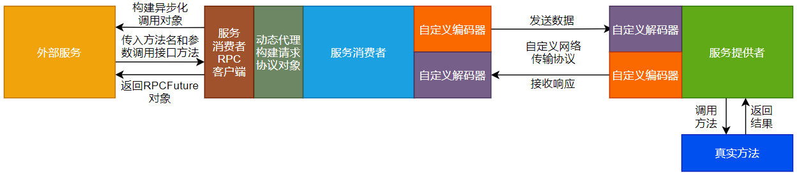
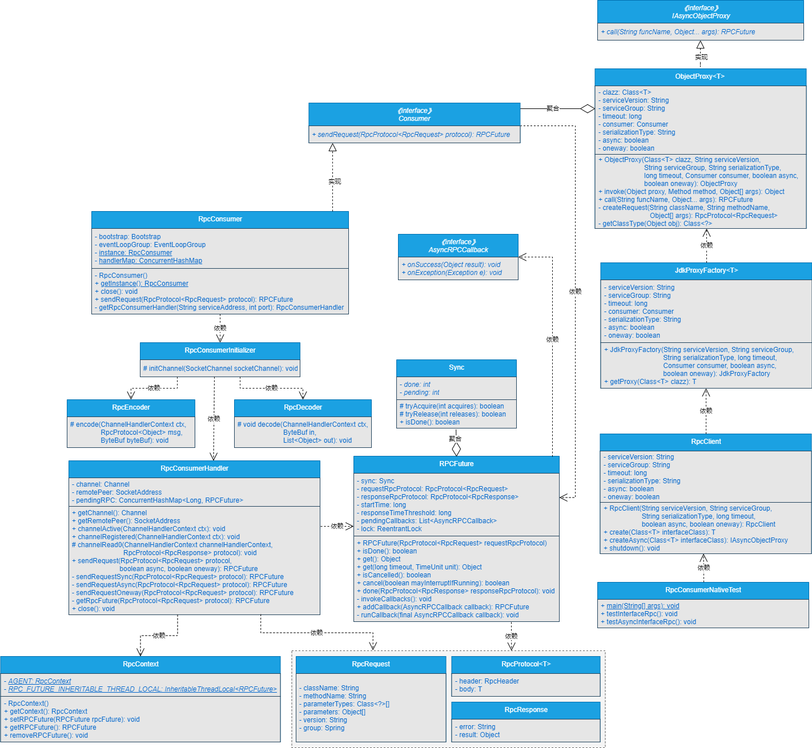

## **一、前言**


> 我想在服务消费者端动态代理实现异步调用，这个可以吗？


在前面的章节中，我们不仅实现了服务消费者与服务提供者之间进行同步、异步、单向和回调调用，并且在外部服务调用服务消费者时，服务消费者也屏蔽了底层Netty通信的细节信息。实现了在服务消费者端基于动态代理的功能屏蔽了构建请求协议对象的细节。跟进一步，我们也将动态代理整合进了服务消费者，实现了直接调用接口返回结果数据。


但是，细心的读者可以发现，通过直接调用接口方法的方式调用远程方法，底层采用的都是同步调用的方式。本章，我们一起将服务消费者增加动态代理后的调用方式扩展为同步方式和异步方式两种方式。


说干就干，我们一起开始吧。


## **二、目标**


> 目标很明确：就是在服务消费者端整合完动态代理后，支持同步调用的同时，也支持异步调用！


我们自己写的RPC框架，能够实现通过直接调用接口的方法来实现远程方法调用，这看起来比一般的RPC Demo程序强大。但是我们不能止步于此，细心的读者可能会发现，一个好的并且成熟的RPC框架，整合进动态代理后，也是可以支持同步调用和异步调用两种方式。


在前面的文章中，在服务消费者整合动态代理的部分，使用的同步调用的方式，那只支持同步调用的方式是远远不够的，我们还需要在自己写的RPC框架中支持异步调用。


本章，我们就要在服务消费者整合动态代理后，实现异步调用。


## **三、设计**


> 如果让你设计基于动态代理的异步调用，你会怎么设计呢？


消费者整合动态代理后，能够在RPC框架层面屏蔽掉构建请求协议对象的细节，直接通过接口的方法调用远程方法。在异步化设计上，可以基于接口的Class对象，通过RPC客户端生成异步化调用的对象，然后通过异步化调用对象的方法，传入要调用的方法名和参数实现异步调用，最终会返回一个RPCFuture对象，通过RPCFuture对象的get()方法获取最终的结果数据。


整个流程如图19-1所示。





由图19-1所示的流程可以看出，图19-1与第18章的图18-1整体流程相差不大，图19-1的整体流程如下所示。


（1）外部服务通过服务消费者RPC客户端构建异步化调用对象。

（2）外部服务通过异步化调用对象的方法，传入方法名和参数调用接口方法，实际上是通过动态代理调用远程方法。

（3）服务消费者端的动态代理模块，会根据外部服务传递过来的参数构建请求协议对象，这样就在RPC框架层面对外屏蔽了构建请求协议对象的细节。

（4）服务消费端代理模块构建完请求协议对象后，服务消费者会通过自定义网络传输协议和数据编解码将数据编码成二进制字节流，传输到服务提供者。

（5）服务提供者接收到二进制数据流后，通过自定义网络传输协议和数据编解码对数据进行解码，将解码出的数据作为参数调用真实方法。

（6）真实方法经过业务逻辑处理后，会将结果数据返回给服务提供者。

（7）服务提供者接收到真实方法返回的结果数据后，会通过自定义网络传输协议和数据编解码对数据进行编码，将数据编码成二进制字节流后传输给服务消费者。

（8）服务消费者接收到服务提供者响应的二进制流数据后，通过自定义网络传输协议和数据编解码对数据进行解码，将数据解码成明文数据，再通过异步化调用对象将封装有最终结果数据的RPCFuture对象返回给外部服务。


## **四、实现**


> 说了这么多，具体要怎么实现呢？


### **1.工程结构**


1. gxl-rpc-annotation：实现gxl-rpc框架的核心注解工程。
2. gxl-rpc-codec：实现gxl-rpc框架的自定义编解码功能。
3. gxl-rpc-common：实现gxl-rpc框架的通用工具类，包含服务提供者注解与服务消费者注解的扫描器。
4. gxl-rpc-constants：存放实现gxl-rpc框架通用的常量类。
5. gxl-rpc-consumer：服务消费者父工程
6. gxl-rpc-consumer-common：服务消费者通用工程
7. gxl-rpc-consumer-native：以纯Java方式启动gxl-rpc框架服务消费者的工程
8. gxl-rpc-protocol：实现gxl-rpc框架的自定义网络传输协议的工程。
9. gxl-rpc-provider：服务提供者父工程。
10. gxl-rpc-provider-common：服务提供者通用工程。
11. gxl-rpc-provider-native：以纯Java方式启动gxl-rpc框架服务提供者的工程。
12. gxl-rpc-proxy：服务消费者端动态代理父工程。
13. gxl-rpc-proxy-api：服务消费者端动态代理的通用接口工程。
14. gxl-rpc-proxy-jdk：服务消费者端基于JDK动态代理的工程。
15. gxl-rpc-serialization：实现gxl-rpc框架序列化与反序列化功能的父工程。
16. gxl-rpc-serialization-api：实现gxl-rpc框架序列化与反序列化功能的通用接口工程。
17. gxl-rpc-serialization-jdk：以JDK的方式实现序列化与反序列化功能。
18. gxl-rpc-test：测试gxl-rpc框架的父工程。
19. gxl-rpc-test-api：测试的通用Servcie接口工程
20. gxl-rpc-test-provider：测试服务提供者的工程。
21. gxl-rpc-test-consumer：测试服务消费者的工程
22. gxl-rpc-test-consumer-codec：测试服务消费者基于自定义网络协议与编解码与服务提供者进行数据交互
23. gxl-rpc-test-consumer-handler：测试屏蔽服务消费者基于Netty与服务提供者建立连接的细节后，与服务提供者进行数据通信
24. gxl-rpc-test-consumer-native：测试服务消费者整合动态代理实现直接调用接口返回结果数据
25. gxl-rpc-test-scanner：测试扫描器的工程。


### **2.核心类实现关系**


服务消费者整合动态代理后，实现异步调用的类关系如图19-2所示。




### **3.动态代理异步接口IAsyncObjectProxy的实现**


IAsyncObjectProxy接口位于gxl-rpc-proxy-api工程下的[io.gxl.rpc.proxy.api.async.IAsyncObjectProxy](http://io.gxl.rpc.proxy.api.async.iasyncobjectproxy/)，源码如下所示。


```java
public interface IAsyncObjectProxy {
        /**
        
        * 异步代理对象调用方法
          @param funcName 方法名称
        * @param args 方法参数
          @return 封装好的RPCFuture对象
      */
      RPCFuture call(String funcName, Object... args);
      }
```


可以看到，在IAsyncObjectProxy接口中，定义了一个call()方法，传入方法名和参数列表，返回RPCFuture对象。


### **4.修改ObjectProxy对象代理类**


ObjectProxy类位于gxl-rpc-proxy-api工程下的[io.gxl.rpc.proxy.api.object.ObjectProxy](http://io.gxl.rpc.proxy.api.object.objectproxy/)，修改的步骤如下所示。


**（1）实现IAsyncObjectProxy接口**

**
**

修改ObjectProxy类的定义，使其实现IAsyncObjectProxy接口，源码如下所示。


```java
public class ObjectProxy <T> implements IAsyncObjectProxy, InvocationHandler{

//################省略其他代码#######################

}
```

**
**

**（2）新增异步调用call()方法**

**
**

在ObjectProxy类中新增异步调用的call()方法，传入方法名和方法参数列表，调用远程方法，返回RPCFuture对象，源码如下所示。


```java
@Override

public RPCFuture call(String funcName, Object... args) {

RpcProtocol<RpcRequest> request = createRequest(this.clazz.getName(), funcName, args);

RPCFuture rpcFuture = null;

try {

     rpcFuture = this.consumer.sendRequest(request);

} catch (Exception e) {

     LOGGER.error("async all throws exception:{}", e);

}

return rpcFuture;

}
```

**
**

**（3）新增创建请求协议对象的createRequest()方法**

**
**

在ObjectProxy类中新增创建请求协议对象的createRequest()方法，传入类名、方法名和方法的参数列表来构建请求协议对象，源码如下所示。


```java

private RpcProtocol<RpcRequest> createRequest(String className, String methodName, Object[] args) {

RpcProtocol<RpcRequest> requestRpcProtocol = new RpcProtocol<RpcRequest>();

requestRpcProtocol.setHeader(RpcHeaderFactory.getRequestHeader(serializationType));

RpcRequest request = new RpcRequest();

request.setClassName(className);

request.setMethodName(methodName);

request.setParameters(args);

request.setVersion(this.serviceVersion);

request.setGroup(this.serviceGroup);


Class[] parameterTypes = new Class[args.length];

// Get the right class type

for (int i = 0; i < args.length; i++) {

     parameterTypes[i] = getClassType(args[i]);

}

request.setParameterTypes(parameterTypes);

requestRpcProtocol.setBody(request);


LOGGER.debug(className);

LOGGER.debug(methodName);

for (int i = 0; i < parameterTypes.length; ++i) {

     LOGGER.debug(parameterTypes[i].getName());

}

for (int i = 0; i < args.length; ++i) {

     LOGGER.debug(args[i].toString());

}

return requestRpcProtocol;

}
```

**
**

**（4）新增获取类型的getClassType()方法**

**
**

在ObjectProxy类中新增获取基本类型的getClassType()方法，主要功能就是根据传入的参数的类型名称，返回对应的类型。源码如下所示。


```java
private Class<?> getClassType(Object obj){

Class<?> classType = obj.getClass();

String typeName = classType.getName();

switch (typeName){

     case "java.lang.Integer":

       return Integer.TYPE;

     case "java.lang.Long":

       return Long.TYPE;

     case "java.lang.Float":

       return Float.TYPE;

     case "java.lang.Double":

       return Double.TYPE;

     case "java.lang.Character":

       return Character.TYPE;

     case "java.lang.Boolean":

       return Boolean.TYPE;

     case "java.lang.Short":

       return Short.TYPE;

     case "java.lang.Byte":

       return Byte.TYPE;

}

return classType;

}
```


### **5.修改RPC客户端RpcClient类**


在RpcClient类中新增createAsync()方法，主要用于构建异步化调用对象，源码如下所示。


```java
public <T> IAsyncObjectProxy createAsync(Class<T> interfaceClass) {

return new ObjectProxy<T>(interfaceClass, serviceVersion, serviceGroup, serializationType, timeout, RpcConsumer.getInstance(), async, oneway);

}
```


## **五、测试**


> 写好的功能不测试下怎么行？


### **1.修改RpcConsumerNativeTest测试类**


RpcConsumerNativeTest类位于gxl-rpc-test-consumer-native工程下的[io.gxl.test.consumer.RpcConsumerNativeTest](http://io.gxl.test.consumer.rpcconsumernativetest/)，在RpcConsumerNativeTest类中新增testAsyncInterfaceRpc()方法用于测试异步调用，源码如下所示。


```java
@Test

public void testAsyncInterfaceRpc() throws Exception {

RpcClient rpcClient = new RpcClient("1.0.0", "gxl", "jdk", 3000, false, false);

IAsyncObjectProxy demoService = rpcClient.createAsync(DemoService.class);

RPCFuture future = demoService.call("hello", "gxl");

LOGGER.info("返回的结果数据===>>> " + future.get());

rpcClient.shutdown();

}
```


### **2.启动服务提供者**


启动gxl-rpc-test-provider工程下的[io.gxl.rpc.test.provider.single.RpcSingleServerTest](http://io.gxl.rpc.test.provider.single.rpcsingleservertest/)类，输出的结果信息如下所示。


INFO BaseServer:82 - Server started on 127.0.0.1:27880


可以看到，服务提供者启动成功。


### **3.启动服务消费者**


运行gxl-rpc-test-consumer-native工程下的[io.gxl.test.consumer.RpcConsumerNativeTest](http://io.gxl.test.consumer.rpcconsumernativetest/)类中的testAsyncInterfaceRpc()方法，输出的结果信息如下所示。


12:24:44,838  INFO RpcConsumer:103 - connect rpc server 127.0.0.1 on port 27880 success.

12:24:44,960  INFO RpcConsumerHandler:90 - 服务消费者发送的数据===>>>{"body":{"async":false,"className":"io.gxl.rpc.test.api.DemoService","group":"gxl","methodName":"hello","oneway":false,"parameterTypes":["java.lang.String"],"parameters":["gxl"],"version":"1.0.0"},"header":{"magic":16,"msgLen":0,"msgType":1,"requestId":1,"serializationType":"jdk","status":1}}

12:24:45,106  INFO RpcConsumerHandler:77 - 服务消费者接收到的数据===>>>{"body":{"async":false,"oneway":false,"result":"hello gxl"},"header":{"magic":16,"msgLen":211,"msgType":2,"requestId":1,"serializationType":"jdk","status":0}}

12:24:45,107  INFO RpcConsumerNativeTest:57 - 返回的结果数据===>>> hello gxl


可以看到，在服务消费者端打印的日志中，包含了如下信息：

1. 服务消费者连接服务提供者的日志。
2. 服务消费者发送的数据，其中服务消费者向服务提供者发送的参数为gxl。
3. 服务消费者接收到的数据：最终的结果数据是hello gxl。
4. 打印的返回的结果数据为：hello gxl。


服务预期的效果。


### **4.再次查看服务提供者的日志**


再次查看服务提供者输出的日志信息，如下所示。


12:24:45,032  INFO RpcProviderHandler:132 - use cglib reflect type invoke method...

12:24:45,084  INFO ProviderDemoServiceImpl:33 - 调用hello方法传入的参数为===>>>gxl


可以看到，服务提供者的日志信息中，输出了使用CGLib的方式调用方法，并在真实的方法中输出了传入的参数为gxl。


整体服务预期的效果。


## **六、总结**


> 实现了功能不总结下怎么行？


目前实现的RPC框架以Java原生进程的方式启动后，能够实现服务消费者以同步、异步和单向调用以及回调的方式与服务提供者之间进行数据交互，并且通过回调方法，服务消费者会主动将数据传递给外部服务。在此基础上我们在服务消费者端新增了动态代理模块，并将动态代理模块整合进服务消费者的流程中。同时，服务消费者整合动态代理后，扩展支持了同步调用和异步调用两种调用方式。


总之，我们写的RPC框架正在一步步实现它该有的功能。