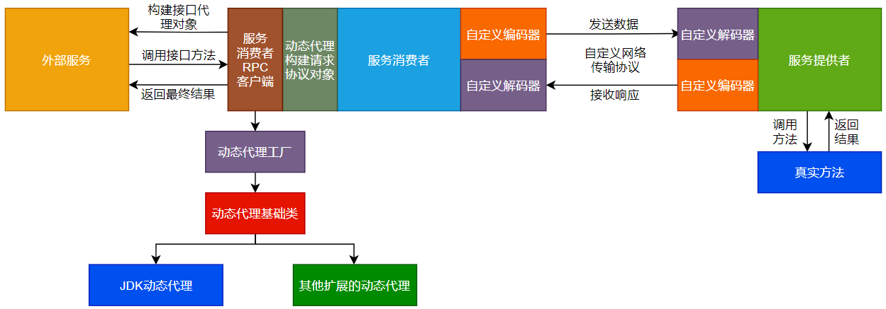
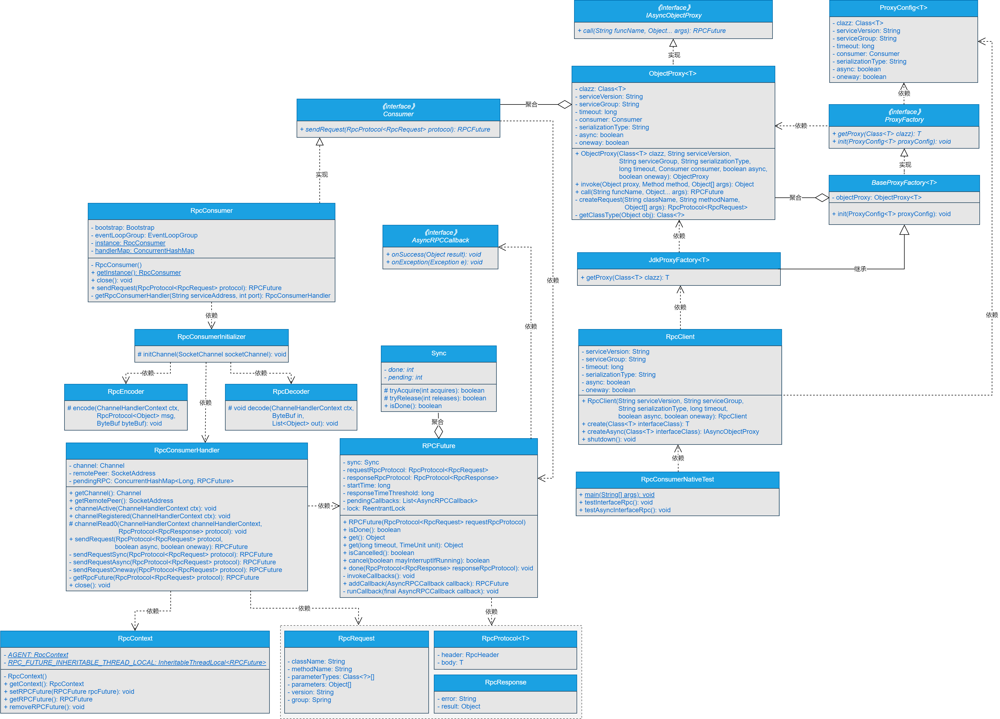

之前在服务消费者端实现了动态代理，在RPC框架层面屏蔽了创建请求协议对象的信息，这次，我想对动态代理进行扩展优化。


## **一、前言**


> 写完就算完事儿了吗？不，你还要进行扩展优化！


在前面的章节中，我们不仅实现了服务消费者与服务提供者之间进行同步、异步、单向和回调调用，并且在外部服务调用服务消费者时，服务消费者也屏蔽了底层Netty通信的细节信息。实现了在服务消费者端基于动态代理的功能屏蔽了构建请求协议对象的细节。我们也将动态代理整合进了服务消费者，实现了直接调用接口返回结果数据。更进一步的，将服务消费者增加动态代理后的调用方式扩展为同步方式和异步方式两种方式。


但是，在RPC客户端RpcClient类中，基于接口的Class对象创建动态代理的方法扩展性不高，这里，我们需要进行优化。


说干就干，我们一起开始吧。


## **二、目标**


> 目标很明确：对消费者端封装RPC远程通信的动态代理进行扩展优化！


目前，我们一起手写的RPC框架，在服务提供者端实现了不依赖任何第三方框架的包扫描功能，能够将标注有@RpcService的注解注册到本地Map中。在服务消费者端能够实现通过直接调用接口的方法来实现远程方法调用，服务消费者整合动态代理后支持同步调用和异步调用两种方式。

开发到这种程度，我相信比一般的RPC Demo程序更加强大。但是，出于对技术的执着追求，我们不能止步于此，在正式进入注册中心部分的开发外，还需要完成一些扩展和优化的事项，就比如这次需要对消费者端封装RPC远程通信的动态代理进行扩展优化。

那怎么办呢？还能怎么办呢？撸起袖子加油干吧！


## **三、设计**


> 如果让你设计扩展优化消费者端封装RPC远程通信的动态代理，你会怎么设计呢？


对消费者端封装RPC远程通信的动态代理进行扩展优化后的整体流程如图20-1所示。





由图20-1可以看出，消费者整合动态代理实现直接调用接口返回结果数据的大致流程如下所示：


（1）外部服务通过服务消费者RPC客户端构建接口代理对象。

（2）服务消费者RPC客户端会根据动态代理工厂接口，动态创建JDK动态代理对象或者其他扩展的动态代理对象。

（3）外部服务调用接口方法，实际上是调用的接口动态代理对象里的方法来调用远程方法。

（4）服务消费者端的动态代理模块，会根据外部服务传递过来的参数构建请求协议对象，这样就在RPC框架层面对外屏蔽了构建请求协议对象的细节。

（5）服务消费端代理模块构建完请求协议对象后，会通过自定义网络传输协议和数据编解码对数据编码成二进制字节流，传输到服务提供者。

（6）服务提供者接收到二进制数据流后，通过自定义网络传输协议和数据编解码对数据进行解码，将解码出的数据作为参数调用真实方法。

（7）真实方法经过业务逻辑处理后，会将结果数据返回给服务提供者。

（8）服务提供者接收到真实方法返回的结果数据后，会通过自定义网络传输协议和数据编解码对数据进行编码，将数据编码成二进制字节流后传输给服务消费者。

（9）服务消费者接收到服务提供者响应的二进制流数据后，通过自定义网络传输协议和数据编解码对数据进行解码，将数据解码成明文数据，再通过接口的动态代理对象将最终的结果返回给外部服务。


## **四、实现**


> 说了这么多，具体要怎么实现呢？


### **1.工程结构**


1. gxl-rpc-annotation：实现gxl-rpc框架的核心注解工程。
2. gxl-rpc-codec：实现gxl-rpc框架的自定义编解码功能。
3. gxl-rpc-common：实现gxl-rpc框架的通用工具类，包含服务提供者注解与服务消费者注解的扫描器。
4. gxl-rpc-constants：存放实现gxl-rpc框架通用的常量类。
5. gxl-rpc-consumer：服务消费者父工程
6. gxl-rpc-consumer-common：服务消费者通用工程
7. gxl-rpc-consumer-native：以纯Java方式启动gxl-rpc框架服务消费者的工程
8. gxl-rpc-protocol：实现gxl-rpc框架的自定义网络传输协议的工程。
9. gxl-rpc-provider：服务提供者父工程。
10. gxl-rpc-provider-common：服务提供者通用工程。
11. gxl-rpc-provider-native：以纯Java方式启动gxl-rpc框架服务提供者的工程。
12. gxl-rpc-proxy：服务消费者端动态代理父工程。
13. gxl-rpc-proxy-api：服务消费者端动态代理的通用接口工程。
14. gxl-rpc-proxy-jdk：服务消费者端基于JDK动态代理的工程。
15. gxl-rpc-serialization：实现gxl-rpc框架序列化与反序列化功能的父工程。
16. gxl-rpc-serialization-api：实现gxl-rpc框架序列化与反序列化功能的通用接口工程。
17. gxl-rpc-serialization-jdk：以JDK的方式实现序列化与反序列化功能。
18. gxl-rpc-test：测试gxl-rpc框架的父工程。
19. gxl-rpc-test-api：测试的通用Servcie接口工程
20. gxl-rpc-test-provider：测试服务提供者的工程。
21. gxl-rpc-test-consumer：测试服务消费者的工程
22. gxl-rpc-test-consumer-codec：测试服务消费者基于自定义网络协议与编解码与服务提供者进行数据交互
23. gxl-rpc-test-consumer-handler：测试屏蔽服务消费者基于Netty与服务提供者建立连接的细节后，与服务提供者进行数据通信
24. gxl-rpc-test-consumer-native：测试服务消费者整合动态代理实现直接调用接口返回结果数据
25. gxl-rpc-test-scanner：测试扫描器的工程。


### **2.核心类实现关系**


对消费者端封装RPC远程通信的动态代理进行扩展优化后的核心类关系如图20-2所示。




### **3.新增ProxyConfig代理配置类**


ProxyConfig类位于gxl-rpc-proxy-api工程下的[io.gxl.rpc.proxy.api.config.ProxyConfig](http://io.gxl.rpc.proxy.api.config.proxyconfig/)，源码如下所示。


```java
public class ProxyConfig<T> implements Serializable {
private static final long serialVersionUID = 6648940252795742398L;
/**

* 接口的Class实例
  /
  private Class<T> clazz;
  /**
    * 服务版本号
      /
      private String serviceVersion;
      /**
    * 服务分组
      /
      private String serviceGroup;
  /**
    * 超时时间
      /
      private long timeout;
  /**
    * 消费者接口
      /
      private Consumer consumer;
  /**
    * 序列化类型
      /
      private String serializationType;
  /**
    * 是否异步调用
      /
      private boolean async;
  /**
    * 是否单向调用
      /
      private boolean oneway;

    //#################省略getter/setter###################
}
```


### **4.新增动态代理ProxyFactory工厂类**


ProxyFactory类位于gxl-rpc-proxy-api工程下的[io.gxl.rpc.proxy.api.ProxyFactory](http://io.gxl.rpc.proxy.api.proxyfactory/)，源码如下所示。


```java
public interface ProxyFactory {

/**

\* 获取代理对象

*/

   <T> T getProxy(Class<T> clazz);


/**

\* 默认初始化方法

*/

default <T> void init(ProxyConfig<T> proxyConfig){}

}
```


可以看到，在ProxyFactory接口中，定义了一个根据Class对象获取动态代理对象的getProxy()方法，和一个根据ProxyConfig类进行初始化的init()默认方法。


### **5.新增BaseProxyFactory基础代理类**


BaseProxyFactory类位于gxl-rpc-proxy-api工程下的[io.gxl.rpc.proxy.api.BaseProxyFactory](http://io.gxl.rpc.proxy.api.baseproxyfactory/)，源码如下所示。


```java
public abstract class BaseProxyFactory<T> implements ProxyFactory {

protected ObjectProxy<T> objectProxy;

@Override

public <T> void init(ProxyConfig<T> proxyConfig) {

     this.objectProxy = new ObjectProxy(proxyConfig.getClazz(),

         proxyConfig.getServiceVersion(),

         proxyConfig.getServiceGroup(),

         proxyConfig.getSerializationType(),

         proxyConfig.getTimeout(),

         proxyConfig.getConsumer(),

         proxyConfig.getAsync(),

         proxyConfig.getOneway());

}

}
```


可以看到，在BaseProxyFactory类中定义了一个ObjectProxy类型的成员变量objectProxy，并实现了init()方法，在init()方法中通过ProxyConfig对象创建ObjectProxy对象，并为objectProxy成员变量赋值。


### **6.修改JdkProxyFactory动态代理实现类**


JdkProxyFactory类位于gxl-rpc-proxy-jdk工程下的[io.gxl.rpc.proxy.jdk.JdkProxyFactory](http://io.gxl.rpc.proxy.jdk.jdkproxyfactory/)，对于JdkProxyFactory类的改造步骤如下所示。


（1）使JdkProxyFactory类继承BaseProxyFactory类并实现ProxyFactory接口。

（2）去除JdkProxyFactory类中的成员变量和构造方法。

（3）最终修改后的JdkProxyFactory类的源码如下所示。


```java
public class JdkProxyFactory<T> extends BaseProxyFactory<T> implements ProxyFactory {

@Override

public <T> T getProxy(Class<T> clazz) {

     return (T) Proxy.newProxyInstance(

         clazz.getClassLoader(),

         new Class<?>[]{clazz},

         objectProxy

     );

}

}
```


可以看到，修改后的JdkProxyFactory类的源码精简了许多。


### **7.修改RPC客户端RpcClient类**


RpcClient类位于gxl-rpc-consumer-native工程下的[io.gxl.rpc.consumer.RpcClient](http://io.gxl.rpc.consumer.rpcclient/)，这里，主要是修改RpcClient类的create(Class<T> interfaceClass)方法，修改后的create(Class<T> interfaceClass)方法的源码如下所示。


```java
public <T> T create(Class<T> interfaceClass) {

ProxyFactory proxyFactory = new JdkProxyFactory<T>();

proxyFactory.init(new ProxyConfig(interfaceClass, serviceVersion, serviceGroup, serializationType, timeout, RpcConsumer.getInstance(), async, oneway));

return proxyFactory.getProxy(interfaceClass);

}
```


可以看到，创建JdkProxyFactory类的对象后赋值给ProxyFactory接口类型的变量proxyFactory，再通过proxyFactory对象的init()方法创建ObjectProxy对象，最终通过proxyFactory对象的getProxy()创建代理对象。

在create()方法中，使得创建接口动态代理对象的方法在一定程度上具备了扩展性，也为后续SPI技术的引入打下了良好的基础。


## **五、测试**


> 写好的功能不测试下怎么行？


### **1.启动服务提供者**


启动gxl-rpc-test-provider工程下的[io.gxl.rpc.test.provider.single.RpcSingleServerTest](http://io.gxl.rpc.test.provider.single.rpcsingleservertest/)类，输出的结果信息如下所示。


INFO BaseServer:82 - Server started on 127.0.0.1:27880


可以看到，服务提供者启动成功。


### **2.启动服务消费者**


运行gxl-rpc-test-consumer-native工程下的[io.gxl.test.consumer.RpcConsumerNativeTest](http://io.gxl.test.consumer.rpcconsumernativetest/)类中的testInterfaceRpc()方法，输出的结果信息如下所示。


12:25:38,240  INFO RpcConsumer:103 - connect rpc server 127.0.0.1 on port 27880 success.

12:25:38,397  INFO RpcConsumerHandler:90 - 服务消费者发送的数据===>>>{"body":{"async":false,"className":"io.gxl.rpc.test.api.DemoService","group":"gxl","methodName":"hello","oneway":false,"parameterTypes":["java.lang.String"],"parameters":["gxl"],"version":"1.0.0"},"header":{"magic":16,"msgLen":0,"msgType":1,"requestId":1,"serializationType":"jdk","status":1}}

12:25:38,592  INFO RpcConsumerHandler:77 - 服务消费者接收到的数据===>>>{"body":{"async":false,"oneway":false,"result":"hello gxl"},"header":{"magic":16,"msgLen":211,"msgType":2,"requestId":1,"serializationType":"jdk","status":0}}

12:25:38,592  INFO RpcConsumerNativeTest:48 - 返回的结果数据===>>> hello gxl

可以看到，在服务消费者端打印的日志中，包含了如下信息：


1. 服务消费者连接服务提供者的日志。
2. 服务消费者发送的数据，其中服务消费者向服务提供者发送的参数为gxl。
3. 服务消费者接收到的数据：最终的结果数据是hello gxl。
4. 打印的返回的结果数据为：hello gxl。


服务预期的效果。


### **3.再次查看服务提供者的日志**


再次查看服务提供者输出的日志信息，如下所示。


12:25:38,500  INFO RpcProviderHandler:132 - use cglib reflect type invoke method...

12:25:38,564  INFO ProviderDemoServiceImpl:33 - 调用hello方法传入的参数为===>>>gxl


可以看到，服务提供者的日志信息中，输出了使用CGLib的方式调用方法，并在真实的方法中输出了传入的参数为gxl。


整体服务预期的效果。


## **六、总结**


> 实现了功能不总结下怎么行？


目前实现的RPC框架以Java原生进程的方式启动后，能够实现服务消费者以同步、异步和单向调用以及回调的方式与服务提供者之间进行数据交互，并且通过回调方法，服务消费者会主动将数据传递给外部服务。在此基础上我们在服务消费者端新增了动态代理模块，并将动态代理模块整合进服务消费者的流程中。在服务消费者整合动态代理后，也扩展支持了同步调用和异步调用两种调用方式。同时，对消费者端封装RPC远程通信的动态代理进行了进一步的扩展和优化。


总之，我们写的RPC框架正在一步步实现它该有的功能。