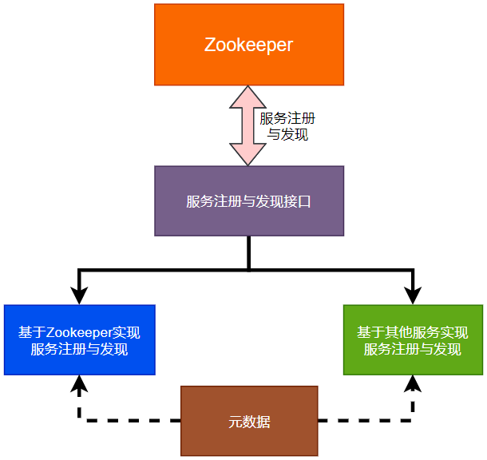
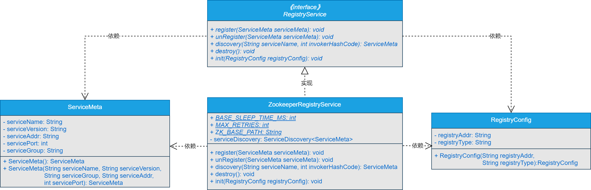

## **一、前言**


> RPC框架缺少了注册中心，那怎么行？要搞定它！


目前实现的RPC框架以Java原生进程的方式启动后，能够实现服务消费者以同步、异步和单向调用以及回调的方式与服务提供者之间进行数据交互，并且通过回调方法，服务消费者会主动将数据传递给外部服务。在此基础上我们在服务消费者端新增了动态代理模块，并将动态代理模块整合进服务消费者的流程中。在服务消费者整合动态代理后，也扩展支持了同步调用和异步调用两种调用方式。同时，对消费者端封装RPC远程通信的动态代理进行了进一步的扩展和优化。


但是，我们现在写的RPC框架中，服务消费者调用服务提供者时，在服务消费者一端，对服务提供者的IP和端口进行了硬编码，写死到了服务消费者的代码中。这种编码方式的缺点就是一旦服务提供者部署的服务器或者端口发生了变化，那就需要手动修改服务消费者的代码了，而且还不是修改自己业务中的代码，是要修改RPC框架中服务消费者端的代码，修改完要重新打包引入到项目中，这种方式是万万不可取的。


那怎么办呢？怎么解决需要修改服务消费者代码的问题呢？那就是：引入注册中心进行服务治理。


## **二、目标**


> 明确目标：新增注册中心基础服务能力。


目前，我们一起手写的RPC框架，在服务提供者端实现了不依赖任何第三方框架的包扫描功能，能够将标注有@RpcService的注解注册到本地Map中。在服务消费者端能够实现通过直接调用接口的方法来实现远程方法调用，服务消费者整合动态代理后支持同步调用和异步调用两种方式。


但是，现在框架还不能做到服务治理功能，那怎么办？接下来，就要逐步引入服务注册中心，实现服务治理功能。本章，我们就先实现服务注册中心的基础功能。


说干就干，我们开始吧。


## **三、设计**


> 如果让你设计服务注册中心的基础功能，你会怎么设计呢？


本章，我们以Zookeeper为例，实现注册中心的基础功能，以Zookeeper为例实现的注册中心基础功能的流程如图21-1所示。





由图21-1可以看出如下信息：


（1）设计服务注册到注册中心的元数据，例如服务的名称、服务的版本号、服务地址、服务端口和服务分组等信息，元数据会贯穿整个服务的注册与发现流程。

（2）会定义服务注册与发现的接口，对外提供服务注册与发现的方法。

（3）基于服务注册与发现的接口，会实现多个服务注册与发现的实现类，每个实现类对应着一种注册中心服务。

（4）本章以Zookeeper为例实现注册中心，后续会进行扩展。


## **四、实现**


> 说了这么多，具体要怎么实现呢？


### **1.工程结构**


1. gxl-rpc-annotation：实现gxl-rpc框架的核心注解工程。
2. gxl-rpc-codec：实现gxl-rpc框架的自定义编解码功能。
3. gxl-rpc-common：实现gxl-rpc框架的通用工具类，包含服务提供者注解与服务消费者注解的扫描器。
4. gxl-rpc-constants：存放实现gxl-rpc框架通用的常量类。
5. gxl-rpc-consumer：服务消费者父工程
6. gxl-rpc-consumer-common：服务消费者通用工程
7. gxl-rpc-consumer-native：以纯Java方式启动gxl-rpc框架服务消费者的工程
8. gxl-rpc-protocol：实现gxl-rpc框架的自定义网络传输协议的工程。
9. gxl-rpc-provider：服务提供者父工程。
10. gxl-rpc-provider-common：服务提供者通用工程。
11. gxl-rpc-provider-native：以纯Java方式启动gxl-rpc框架服务提供者的工程。
12. gxl-rpc-proxy：服务消费者端动态代理父工程。
13. gxl-rpc-proxy-api：服务消费者端动态代理的通用接口工程。
14. gxl-rpc-proxy-jdk：服务消费者端基于JDK动态代理的工程。
15. gxl-rpc-registry：服务注册与发现父工程（**第21章新增**）。
16. gxl-rpc-registry-api：服务注册与发现通用接口工程（**第21章新增**）。
17. gxl-rpc-registry-zookeeper：基于Zookeeper实现服务注册与发现的工程（**第21章新增**）。
18. gxl-rpc-serialization：实现gxl-rpc框架序列化与反序列化功能的父工程。
19. gxl-rpc-serialization-api：实现gxl-rpc框架序列化与反序列化功能的通用接口工程。
20. gxl-rpc-serialization-jdk：以JDK的方式实现序列化与反序列化功能。
21. gxl-rpc-test：测试gxl-rpc框架的父工程。
22. gxl-rpc-test-api：测试的通用Servcie接口工程
23. gxl-rpc-test-provider：测试服务提供者的工程。
24. gxl-rpc-test-registry：测试服务注册与发现的工程（**第21章新增**）。
25. gxl-rpc-test-consumer：测试服务消费者的工程
26. gxl-rpc-test-consumer-codec：测试服务消费者基于自定义网络协议与编解码与服务提供者进行数据交互
27. gxl-rpc-test-consumer-handler：测试屏蔽服务消费者基于Netty与服务提供者建立连接的细节后，与服务提供者进行数据通信
28. gxl-rpc-test-consumer-native：测试服务消费者整合动态代理实现直接调用接口返回结果数据
29. gxl-rpc-test-scanner：测试扫描器的工程。


### **2.核心类实现关系**


实现注册中心基础功能的核心类之间的关系如图21-2所示。





### **3.服务元数据ServiceMeta类的实现**


ServiceMeta类位于gxl-rpc-protocol工程下的[io.gxl.rpc.protocol.meta.ServiceMeta](http://io.gxl.rpc.protocol.meta.servicemeta/)，源码如下所示。


```java
public class ServiceMeta implements Serializable {
private static final long serialVersionUID = 6289735590272020366L;
/**
* 服务名称
*/
private String serviceName;
/**
* 服务版本号
*/
private String serviceVersion;
/**
* 服务地址
*/
private String serviceAddr;
/**
* 服务端口
*/
private int servicePort;
/**
* 服务分组
*/
private String serviceGroup;

    public ServiceMeta() {
    }
    public ServiceMeta(String serviceName, String serviceVersion, String serviceGroup, String serviceAddr, int servicePort) {
        this.serviceName = serviceName;
        this.serviceVersion = serviceVersion;
        this.serviceAddr = serviceAddr;
        this.servicePort = servicePort;
        this.serviceGroup = serviceGroup;
    }
    //###########省略getter/setter方法############
}
```


可以看到，在ServiceMeta类中，主要定义了服务名称、服务版本号、服务地址、服务端口和服务分组等信息，这些也是要注册到注册中心中的元数据。


### **4.注册配置类RegistryConfig的实现**


RegistryConfig类主要位于gxl-rpc-registry-api工程下的[io.gxl.rpc.registry.api.config.RegistryConfig](http://io.gxl.rpc.registry.api.config.registryconfig/)，源码如下所示。


```java
public class RegistryConfig implements Serializable {

private static final long serialVersionUID = -7248658103788758893L;

/**

\* 注册地址

*/

private String registryAddr;

/**

\* 注册类型

*/

private String registryType;


public RegistryConfig(String registryAddr, String registryType) {

     this.registryAddr = registryAddr;

     this.registryType = registryType;

}

//###########省略getter/setter方法############

}
```


### **5.服务注册与发现接口RegistryService的实现**


RegistryService接口位于gxl-rpc-registry-api工程下的[io.gxl.rpc.registry.api.RegistryService](http://io.gxl.rpc.registry.api.registryservice/)，源码如下所示。


```java
public interface RegistryService {
/** 服务注册
* @param serviceMeta 服务元数据
* @throws Exception 抛出异常
*/
void register(ServiceMeta serviceMeta) throws Exception;
/**
* 服务取消注册
* @param serviceMeta 服务元数据
* @throws Exception 抛出异常
*/
void unRegister(ServiceMeta serviceMeta) throws Exception;
/**
* 服务发现
* @param serviceName 服务名称
* @param invokerHashCode HashCode值
* @return 服务元数据
* @throws Exception 抛出异常
*/
ServiceMeta discovery(String serviceName, int invokerHashCode) throws Exception;
/**
* 服务销毁
* @throws IOException 抛出异常
*/
void destroy() throws IOException;
/**
* 默认初始化方法
*/
default void init(RegistryConfig registryConfig) throws Exception {

    }
}
```


可以看到，在RegistryService接口中，主要定义了与服务注册和发现相关的方法，并且也定义了一个init()默认方法，init()默认方法也会交由实现类实现，创建实现类的对象后，会调用init()方法进行初始化。


### **6.服务注册与发现类ZookeeperRegistryService的实现**


ZookeeperRegistryService类位于gxl-rpc-registry-zookeeper工程下的[io.gxl.rpc.registry.zookeeper.ZookeeperRegistryService](http://io.gxl.rpc.registry.zookeeper.zookeeperregistryservice/)，ZookeeperRegistryService类是基于Zookeeper实现的服务注册与发现类。主要的实现步骤如下所示。


**（1）定义常量和成员变量**

**
**

在ZookeeperRegistryService类中定义相关的常量和成员变量，源码如下所示。


```java
public static final int BASE_SLEEP_TIME_MS = 1000;

public static final int MAX_RETRIES = 3;

public static final String ZK_BASE_PATH = "/gxl_rpc";

private ServiceDiscovery<ServiceMeta> serviceDiscovery;

```


具体说明如下所示。

1. BASE_SLEEP_TIME_MS：初始化CuratorFramework客户端时，进行连接重试的间隔时间。
2. MAX_RETRIES：初始化CuratorFramework客户端时，进行连接重试的最大重试次数。
3. ZK_BASE_PATH：服务注册到Zookeeper的根路径，我们写的RPC框架的根目录为/gxl_rpc。
4. serviceDiscovery：服务注册与发现的ServiceDiscovery类实例。


**（2）实现init()初始化方法**

**
**

在ZookeeperRegistryService类中首先实现init()方法，源码如下所示。


```java
@Override

public void init(RegistryConfig registryConfig) throws Exception {

CuratorFramework client = CuratorFrameworkFactory.newClient(registryConfig.getRegistryAddr(), new ExponentialBackoffRetry(BASE_SLEEP_TIME_MS, MAX_RETRIES));

client.start();

JsonInstanceSerializer<ServiceMeta> serializer = new JsonInstanceSerializer<>(ServiceMeta.class);

this.serviceDiscovery = ServiceDiscoveryBuilder.builder(ServiceMeta.class)

     .client(client)

     .serializer(serializer)

     .basePath(ZK_BASE_PATH)

     .build();

this.serviceDiscovery.start();

}
```


可以看到，在init()放大中，主要是构建CuratorFramework客户端，并初始化serviceDiscovery。


**（3）实现register()服务注册方法**

**
**

register()方法主要是使用serviceDiscovery将ServiceMeta元数据注册到Zookeeper中，源码如下所示。


```java
@Override

public void register(ServiceMeta serviceMeta) throws Exception {

ServiceInstance<ServiceMeta> serviceInstance = ServiceInstance

     .<ServiceMeta>builder()

     .name(RpcServiceHelper.buildServiceKey(serviceMeta.getServiceName(), serviceMeta.getServiceVersion(), serviceMeta.getServiceGroup()))

     .address(serviceMeta.getServiceAddr())

     .port(serviceMeta.getServicePort())

     .payload(serviceMeta)

     .build();

serviceDiscovery.registerService(serviceInstance);

}
```

**
**

**（4）实现unRegister()服务移除方法**

**
**

unRegister()方法主要是移除Zookeeper中注册的对应的元数据，源码如下所示。


```java
@Override

public void unRegister(ServiceMeta serviceMeta) throws Exception {

ServiceInstance<ServiceMeta> serviceInstance = ServiceInstance

     .<ServiceMeta>builder()

     .name(serviceMeta.getServiceName())

     .address(serviceMeta.getServiceAddr())

     .port(serviceMeta.getServicePort())

     .payload(serviceMeta)

     .build();

serviceDiscovery.unregisterService(serviceInstance);

}
```

**
**

**（5）实现discovery()服务发现方法**


discovery()方法主要是根据传入的serviceName和invokerHashCode从Zookeeper中获取对应的ServiceMeta元数据信息，源码如下所示。


```java
@Override

public ServiceMeta discovery(String serviceName, int invokerHashCode) throws Exception {

Collection<ServiceInstance<ServiceMeta>> serviceInstances = serviceDiscovery.queryForInstances(serviceName);

ServiceInstance<ServiceMeta> instance = this.selectOneServiceInstance((List<ServiceInstance<ServiceMeta>>) serviceInstances);

if (instance != null) {

     return instance.getPayload();

}

return null;

}
```


这里，为了重点实现服务注册中心的基础功能，也就是实现服务的注册与发现功能，在discovery()方法中并没有使用到参数invokerHashCode，参数invokerHashCode还会在后续扩展负载均衡策略时使用，这里先扩展这个参数。


可以看到，在discovery()方法中从serviceInstances元数据列表中选择一个元数据对象时，使用了selectOneServiceInstance()方法，selectOneServiceInstance()方法的源码如下所示。


```java
private ServiceInstance<ServiceMeta> selectOneServiceInstance(List<ServiceInstance<ServiceMeta>> serviceInstances){

if (serviceInstances == null || serviceInstances.isEmpty()){

     return null;

}

Random random = new Random();

int index = random.nextInt(serviceInstances.size());

return serviceInstances.get(index);

}
```


selectOneServiceInstance()方法的实现也比较简单，就是从0~serviceInstances列表的长度之间，随机生成一个整数类型的随机数作为下标索引值，从serviceInstances列表中随机获取一个元数据对象即可。


**（6）实现destroy()销毁方法**

**
**

destroy()方法主要是通过调用serviceDiscovery对象的close()方法，关闭与Zookeeper的连接，也就是销毁与Zookeeper的连接。源码如下所示。


```java
@Override

public void destroy() throws IOException {

serviceDiscovery.close();

}
```


## **五、测试**


> 写好的功能不测试下怎么行？


在gxl-rpc-test-registry工程下的[io.gxl.rpc.test.registry](http://io.gxl.rpc.test.registry/)包下新建ZookeeperRegistryTest类，用于测试服务的注册与发现功能。ZookeeperRegistryTest类的实现也比较简单，这里我直接给出ZookeeperRegistryTest类的源代码，如下所示。


```java
public class ZookeeperRegistryTest {

private RegistryService registryService;

private ServiceMeta serviceMeta;

@Before

public void init() throws Exception{

     RegistryConfig registryConfig = new RegistryConfig("127.0.0.1:2181", "zookeeper");

     this.registryService = new ZookeeperRegistryService();

     this.registryService.init(registryConfig);

     this.serviceMeta = new ServiceMeta(ZookeeperRegistryTest.class.getName(), "1.0.0", "gxl", "127.0.0.1", 8080);

}

@Test

public void testRegister() throws Exception {

     this.registryService.register(serviceMeta);

}

@Test

public void testUnRegister() throws Exception {

     this.registryService.unRegister(serviceMeta);

}

@Test

public void testDiscovery() throws Exception {

     this.registryService.discovery(RegistryService.class.getName(), "gxl".hashCode());

}

@Test

public void testDestroy() throws IOException {

     this.registryService.destroy();

}

}

```


接下来，在本机启动Zookeeper，运行ZookeeperRegistryTest类中的每个标注有@Test注解的方法，登录Zookeeper的客户端查看/gxl_rpc目录下内容的变化。


**测试流程比较简单，这里，我就不细说了，大家可以自己运行ZookeeperRegistryTest类中标注有@Test注解的方法，并查看Zookeeper中/gxl_rpc目录下内容的变化情况。**


## **六、总结**


> 实现了功能不总结下怎么行？


目前实现的RPC框架以Java原生进程的方式启动后，能够实现服务消费者以同步、异步和单向调用以及回调的方式与服务提供者之间进行数据交互，并且通过回调方法，服务消费者会主动将数据传递给外部服务。在此基础上我们在服务消费者端新增了动态代理模块，并将动态代理模块整合进服务消费者的流程中。在服务消费者整合动态代理后，也扩展支持了同步调用和异步调用两种调用方式。同时，对消费者端封装RPC远程通信的动态代理进行了进一步的扩展和优化。


直到现在，这个RPC框架在基础功能上还缺少了服务注册与发现功能，所以，本章，我们先实现了注册中心的基础服务功能。在后续的几章中，我们会逐步完善注册中心的各项功能。


总之，我们写的RPC框架正在一步步实现它该有的功能。