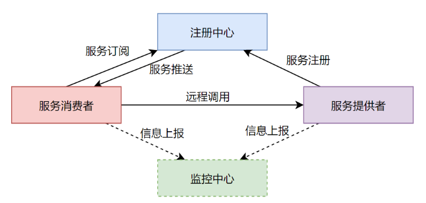

# 核心注解的设计
一个完整的RPC框架其实是包含四个大的部分，分别是服务提供者、服务消费者、注册中心和监控中心。



而对于RPC的注解设计来说，往往最核单独心的就是设计服务提供者和服务消费者的注解。接下来，我们就对服务提供者和服务消费者的注解进行针对性的设计。

## 1 设计服务提供者注解
### 1.1 服务提供者注解设计的逻辑

一个极简的服务提供者注册到注册中心的元数据应该包含如下几部分：服务名称、服务版本号、服务地址、服务端口号、服务分组信息。

- 服务名称：服务的名称往往是提供服务的接口的完整类名。
- 服务版本号：标识当前服务的版本号，以版本号的形式来区分不同版本所提供的不同服务。
- 服务地址：服务提供者发布的服务所在的网络地址，往往是一个IP地址或者域名。
- 服务端口号：服务提供者发布的服务所监听的端口号。
- 服务分组：对不同的服务进行分组，达到服务隔离的效果。

接下来，我们再次思考下，其实对于一个应用程序来说，启动后一个应用程序监听一个IP地址/域名和端口就足够了，而不需要为同一个应用程序中的每一个RPC服务都单独去监听一个IP地址/域名和端口，我们只需要为服务提供者所在的项目工程统一配置服务监听的IP地址/域名和端口号即可。又因为对于一个较完备的RPC框架来说，需要支持多种不同的注册中心，同时，针对同一个服务提供者来说，往往会将其服务统一注册到同一种类型的注册中心上，所以，注册中心的地址和类型以及负载均衡类型也都可以在项目工程中统一配置。

所以，在我们设计的服务提供者的注解中，可以不包含服务地址和服务端口号。

**大家可以再仔细思考下，为什么不需要在注解中提供服务地址和服务端口号。**

**所以，在我们设计的服务提供者注解中就只剩下了服务名称、服务版本号和服务分组三个核心属性，并且这三个核心属性可以确定一个唯一的服务提供者。**

### 1.2 服务提供者注解设计的实现
见@RpcService
```java
/**
 * @author binghe
 * @version 1.0.0
 * @description bhrpc服务提供者注解
 */
@Target({ElementType.TYPE})
@Retention(RetentionPolicy.RUNTIME)
@Component
public @interface RpcService {

    /**
     * 接口的Class
     */
    Class<?> interfaceClass() default void.class;

    /**
     * 接口的ClassName
     */
    String interfaceClassName() default "";

    /**
     * 版本号
     */
    String version() default "1.0.0";

    /**
     * 服务分组，默认为空
     */
    String group() default "";
}
```
可以看到，RpcService注解的实现基本上和之前的分析逻辑一致，只不过针对与服务的名称，也就是实现服务的接口的完整类名，这里定义了两个属性，一个是interfaceClass属性，一个是interfaceClassName属性。

### 1.3 服务提供者注解使用样例
如果使用interfaceClass属性的话，使用的注解形式如下所示。


```java
@RpcService(interfaceClass=BingheService.class, version="1.0.0", group = "binghe")
public class GxlServiceImpl implements GxlService{
//此处省略
}
```
如果使用interfaceClassName属性的话，就需要标注实现服务的接口的完整类名，使用的注解形式如下所示。
```java
@RpcService(interfaceClassName="io.binghe.rpc.demo.service.BingheService", version="1.0.0", group="binghe")
public class GxlServiceImpl implements GxlService{
    //此处省略
}
```
**另外，需要注意的是服务提供者注解@RpcService是标注到实现类上的。**

**至此，服务提供者的注解就设计并实现完毕了。**


## 2 设计服务消费者注解
服务消费者相对服务提供者来说要复杂一些，所以，服务消费者的设计比服务提供者的设计也会复杂一些。因为RPC框架中需要实现的同步调用、异步调用、回调和单向调用等等，往往都是需要在服务消费者一侧实现，这就导致服务消费者的设计要比服务提供者的设计复杂的多。

### 2.1 服务消费者注解设计的逻辑

一个极简的服务消费者注解需要包含如下几个部分：

- 注册中心地址：服务消费者需要从注册中心中订阅服务提供者的信息。
- 注册中心的类型：由于RPC框架需要支持不同类型的注册中心，所以在服务消费者中需要配置服务的注册中心类型。
- 负载均衡类型：当具备多个服务提供者时，服务消费者需要实现负载均衡，在多个服务提供者中选择一个有效的服务提供者进行调用。
- 版本号：与服务提供者对应，只有服务名称、服务版本号、服务分组与服务提供者都匹配时，才能调用到服务提供者相应的服务。
- 服务分组：与服务提供者对应，只有服务名称、服务版本号、服务分组与服务提供者都匹配时，才能调用到服务提供者相应的服务。
- 序列化类型：服务消费者调用服务提供者的服务时，数据需要在网络中进行传输，这就涉及到数据的序列化方式。
- 超时时间：服务消费者调用服务提供者的服务时，为避免一直阻塞，造成服务性能低下的问题，这里根据实际情况可以设置超时时间。
- 是否异步调用：一个较为完备的RPC框架，需要在服务消费者一侧实现同步和异步调用。
- 是否单向调用：一个较为完备的RPC框架，需要在服务消费者一侧实现是否是单向调用。
- 代理方式：在服务消费者一侧需要实现根据不同的代理方式来对远程的服务提供者发起调用。

**这里，大家有没有发现，在服务消费者的注解中并没有包含服务的名称，同时在服务消费者的注解中包含了注册中心地址、注册中心类型和负载均衡类型，而服务提供者中的注册中心地址、注册中心类型和负载均衡类型都在项目工程中统一设置的。这是为什么呢？**

其实，服务消费者需要调用的服务提供者发布的服务名称，是从注册中心中获取的，所以，在服务消费者中不用配置服务名称。

另外，是RPC框架的服务消费者的实现中，支持在项目工程中统一配置注册中心地址、注册中心类型和负载均衡类型，但是考虑到作为服务消费者，可能要调用不同项目工程实现的服务提供者发布的RPC服务，不同项目工程的服务提供者可能使用的注册中心类型不同，也就是使用了不同的注册中心，**所以，在实现RPC框架的服务消费者时，这里不仅支持在项目工程中统一配置注册中心地址、注册中心类型和负载均衡类型，还支持在注解中针对具体的服务不同，配置不同的注册中心地址、注册中心类型和负载均衡类型。这是区别于其他RPC框架的一大亮点。**

### 2.2 服务消费者注解设计的实现

```java
/**
 * @author binghe
 * @version 1.0.0
 * @description bhrpc服务消费者
 */
@Retention(RetentionPolicy.RUNTIME)
@Target(ElementType.FIELD)
@Autowired
public @interface RpcReference {

    /**
     * 版本号
     */
    String version() default "1.0.0";

    /**
     * 注册中心类型, 目前的类型包含：zookeeper、nacos、etcd、consul
     */
    String registryType() default "zookeeper";

    /**
     * 注册地址
     */
    String registryAddress() default "127.0.0.1:2181";

    /**
     * 负载均衡类型，默认基于ZK的一致性Hash
     */
    String loadBalanceType() default "zkconsistenthash";

    /**
     * 序列化类型，目前的类型包含：protostuff、kryo、json、jdk、hessian2、fst
     */
    String serializationType() default "protostuff";

    /**
     * 超时时间，默认5s
     */
    long timeout() default 5000;

    /**
     * 是否异步执行
     */
    boolean async() default false;

    /**
     * 是否单向调用
     */
    boolean oneway() default false;

    /**
     * 代理的类型，jdk：jdk代理， javassist: javassist代理, cglib: cglib代理
     */
    String proxy() default "jdk";

    /**
     * 服务分组，默认为空
     */
    String group() default "";
}
```

这里，我们实现的服务消费者注解@RpcReference中的属性与设计的逻辑一致。

**另外，需要注意的是服务消费者的注解@RpcReference是标注到字段上的。**

### 2.3 服务消费者使用样例

我们可以按照如下的形式使用服务消费者的注解@RpcReference。

```java
@Service //Spring的@Service注解
public class ConsumerServiceImpl implements ConsumerService{
    @RpcReference(registryType = "zookeeper", registryAddress = "127.0.0.1:2181", loadBalanceType = "zkconsistenthash", version = "1.0.0", group = "binghe", serializationType = "protostuff", proxy = "cglib", timeout = 30000, async = true, oneway=false)
    private GxlService gxlService;
     //此处省略
}
```

可以看到，作为使用样例，我们在BingheService上使用的@RpcReference注解几乎涵盖了注解的所有属性，在实际使用的过程中，由于 @RpcReference注解中提供了部分属性的默认值，如果实际环境与@RpcReference注解的默认值相同的话，大家可以根据实际情况省略部分注解属性的配置。


例如，使用的注册中心是Zookeeper，并且Zookeeper与服务消费者部署在同一台服务器，同时使用的负载均衡类型为zkconsistenthash，序列化类型为protostuff，代理类型为cglib，超时时间为5秒，不是异步调用，也不是单向调用。这样，这些配置和@RpcReference注解中提供的属性值相同。


那么可以按照如下方式进行配置。

## 3 本章总结

本章主要带着大家详细分析了RPC框架的核心注解@RpcService和@RpcReference的设计逻辑和实现，以及简单列举了在项目中如何使用@RpcService注解发布RPC服务和使用@RpcReference注解订阅服务。

