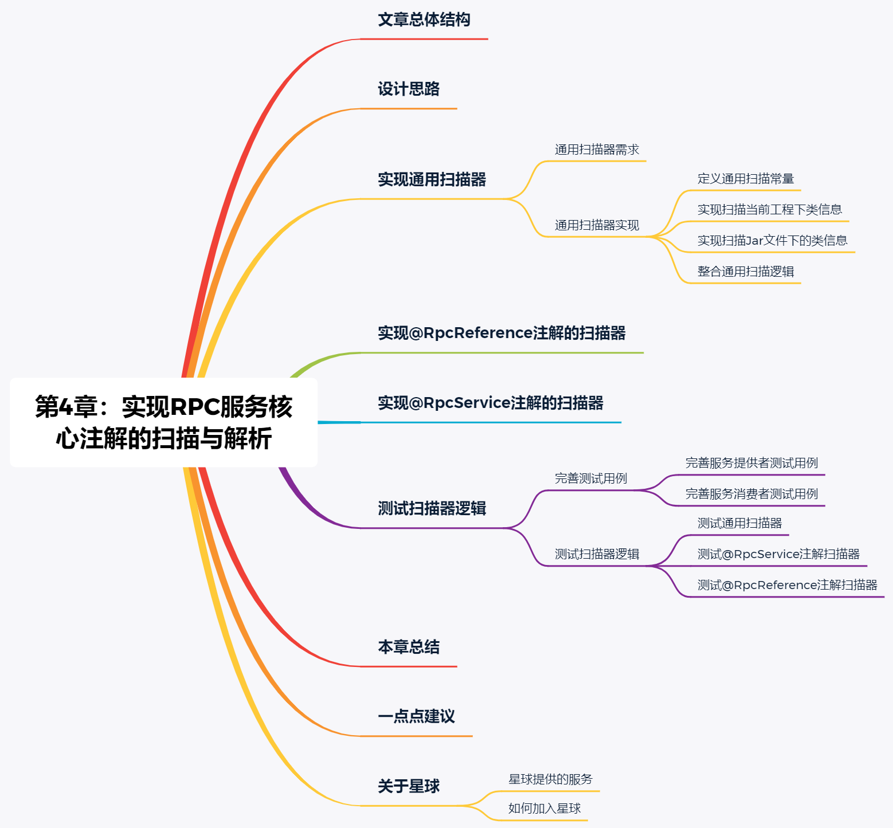

## 一、文章总体结构


## 二、设计思路

在实现的RPC框架中的服务提供者、服务消费者、注册中心和监控中心四个部分中，最为核心的就是服务提供者和服务消费者。服务提供提供者和服务消费者要做到支持远程Java调用、整合Spring的xml配置方式调用、整合Spring注解调用、整合SpringBoot调用等等。并且还需要支持同步调用、异步调用、回调和单向调用。

在设计上，服务提供者将自身对外提供的服务注册到注册中心，服务消费者从注册中心订阅到服务提供者提供的服务后，即使注册中心发生宕机不可用，服务提供者与服务消费者之间也能够正常通信。

既然服务提供者和服务消费者需要支持原生的Java方式调用，那么，就需要自行开发一套扫描@RpcService注解和@RpcReference注解的逻辑，而不是直接依赖Spring的包扫描逻辑。

接下来，还需要在性能与实现两个方面做权衡和取舍。

首先，在服务提供者一侧，当使用Java原生程序启动服务提供者时，通过扫描所有实现类上的@RpcService注解将对应的服务注册到注册中心，这种方式没啥问题。

其次，在服务消费者一侧，当使用Java原生程序启动服务消费者时，通过扫描所有@RpcReference注解的类字段，并创建对应实例的代理对象的方式，比起直接通过服务消费者客户端创建服务引用的代理对象的方式性能上略微低下，所以，在设计使用Java原生程序启动服务消费者时，支持直接通过服务消费者客户端和扫描@RpcReference注解两种方式 创建服务应用的代理对象。

## 三、实现通用扫描器

在设计思路时，已经确定了如果使用Java的原生程序启动服务提供者和服务消费者时，需要自行实现一套包扫描逻辑，而不是直接使用Spring提供的包扫描。

### 3.1 通用扫描器需求

在针对于@RpcService注解和@RpcReference注解开发包扫描逻辑之前，我们可以首先实现一个扫描指定包下的所有类的逻辑，具体的需求点如下。

- 扫描指定包下的所有类，无论这个类是在当前项目中，还是在引用的Jar文件中，都需要被扫描到。
- 真正需要扫描的类文件的后缀必须是.class，因为只有.class文件时Java编译出的类文件。
- 返回指定包下所有类的完整类名称集合。

### 3.2 通用扫描器实现

在gxl-rpc-common子工程模块创建scanner包，并在包下新建ClassScanner类，作为通用的类扫描器。

在ClassScanner类中定义三个常量，如下所示。

#### 3.2.1 定义通用扫描常量
在ClassScanner类中定义三个常量，如下所示。
```java
/**
 * 文件
 */
private static final String PROTOCOL_FILE = "file";
/**
 * jar包
 */
private static final String PROTOCOL_JAR = "jar";
/**
 * class文件的后缀
 */
private static final String CLASS_FILE_SUFFIX = ".class";

```
其中各常量的具体含义如下所示。

- PROTOCOL_FILE：扫描当前工程中指定包下的所有类信息。
- PROTOCOL_JAR：扫描Jar文件中指定包下的所有类信息。
- CLASS_FILE_SUFFIX：扫描的过程中指定需要处理的文件的后缀信息。

#### 3.2.2 实现扫描当前工程下类信息

这里，就直接上代码吧，在ClassScanner类中，实现的扫描当前工程下的类信息的代码逻辑如下所示。

```java
/**
 * 扫描当前工程中指定包下的所有类信息
 * @param packageName 扫描的包名
 * @param packagePath 包在磁盘上的完整路径
 * @param recursive 是否递归调用
 * @param classNameList 类名称的集合
 */
private static void findAndAddClassesInPackageByFile(String packageName, String packagePath, final boolean recursive, List<String> classNameList){
	//获取此包的目录 建立一个File
	File dir = new File(packagePath);
	//如果不存在或者 也不是目录就直接返回
	if (!dir.exists() || !dir.isDirectory()) {
		return;
	}
	//如果存在 就获取包下的所有文件 包括目录
	File[] dirfiles = dir.listFiles(new FileFilter() {
		//自定义过滤规则 如果可以循环(包含子目录) 或则是以.class结尾的文件(编译好的java类文件)
		public boolean accept(File file) {
			return (recursive && file.isDirectory()) || (file.getName().endsWith(".class"));
		}
	});
	//循环所有文件
	for (File file : dirfiles) {
		//如果是目录 则继续扫描
		if (file.isDirectory()) {
			findAndAddClassesInPackageByFile(packageName + "." + file.getName(),
					file.getAbsolutePath(),
					recursive,
					classNameList);
		}else {
			//如果是java类文件 去掉后面的.class 只留下类名
			String className = file.getName().substring(0, file.getName().length() - 6);
			//添加到集合中去
			classNameList.add(packageName + '.' + className);
		}
	}
}
```
上述代码主要是使用了递归调用，总体实现上也比较简单，并且代码上标注了详细的注释，各位小伙伴可以自行查看代码理解逻辑，我就不过多说明了。

#### 3.2.3 实现扫描Jar文件下的类信息

同样，直接上代码吧，在ClassScanner类中，实现的扫描Jar文件中指定包下的所有类信息的代码逻辑如下所示。

```java
/**
 * 扫描Jar文件中指定包下的所有类信息
 * @param packageName 扫描的包名
 * @param classNameList 完成类名存放的List集合
 * @param recursive 是否递归调用
 * @param packageDirName 当前包名的前面部分的名称
 * @param url 包的url地址
 * @return 处理后的包名，以供下次调用使用
 * @throws IOException
 */
private static String FindAndAddClassesInPackageByJar(String packageName, List<String> classNameList, boolean recursive, String packageDirName, URL url) throws IOException {
	//如果是jar包文件
	//定义一个JarFile
	JarFile jar = ((JarURLConnection) url.openConnection()).getJarFile();
	//从此jar包 得到一个枚举类
	Enumeration<JarEntry> entries = jar.entries();
	//同样的进行循环迭代
	while (entries.hasMoreElements()) {
		//获取jar里的一个实体 可以是目录 和一些jar包里的其他文件 如META-INF等文件
		JarEntry entry = entries.nextElement();
		String name = entry.getName();
		//如果是以/开头的
		if (name.charAt(0) == '/') {
			//获取后面的字符串
			name = name.substring(1);
		}
		//如果前半部分和定义的包名相同
		if (name.startsWith(packageDirName)) {
			int idx = name.lastIndexOf('/');
			//如果以"/"结尾 是一个包
			if (idx != -1) {
				//获取包名 把"/"替换成"."
				packageName = name.substring(0, idx).replace('/', '.');
			}
			//如果可以迭代下去 并且是一个包
			if ((idx != -1) || recursive){
				//如果是一个.class文件 而且不是目录
				if (name.endsWith(CLASS_FILE_SUFFIX) && !entry.isDirectory()) {
					//去掉后面的".class" 获取真正的类名
					String className = name.substring(packageName.length() + 1, name.length() - 6);
					classNameList.add(packageName + '.' + className);
				}
			}
		}
	}
	return packageName;
}
```
扫描Jar文件中指定包下的类信息，总体逻辑也比较简单，主要就是对一些包名和类名的处理，上述代码中标注了详细的注释信息，小伙伴们自行查看代码即可，我就不啰嗦了。

#### 3.2.4 整合通用扫描逻辑

细心的小伙伴可能已经发现，无论是扫描当前工程中指定包下的所有类信息的findAndAddClassesInPackageByFile()方法，还是扫描Jar文件中指定包下的所有类信息的findAndAddClassesInPackageByJar()方法，都是以private修饰符修复，说明这两个方法都是ClassScanner类私有的，并不对外开放。如果在外部使用ClassScanner类的通用扫描逻辑，我们需要在ClassScanner类中对findAndAddClassesInPackageByFile()方法和findAndAddClassesInPackageByJar()方法进行整合。

在ClassScanner类中新建getClassNameList()方法，整合findAndAddClassesInPackageByFile()方法和findAndAddClassesInPackageByJar()方法，getClassNameList()方法的实现如下所示

```java
/**
 * 扫描指定包下的所有类信息
 * @param packageName 指定的包名
 * @return 指定包下所有完整类名的List集合
 * @throws Exception
 */
public static List<String> getClassNameList(String packageName) throws Exception{
	//第一个class类的集合
	List<String> classNameList = new ArrayList<String>();
	//是否循环迭代
	boolean recursive = true;
	//获取包的名字 并进行替换
	String packageDirName = packageName.replace('.', '/');
	//定义一个枚举的集合 并进行循环来处理这个目录下的things
	Enumeration<URL> dirs = Thread.currentThread().getContextClassLoader().getResources(packageDirName);
	//循环迭代下去
	while (dirs.hasMoreElements()){
		//获取下一个元素
		URL url = dirs.nextElement();
		//得到协议的名称
		String protocol = url.getProtocol();
		//如果是以文件的形式保存在服务器上
		if (PROTOCOL_FILE.equals(protocol)) {
			//获取包的物理路径
			String filePath = URLDecoder.decode(url.getFile(), "UTF-8");
			//以文件的方式扫描整个包下的文件 并添加到集合中
			findAndAddClassesInPackageByFile(packageName, filePath, recursive, classNameList);
		} else if (PROTOCOL_JAR.equals(protocol)){
			packageName = findAndAddClassesInPackageByJar(packageName, classNameList, recursive, packageDirName, url);
		}
	}
	return classNameList;
}
```

在getClassNameList()方法中主要是根据实际逻辑调用findAndAddClassesInPackageByFile()方法和findAndAddClassesInPackageByJar()方法，并最终返回指定包下的所有完整类名的List集合，上述代码也比较简单，我就不再过多说明了。

## 四、实现通用扫描器

在RPC框架的服务提供者一侧，在程序启动时，需要扫描类上标注的@RpcService注解，通过解析@RpcService注解的属性，将服务提供者的元数据信息注册到注册中心，并且会将@RpcService注解标注的实现类放入一个Map缓存中。

这里，我们暂且实现扫描@RpcService注解的逻辑。在gxl-rpc-common子工程模块中，创建io.gxl.rpc.common.scanner.server 包，并在 io.gxl.rpc.common.scanner.server  包下新建RpcServiceScanner类，继承通用类扫描器ClassScanner，在RpcServiceScanner类中创建一个 doScannerWithRpcServiceAnnotationFilterAndRegistryService()方法，传入要扫描的包名。首先会调用通用类扫描器ClassScanner中的getClassNameList()方法，获取指定包下的所有类信息。

接下来，会遍历所有的类信息，将标注了@RpcService注解的类过滤出来，这里暂时将@RpcService注解的信息打印出来，RpcServiceScanner类的代码如下所示。

```java
/**
 * @author gxl
 * @version 1.0.0
 * @description @RpcService注解扫描器
 */
public class RpcServiceScanner extends ClassScanner {

    private static final Logger LOGGER = LoggerFactory.getLogger(RpcServiceScanner.class);

    /**
     * 扫描指定包下的类，并筛选使用@RpcService注解标注的类
     */
    public static Map<String, Object> doScannerWithRpcServiceAnnotationFilterAndRegistryService(/*String host, int port, */ String scanPackage/*, RegistryService registryService*/) throws Exception{
        Map<String, Object> handlerMap = new HashMap<>();
        List<String> classNameList = getClassNameList(scanPackage);
        if (classNameList == null || classNameList.isEmpty()){
            return handlerMap;
        }
        classNameList.stream().forEach((className) -> {
            try {
                Class<?> clazz = Class.forName(className);
                RpcService rpcService = clazz.getAnnotation(RpcService.class);
                if (rpcService != null){
                    //优先使用interfaceClass, interfaceClass的name为空，再使用interfaceClassName
                    //TODO 后续逻辑向注册中心注册服务元数据，同时向handlerMap中记录标注了RpcService注解的类实例
                    LOGGER.info("当前标注了@RpcService注解的类实例名称===>>> " + clazz.getName());
                    LOGGER.info("@RpcService注解上标注的属性信息如下：");
                    LOGGER.info("interfaceClass===>>> " + rpcService.interfaceClass().getName());
                    LOGGER.info("interfaceClassName===>>> " + rpcService.interfaceClassName());
                    LOGGER.info("version===>>> " + rpcService.version());
                    LOGGER.info("group===>>> " + rpcService.group());
                }
            } catch (Exception e) {
                LOGGER.error("scan classes throws exception: {}", e);
            }
        });
        return handlerMap;
    }
}
```

上述代码的实现逻辑比较简单，我就不啰嗦了，大家自己看吧。

## 五、实现@RpcReference注解的扫描器

在实现的RPC框架中，在以Java原生程序启动服务消费者时，支持直接通过服务消费者客户端和扫描@RpcReference注解两种方式 创建服务应用的代理对象。

这里，我们先说明如何扫描实现类中标注了@RpcReference注解的字段。在gxl-rpc-common子工程模块中，创建io.gxl.rpc.common.scanner.reference包，在io.gxl.rpc.common.scanner.reference 包下新建RpcReferenceScanner类，在RpcReferenceScanner类中创建一个doScannerWithRpcReferenceAnnotationFilter()方法，在doScannerWithRpcReferenceAnnotationFilter()方法中，传入要扫描的包。首先，还是通过通用类扫描器ClassScanner，获取指定包下的所有类信息，然后遍历所有的类信息，获取每个类下的所有字段信息，将字段中标注有@RpcReference注解的字段过滤出来做进一步处理。这里，我们先简单打印日志。

RpcReferenceScanner类的代码如下所示。

## 六、测试扫描器逻辑

今天整体上的逻辑我们就实现完成了，接下来，需要对今天实现的逻辑进行简单的测试，整体测试的步骤如下。

### 6.1 完善测试用例

在gxl-rpc-learning工程下创建gxl-rpc-test子模块工程，并在gxl-rpc-test子工程模块下再次创建gxl-rpc-test-scanner子工程模块，gxl-rpc-test-scanner子工程模块表示测试自定义类扫描器的工程模块，并在gxl-rpc-test-scanner子工程模块的pom.xml文件中添加如下依赖。

```java
<dependencies>
	<dependency>
		<groupId>io.gxl.rpc</groupId>
		<artifactId>gxl-rpc-common</artifactId>
		<version>${project.version}</version>
	</dependency>
</dependencies>
```

#### 6.1.1 完善服务提供者测试用例

（1）在gxl-rpc-test-scanner子工程模块下创建io.gxl.rpc.test.scanner.service 包，并在包下创建DemoService接口表示服务提供者需要实现的接口，此接口也会在服务消费者中引用。DemoService接口的代码如下所示。

```java
/**
 * @author gxl
 * @version 1.0.0
 * @description 测试@RpcService注解的扫描
 */
public interface DemoService {
    
}
```
（2）在gxl-rpc-test-scanner子工程模块下创建io.gxl.rpc.test.scanner.provider包，并在io.gxl.rpc.test.scanner.provider 包下创建ProviderDemoServiceImpl类，实现ProviderDemoService接口，并在ProviderDemoServiceImpl类上标注了@RpcService注解，代码如下所示。
```java
/**
 * @author gxl
 * @version 1.0.0
 * @description DemoService实现类
 */
@RpcService(interfaceClass = DemoService.class, interfaceClassName = "io.gxl.rpc.test.scanner.service.DemoService", version = "1.0.0", group = "gxl")
public class ProviderDemoServiceImpl implements DemoService {

}

```
#### 6.1.2 完善服务消费者测试用例
（1）在bhrpc-test-scanner子工程模块下创建io.binghe.rpc.test.scanner.consumer.service包，并在io.binghe.rpc.test.scanner.consumer.service 包下新建ConsumerBusinessService接口，表示服务消费者端的业务逻辑接口，ConsumerBusinessService接口的代码如下所示。
```java
/**
 * @author gxl
 * @version 1.0.0
 * @description 服务消费者业务逻辑接口
 */
public interface ConsumerBusinessService {
}
```
（2）在gxl-rpc-test-scanner子工程模块下创建io.gxl.rpc.test.scanner.consumer.service.impl包，并在io.gxl.rpc.test.scanner.consumer.service.impl 包下创建ConsumerBusinessServiceImpl类，实现ConsumerBusinessService接口，在ConsumerBusinessServiceImpl类中，定义了一个DemoService类型的字段，并且标注了@RpcReference注解。

ConsumerBusinessServiceImpl类的代码如下所示。

```java
/**
 * @author gxl
 * @version 1.0.0
 * @description 服务消费者业务逻辑实现类
 */
public class ConsumerBusinessServiceImpl implements ConsumerBusinessService {
    @RpcReference(registryType = "zookeeper", registryAddress = "127.0.0.1:2181", version = "1.0.0", group = "gxl")
    private DemoService demoService;

}
```
至此，服务提供者和服务消费者中，关于注解扫描的测试用例就编写完成了。

### 6.2 测试扫描器逻辑
在gxl-rpc-test-scanner工程中的io.gxl.rpc.test.scanner 包下，创建ScannerTest类，用于测试扫描逻辑的类。

#### 6.2.1  测试通用扫描器
在ScannerTest类中，添加如下代码测试通用扫描器。

```java
/**
* 扫描io.gxl.rpc.test.scanner包下所有的类
  */
  @Test
  public void testScannerClassNameList() throws Exception {
  List<String> classNameList = ClassScanner.getClassNameList("io.gxl.rpc.test.scanner");
  classNameList.forEach(System.out::println);
  }
```
运行上述代码，输出的结果信息如下所示。
```java
io.gxl.rpc.test.scanner.consumer.service.ConsumerBusinessService
io.gxl.rpc.test.scanner.consumer.service.impl.ConsumerBusinessServiceImpl
io.gxl.rpc.test.scanner.provider.ProviderDemoServiceImpl
io.gxl.rpc.test.scanner.ScannerTest
io.gxl.rpc.test.scanner.service.DemoService
```
可以看到，使用通用类扫描器获取到了io.gxl.rpc.test.scanner 包下的所有类信息，符合预期结果。

#### 6.2.2 测试@RpcService注解扫描器
在ScannerTest类中，添加如下代码测试@RpcService注解扫描器。
```java
/**
 * 扫描io.gxl.rpc.test.scanner包下所有标注了@RpcService注解的类
 */
@Test
public void testScannerClassNameListByRpcService() throws Exception {
	RpcServiceScanner.
        doScannerWithRpcServiceAnnotationFilterAndRegistryService("io.gxl.rpc.test.scanner");
}
```
运行上述代码，输出的结果信息如下所示。
```java
14:21:02,581  INFO RpcServiceScanner:38 - 当前标注了@RpcService注解的类实例名称===>>> io.gxl.rpc.test.scanner.provider.ProviderDemoServiceImpl
14:21:02,583  INFO RpcServiceScanner:39 - @RpcService注解上标注的属性信息如下：
14:21:02,583  INFO RpcServiceScanner:40 - interfaceClass===>>> io.gxl.rpc.test.scanner.service.DemoService
14:21:02,584  INFO RpcServiceScanner:41 - interfaceClassName===>>> io.gxl.rpc.test.scanner.service.DemoService
14:21:02,584  INFO RpcServiceScanner:42 - version===>>> 1.0.0
14:21:02,584  INFO RpcServiceScanner:43 - group===>>> gxl
```
可以看到，使用@RpcService注解扫描器获取到了io.gxl.rpc.test.scanner 包下标注了@RpcService注解的类，并打印了@RpcService注解的属性信息，符合预期结果。

#### 6.2.3  测试@RpcReference注解扫描器
在ScannerTest类中，添加如下代码测试@RpcReference注解扫描器。
```java
/**
     * 扫描io.gxl.rpc.test.scanner包下所有标注了@RpcReference注解的类
     */
    @Test
    public void testScannerClassNameListByRpcReference() throws Exception {
        RpcReferenceScanner.
                doScannerWithRpcReferenceAnnotationFilter("io.gxl.rpc.test.scanner");
    }
```
运行上述代码，输出的结果信息如下所示。
```java
14:23:22,881  INFO RpcReferenceScanner:41 - 当前标注了@RpcReference注解的字段名称===>>> demoService
14:23:22,883  INFO RpcReferenceScanner:42 - @RpcReference注解上标注的属性信息如下：
14:23:22,883  INFO RpcReferenceScanner:43 - version===>>> 1.0.0
14:23:22,883  INFO RpcReferenceScanner:44 - group===>>> gxl
14:23:22,884  INFO RpcReferenceScanner:45 - registryType===>>> zookeeper
14:23:22,884  INFO RpcReferenceScanner:46 - registryAddress===>>> 127.0.0.1:2181
```
可以看到，使用@RpcReference注解扫描器获取到了io.gxl.rpc.test.scanner 包下的类中标注了@RpcReference注解的字段，并打印了@RpcReference注解的属性信息，符合预期结果。

## 七、本章总结
实现RPC框架时，需要支持以Java的原生程序启动RPC框架。此时，扫描注解时，需要实现自定义的注解扫描器，而不要依赖Spring提供的注解扫描器。本章主要是对RPC服务的核心注解实现了自定义扫描器来扫描与解析@RpcService注解和@RpcReference注解。

希望本章的内容能够为大家带来实质性的帮助。