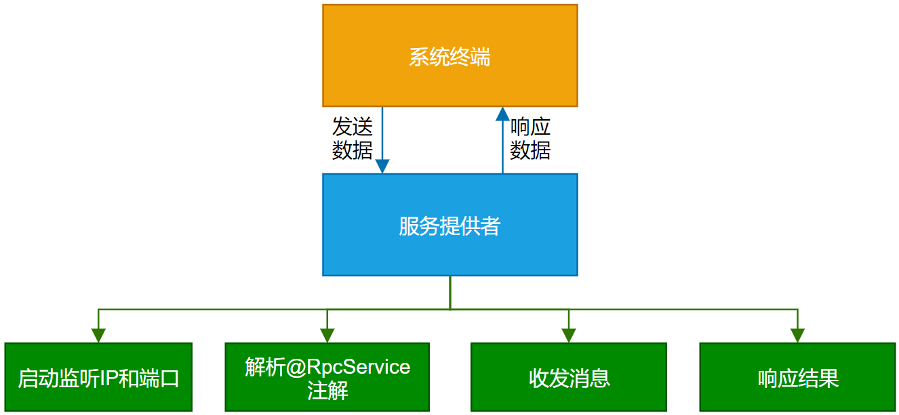
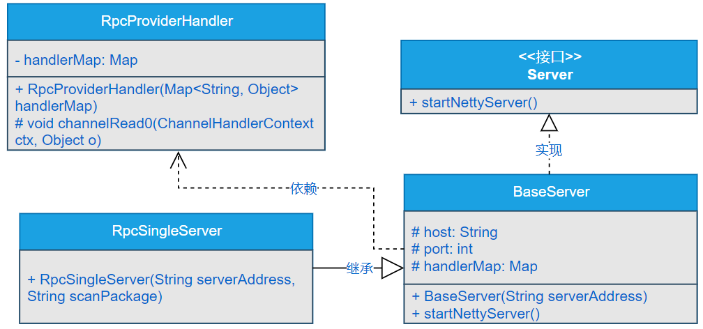
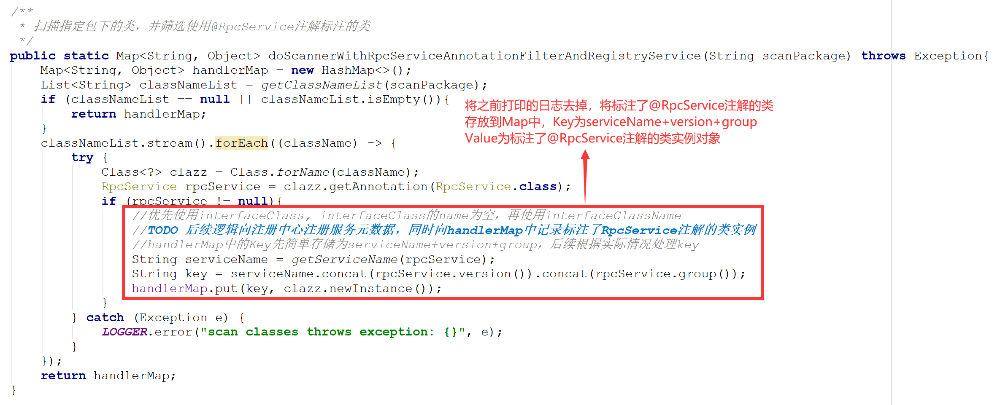
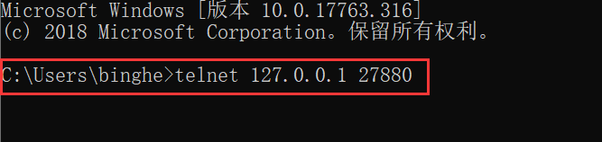
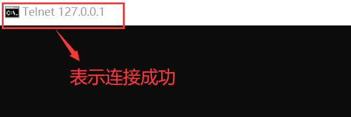

## 一、前言
> 服务提供者作为提供服务的一方，不支持首发消息怎么行？

说到底，无论RPC框架多么复杂，归根结底，一个较为完毕的RPC框架由服务提供者、服务消费者、注册中心和监控中心组成。服务提供者启动后需要监听固定的域名/主机名/IP和端口，并且服务提供者作为一个基础服务，需要接收服务消费者发送过来的消息，后续对消息进行转发，调用目标方法后，向服务消费者响应结果数据。所以，服务提供者需要具备消息的首发功能，并且这是服务提供者应该具备的最基础的功能。

可以将服务提供者想象成是一个对外提供服务的服务端，而服务消费者就是调用服务提供者的客户端，二者之间的通信是通过网络进行的。

大家可以思考下，服务提供者还需要具备哪些功能呢？

## 二、目标

在前面的章节中，我们设计了RPC框架的核心注解，并且实现了RPC服务核心注解的扫描与解析功能。这样的话，在我们实现的RPC框架中，就能实现哪怕不集成Spring，也能够通过扫描注解的方式发布服务提供者的服务。

其实，可以细细的想一下，Spring提供的IOC功能能够简化程序的开发，核心点就在于通过扫描Java包下的类，找到特定注解标注的类，将其实例化后放入IOC容器中。这种方式我们仔细思考下，也能够自己动手实现。所以，在前面的章节中，我们就自己实现了扫描Java包下的类，并且将需要的类进行实例化，放到了一个Map集合中，以供后续使用。

接下来，我们需要顺着之前的思路，完成服务提供者解析@RpcService注解、收发消息、响应结果的目标。

## 三、设计

> 你可以想象一下，如果是让你设计实现服务提供者收发消息的基础功能，你会怎么实现呢？

在实现目标中，已经明确给出了要完成服务提供者解析@RpcService注解、收发消息、响应结果的目标。这是本章要实现的重点，但是作为服务提供者，一定要启动后才能与服务消费者进行通信，所以，上述目标是服务提供者需要启动后才能实现的。综上，我们可以得出本章大体要实现的功能流程，如图5-1所示。



由图5-1可以看出：

- 服务提供者可以接收系统终端发送过来的数据，并且也可以向系统终端响应数据。
- 服务体提供者启动后需要监听IP和端口，并且启动时能够解析@RpcService注解，启动后能够收发消息，并且响应结果
- 由于本章还未实现服务消费者，目前我们可以通过系统终端来模拟服务消费者，向服务提供者发送数据，并且接收服务消费者响应过来的数据。

## 四、实现

### 1.工程结构

- gxl-rpc-annotation：实现gxl-rpc框架的核心注解工程。
- gxl-rpc-common：实现gxl-rpc框架的通用工具类，包含服务提供者注解与服务消费者注解的扫描器。
- gxl-rpc-provider：服务提供者父工程。 
  - gxl-rpc-provider-common：服务提供者通用工程。
  - gxl-rpc-provider-native：以纯Java方式启动gxl-rpc框架的工程。
- gxl-rpc-test：测试gxl-rpc框架的父工程。
  - gxl-rpc-test-provider：测试服务提供者的工程。
  - gxl-rpc-test-scanner：测试扫描器的工程。

### 2.核心实现类

由图5-2可以看出：

- 程序中定义了一个接口Server，在Server中定义了一个抽象方法startNettyServer()。
- BaseServer类作为最基础的服务类，会直接实现Server接口，并实现Server接口中定义的startNettyServer()方法，同时，在BaseServer类中分别定义了host、port和handlerMap三个protected类型的成员变量，在构造方法BaseServer(String serverAddress)中为host和port赋值。
- 在BaseServer的startNettyServer()的方法实现中，会依赖RpcProviderHandler类，并实例化RpcProviderHandler类对象，RpcProviderHandler类对象作为服务提供者最终接收消息，处理消息，响应消息的类。
- RpcSingleServer类作为使用纯Java启动gxl-rpc框架的实现类，继承了BaseServer类。在RpcSingleServer本身的类中，只有一个RpcSingleServer(String serverAddress, String scanPackage)构造方法，其他方法都是继承自BaseServer类。

### 3.实现Handler处理器

由于gxl-rpc框架底层的通信依赖Netty框架，Netty中可以通过Handler处理器进行消息的收发，在gxl-rpc的服务提供中，使用的是Netty中的io.netty.channel.SimpleChannelInboundHandler类实现消息的收发功能。具体就是创建一个RpcProviderHandler类，继承Netty中的SimpleChannelInboundHandler类。
```java
public class RpcProviderHandler extends SimpleChannelInboundHandler<Object> {
    private final Logger logger = LoggerFactory.getLogger(RpcProviderHandler.class);
    private final Map<String, Object> handlerMap;
    public RpcProviderHandler(Map<String, Object> handlerMap){
        this.handlerMap = handlerMap;
    }

    @Override
    protected void channelRead0(ChannelHandlerContext ctx, Object o) throws Exception {
        logger.info("RPC提供者收到的数据为====>>> " + o.toString());
        logger.info("handlerMap中存放的数据如下所示：");
        for(Map.Entry<String, Object> entry : handlerMap.entrySet()){
            logger.info(entry.getKey() + " === " + entry.getValue());
        }
        //直接返回数据
        ctx.writeAndFlush(o);
   }
}
```
可以看到，RpcProviderHandler类继承了SimpleChannelInboundHandler，并重写了SimpleChannelInboundHandler类中的void channelRead0(ChannelHandlerContext ctx, Object o)方法，主要的逻辑就是打印了接收到的数据和存储在handlerMap中的数据，并且将接收到的数据直接返回。

### 4.定义Server接口
Server接口时启动gxl-rpc框架服务提供者的核心接口
```java
public interface Server {
    /**
     * 启动Netty服务
     */
    void startNettyServer();
}
```
可以看到，在Server类内部只定义了一个startNettyServer()抽象方法。

### 5.Server接口的实现类
Server接口的实现类其实包含直接实现类和间接实现类。这里，将gxl-rpc框架服务提供者启动时的通用功能封装在了BaseServer类中，由BaseServer类直接实现Server接口，并实现Server接口中的startNettyServer()方法。而在创建一个RpcSingleServer类，继承BaseServer类，实现只使用Java启动gxl-rpc框架。

#### 5.1 BaseServer类的实现
````java
public class BaseServer implements Server {
    private final Logger logger = LoggerFactory.getLogger(BaseServer.class);
    //主机域名或者IP地址
    protected String host = "127.0.0.1";
    //端口号
    protected int port = 27110;
    //存储的是实体类关系
    protected Map<String, Object> handlerMap = new HashMap<>();
    
    public BaseServer(String serverAddress){
        if (!StringUtils.isEmpty(serverAddress)){
            String[] serverArray = serverAddress.split(":");
            this.host = serverArray[0];
            this.port = Integer.parseInt(serverArray[1]);
        }
    }
    @Override
    public void startNettyServer() {
        EventLoopGroup bossGroup = new NioEventLoopGroup();
        EventLoopGroup workerGroup = new NioEventLoopGroup();
        try{
            ServerBootstrap bootstrap = new ServerBootstrap();
            bootstrap.group(bossGroup, workerGroup).channel(NioServerSocketChannel.class)
                    .childHandler(new ChannelInitializer<SocketChannel>(){
                        @Override
                        protected void initChannel(SocketChannel channel) throws Exception {
                            channel.pipeline()
                                    //TODO 预留编解码，需要实现自定义协议
                                    .addLast(new StringDecoder())
                                    .addLast(new StringEncoder())
                                    .addLast(new RpcProviderHandler(handlerMap));
                        }
                    })
                    .option(ChannelOption.SO_BACKLOG,128)
                    .childOption(ChannelOption.SO_KEEPALIVE, true);
            ChannelFuture future = bootstrap.bind(host, port).sync();
            logger.info("Server started on {}:{}", host, port);
            future.channel().closeFuture().sync();
        }catch (Exception e){
            logger.error("RPC Server start error", e);
        }finally {
            workerGroup.shutdownGracefully();
            bossGroup.shutdownGracefully();
        }
    }
}
````
可以看到，BaseServer类定义了gxl-rpc框架启动的核心逻辑，在实现的startNettyServer()方法中，使用了启动Netty服务的经典代码模板。由于目前为止还未实现具体的网络传输协议和数据的编解码，所以，这里暂时使用的编解码类为Netty自带的StringEncoder类和StringDecoder类，并且将RpcProviderHandler对象添加到Netty的数据传递链中。这样，自定义的RpcProviderHandler类就能够收到外界传递的数据。

注意：如果需要在项目中使用Netty，可按照startNettyServer()中的代码示例启动Netty服务，startNettyServer()中启动Netty服务的代码是经典的代码模板。

#### 5.2 RpcSingleServer类的实现
```java
public class RpcSingleServer extends BaseServer {
    private final Logger logger = LoggerFactory.getLogger(RpcSingleServer.class);

    public RpcSingleServer(String serverAddress, String scanPackage) {
        //调用父类构造方法
        super(serverAddress);
        try {
            this.handlerMap = RpcServiceScanner.doScannerWithRpcServiceAnnotationFilterAndRegistryService(scanPackage);
        } catch (Exception e) {
            logger.error("RPC Server init error", e);
        }
    }
}
```
可以看到，RpcSingleServer类作为使用Java方式，不依赖Spring启动gxl-rpc框架的类，继承了BaseServer类，由于大部分通用功能已经在Base类中实现，所以，RpcSingleServer类的实现就非常简单了。

注意：在RpcSingleServer类中使用了RpcServiceScanner扫描器的doScannerWithRpcServiceAnnotationFilterAndRegistryService()方法，为handlerMap赋值。所以，我们还要修改下RpcServiceScanner扫描器的doScannerWithRpcServiceAnnotationFilterAndRegistryService()方法。

### 6. RpcSingleServer类的实现



## 五、测试
### 1. 事先准备
截止目前，我们在gxl-rpc框架的源码中实现了核心注解的设计、自定义的类扫描器、服务提供者收发消息。所以，在测试gxl-rpc框架收发消息的基础功能时，也需要测试通过自定义扫描器将标注有@RpcService注解的类是否正确添加到了Map中。
#### 1.1 创建测试接口DemoService
源码位于gxl-rpc-test-provider工程下的io.gxl.rpc.test.provider.service.DemoService。
```java
public interface DemoService {
}
```
DemoService主要是测试gxl-rpc服务提供者定义的一个简单接口，DemoService中没有任何方法。
#### 1.2 创建测试类ProviderDemoServiceImpl
源码位于gxl-rpc-test-provider工程下的io.gxl.rpc.test.provider.service.impl.ProviderDemoServiceImpl。
```java
@RpcService(interfaceClass = DemoService.class, 
            interfaceClassName = "io.binghe.rpc.test.scanner.service.DemoService", 
            version = "1.0.0", 
            group = "binghe")
public class ProviderDemoServiceImpl implements DemoService {
}
```
可以看到，ProviderDemoServiceImpl类实现了DemoService接口，并在ProviderDemoServiceImpl类上标注了@RpcService注解，使用类扫描器就能够扫描到ProviderDemoServiceImpl类，并将ProviderDemoServiceImpl类的实例存储到Map中。

### 2. 单元测试
这次单元测试可以分成两个步骤，启动服务提供者和使用系统终端发送消息。
#### 2.1 启动服务提供者

创建RpcSingleServerTest测试类，使用Junit单元测试工具启动gxl-rpc框架的服务提供者，启动的方式就是直接创建RpcSingleServer类的对象，调用RpcSingleServer类对象的startNettyServer()方法。
RpcSingleServerTest类的源码位于：gxl-rpc-test-provider工程下的io.gxl.rpc.test.provider.single.RpcSingleServerTest。
```java
public class RpcSingleServerTest {
    @Test
    public void startRpcSingleServer(){
        RpcSingleServer singleServer = new RpcSingleServer("127.0.0.1:27880", "io.binghe.rpc.test");
        singleServer.startNettyServer();
    }
}
```
直接运行RpcSingleServerTest类的startRpcSingleServer()方法，会输出如下结果信息。
```
INFO BaseServer:80 - Server started on 127.0.0.1:27880
```
说明gxl-rpc框架的服务提供者启动成功，并监听127.0.0.1主机和27880端口。
#### 2.2 使用系统终端发送消息
由于我使用的操作系统是Windows，我就直接在cmd命令进行操作，其实在MacOS和Linux操作系统上操作的步骤相同，我就不赘述了。

（1）打开cmd终端，输入telnet  127.0.0.1 27880 连接服务提供者，如下所示。
```shell
C:\Users\binghe>telnet 127.0.0.1 27880
```
如图5-4所示。



连接成功后如图5-5所示。



接下来，在连接好的终端里向服务提供者发送数据。发送数据时，会发现发送一个字符时，终端会显示两个字符，这是由于服务提供者收到系统终端发送的数据时，会立刻原样返回数据。所以，在终端发送一个字符时，会显示两个字符。

综上可以看到，正确实现了服务提供者收发消息的基础功能，并能使用类扫描器将标注@RpcService注解的类添加到Map集合中，以供后续远程过程调用使用。

## 六、总结
整个章节主要使用的逻辑就是服务提供者实现收发消息的基础功能，从服务提供者工程的创建到服务提供者启动逻辑的实现，再到结合服务提供者类扫描器扫描标注有@RpcService注解的类，将标注有@RpcService注解的类实例对象添加到Map集合中，最后到服务提供者收发消息的基础功能实现。整个过程仅仅围绕着服务提供者来实现的。

在服务提供者收发消息的基础功能实现中，预留了扩展点和优化点，比如自定义网络传输协议、自定义编解码器、存储到Map集合中的类实例的Key设计、服务的注册等等大量需要扩展和优化的地方。这些都需要我们在后面的章节中一一进行实现。