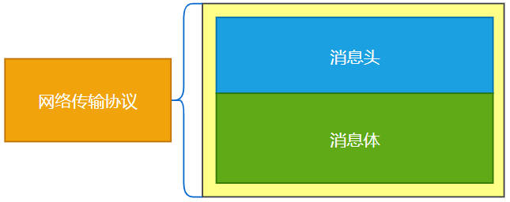
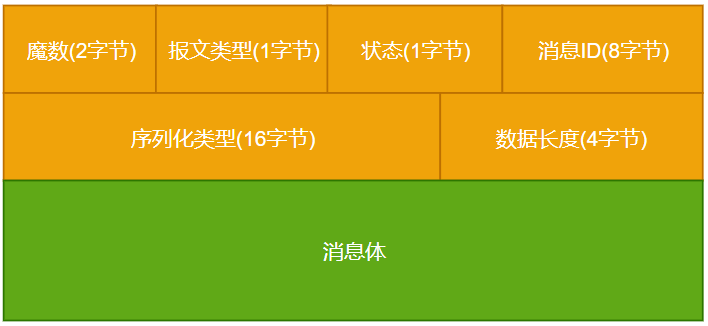
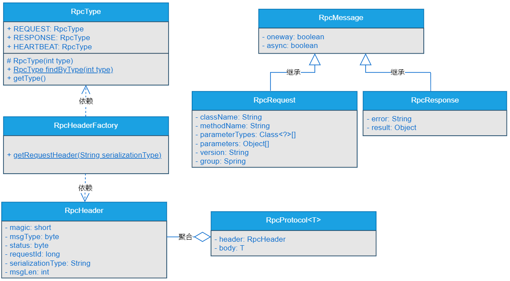

## 一、前言
> RPC框架要如何才能轻松拿捏自定义网络协议

RPC作为分布式系统底层通信的基础设施框架，最主要的功能就是进行远程过程调用，这种调用方式不用想，肯定会涉及到网络传输。通常情况中，只要是涉及到数据在网络过程中传输，都是要通过某种协议进行的。例如HTTP协议、TPC协议、UDP协议这种。

数据由发送方发送到接收方之前，会通过某种协议将其编码成二进制流，通过网络将二进制流传输到接收方后，会根据协议将其解码成对应的数据。当接收方处理完数据返回结果前，也需要先通过协议将返回的数据编码成二进制流，通过网络传输到发送方后，根据协议将二进制数据解码成对应的数据。整个过程如图6-1所示。


由图6-1可以看出，网络协议在整个网络通信过程中是至关重要的，是数据进行编解码的依据。

说的直白点，就好比两个打电话的人，比如张三给李四打电话，三张好比是数据的发送方，李四好比是数据的接收方。张三给李四打电话，李四接通电话后，二者就建立了连接。张三与李四通话的过程中，不管是三张说话还是李四说话，说话的语音信息在网络中传输之前，都会先将语音信息根据通话协议编码成二进制流，传输到对方后，再根据通话协议将二进制流解码成语音信息。如图6-2所示。


可以看到，数据在网络传输的过程中是需要通过某种协议进行编码和解码的。

## 二、目标
> gxl-rpc框架的数据交互需要实现自定义网络传输协议，这个目标如何实现？

在前面的章节中，我们实现了gxl-rpc框架服务提供者收发消息的基础功能，使用了Netty自带的编码器StringEncoder和Netty自带的解码器StringDecoder。也就是在之前的章节中，系统终端和服务提供者之间传输数据时使用的是Netty自带的封装好的协议。但是，Netty本身封装好的协议对于实现RPC框架来说，无论是协议的定制化方面，还是后期对于性能调优方面，都会是一个性能瓶颈点。

所以，在实现gxl-rpc框架的过程中，需要我们自己实现自定义的网络传输协议，在自定义的网络传输协议的实现中，我们可以加入一些框架中特有的信息、也可以根据具体需要自定义网络传输协议的格式、长度等信息，甚至可以在自定义的网络传输协议中根据具体需要添加一些预留字段，以方便后期扩展。

说干就干，接下来，我们就一起设计和实现自定义的网络传输协议。

## 三、设计
> 如果是让你设计网络传输协议，你会怎么设计呢？

一般情况下，网络传输协议的设计可以包含消息头和消息体两部分，如图6-3所示。



- 一个完整的网络传输协议可以分为消息头和消息体。
- 消息头中主要存放的是一些对应整个消息的定义信息，比如协议的类型、状态、消息id、消息的长度等等信息。
- 消息体中主要存放的就是具体的传输数据。

我们可以按照这个网络传输协议的通用逻辑来设计自定义网络传输协议，同样，gxl-rpc框架的网络传输协议也会分为消息头和消息体两部分，并且会根据具体的需要，暂时将消息头部分的长度定义为32字节，具体如图6-4所示。



可以看到，在自定义的网络传输协议中，也会将整个协议分为消息头和消息体两部分。

- 消息头总共32字节，会分为魔数、报文类型、状态、消息ID、序列化类型和数据长度。
- 消息体就是要传输的具体数据。

其中，消息头中的各个字段含义如下：

- 魔数：验证自定义网络传输协议的最基本的校验信息，占据2字节空间。
- 报文类型：消息的类型，可以分为请求消息、响应消息和心跳消息，占据1字节空间。
- 状态：消息的状态，占据1字节空间。
- 消息ID：消息的唯一标识，占据8字节空间。
- 序列化类型：数据进行序列化和反序列化的类型标识，暂定16字节空间。
- 数据长度：标识消息体的数据长度，占据4字节空间。

## 四、实现
> 说了这么多，自定义网络协议该怎么实现呢？

### 1.工程结构

- gxl-rpc-annotation：实现gxl-rpc框架的核心注解工程。
- gxl-rpc-common：实现gxl-rpc框架的通用工具类，包含服务提供者注解与服务消费者注解的扫描器。
- gxl-rpc-constants：存放实现gxl-rpc框架通用的常量类。
- gxl-rpc-protocol：实现gxl-rpc框架的自定义网络传输协议的工程。
- gxl-rpc-provider：服务提供者父工程。
  - gxl-rpc-provider-common：服务提供者通用工程。
  - gxl-rpc-provider-native：以纯Java方式启动gxl-rpc框架的工程。
- gxl-rpc-test：测试gxl-rpc框架的父工程。
  - gxl-rpc-test-provider：测试服务提供者的工程。
  - gxl-rpc-test-scanner：测试扫描器的工程。

### 2.核心实现类关系
核心实现类的关系如图6-5所示。



由图6-5可以看出，自定义网络传输协议主要由7个类组成，分别是RpcType、RpcMessage、RpcRequest、RpcResponse、RpcHeader、RpcHeaderFactory和RpcProtocol。

- RpcType：枚举类，主要标识传输消息的类型，包括：请求消息、响应消息和心跳消息。
- RpcMessage：基础消息类，包含是否单向发送和是否异步发送两个字段，gxl-rpc框架支持单向发送和异步发送。
- RpcRequest：请求消息的消息体数据，继承RpcMessage类，除了是否单向发送和是否异步发送两个字段外，在gxl-rpc框架中包含请求的类名、方法名称、参数类型数组、参数数组、版本号和分组字段。
- RpcResponse：响应消息的消息体数据，继承RpcMessage类，除了是否单向发送和是否异步发送两个字段外，在gxl-rpc框架中包含错误信息和返回的结果数据。
- RpcHeader：网络传输协议的消息头，包括：魔数、消息类型、消息状态、消息ID、序列化类型和消息长度等。
- RpcHeaderFactory：创建RpcHeader的工厂类，依赖RpcHeader类和RpcType枚举类。
- RpcProtocol：真正在gxl-rpc框架中传输数据的协议实体类，包含消息头和消息体，消息头为Header对象，消息体为传入的泛型对象。

### 3.实现RpcType枚举类
RpcType枚举类源码位于gxl-rpc-protocol工程下的io.gxl.rpc.protocol.enumeration.RpcType，源码如下所示。
```java
public enum RpcType {
    //请求消息
    REQUEST(1),
    //响应消息
    RESPONSE(2),
    //心跳数据
    HEARTBEAT(3);
    //##########其他省略##########
}
```
可以看到，RpcType枚举类源码中定义了请求消息、响应消息和心跳消息三种枚举类型。

### 4.实现RpcMessage基础消息类

RpcMessage类的源码位于gxl-rpc-learning工程下的io.gxl.rpc.protocol.base.RpcMessage，源码如下所示。

```java
public class RpcMessage implements Serializable {
    /**
     * 是否单向发送
     */
    private boolean oneway;
    /**
     * 是否异步调用
     */
    private boolean async;
    //#############省略getter/setter############
}
```
可以看到，在RpcMessage消息基础类中定义了是否单向发送和是否异步发送两个字段。

### 5.实现RpcRequest请求消息类

RpcRequest类的源码位于gxl-rpc-protocol工程下的io.gxl.rpc.protocol.request.RpcRequest，源码如下所示。

```java
public class RpcRequest extends RpcMessage {
    private static final long serialVersionUID = 5555776886650396129L;
    /**
     * 类名称
     */
    private String className;
    /**
     * 方法名称
     */
    private String methodName;
    /**
     * 参数类型数组
     */
    private Class<?>[] parameterTypes;
    /**
     * 参数数组
     */
    private Object[] parameters;
    /**
     * 版本号
     */
    private String version;
    /**
     * 服务分组
     */
    private String group;
    //#############省略getter/setter############
}
```

### 6.实现RpcResponse响应消息类
RpcResponse类的源码位于gxl-rpc-protocol工程下的io.gxl.rpc.protocol.response.RpcResponse，源码如下所示。
```java
public class RpcResponse extends RpcMessage {
    private static final long serialVersionUID = 425335064405584525L;
    private String error;
    private Object result;
    //########省略getter/setter############
}
```

可以看到，RpcResponse类继承RpcMessage类，除了是否单向发送和是否异步发送两个字段外，还定义了错误信息和返回的结果数据两个字段。

### 7.实现RpcHeader消息头类

RpcHeader类的源码位于gxl-rpc-protocol工程下的io.gxl.rpc.protocol.header.RpcHeader，源码如下所示。

```java
public class RpcHeader implements Serializable {
    private static final long serialVersionUID = 6011436680686290298L;
    /*
    +---------------------------------------------------------------+
    | 魔数 2byte | 报文类型 1byte | 状态 1byte | 消息 ID 8byte    |
    +---------------------------------------------------------------+
    |           序列化类型 16byte      | 数据长度 4byte    |
    +---------------------------------------------------------------+
    */
    /**
     * 魔数 2字节
     */
    private short magic;
    /**
     * 报文类型 1字节
     */
    private byte msgType;
    /**
     * 状态 1字节
     */
    private byte status;

    /**
     * 消息 ID 8字节
     */
    private long requestId;

    /**
     * 序列化类型16字节，不足16字节后面补0，约定序列化类型长度最多不能超过16
     */
    private String serializationType;

    /**
     * 消息长度 4字节
     */
    private int msgLen;
    //#############省略gettter/setter##############
}
```

可以看到，在RpcHeader类中，定义了魔数、消息类型、消息状态、消息ID、序列化类型和消息长度几个字段。

### 8.实现RpcHeaderFactory工厂类

RpcHeaderFactory类的源码位于gxl-rpc-protocol工程下的io.gxl.rpc.protocol.header.RpcHeaderFactory，源码如下所示。
```java
public class RpcHeaderFactory {
    public static RpcHeader getRequestHeader(String serializationType){
        RpcHeader header = new RpcHeader();
        long requestId = IdFactory.getId();
        header.setMagic(RpcConstants.MAGIC);
        header.setRequestId(requestId);
        header.setMsgType((byte) RpcType.REQUEST.getType());
        header.setStatus((byte) 0x1);
        header.setSerializationType(serializationType);
        return header;
    }
}
```

可以看到，在RpcHeaderFactory类中默认就是传入序列化对象创建一个请求类型的Header对象。

### 9.实现RpcProtocol协议类

RpcProtocol类的源码位于gxl-rpc-protocol工程下的io.gxl.rpc.protocol.RpcProtocol，源码如下所示。
```java
public class RpcProtocol<T> implements Serializable {
    private static final long serialVersionUID = 292789485166173277L;
    /**
     * 消息头
     */
    private RpcHeader header;
    /**
     * 消息体
     */
    private T body;
    //##########省略getter/setter##############
}
```
可以看到RpcProtocol中定义了消息头和消息体两个对象，在gxl-rpc框架中，实际上传输的数据就是RpcProtocol的类对象序列化后的二进制流。RpcProtocol就是最终定义的协议类。

## 五、测试

可以按照如下方式生成RpcProtocol在gxl-rpc框架中传输数据。
```java
public static RpcProtocol<RpcRequest> getRpcProtocol(){
    RpcHeader header = RpcHeaderFactory.getRequestHeader("jdk");
    RpcRequest body = new RpcRequest();
    body.setOneway(false);
    body.setAsync(false);
    body.setClassName("io.gxl.rpc.demo.RpcProtocol");
    body.setMethodName("hello");
    body.setGroup("gxl");
    body.setParameters(new Object[]{"gxl"});
    body.setParameterTypes(new Class[]{String.class});
    body.setVersion("1.0.0");
    RpcProtocol<RpcRequest> protocol = new RpcProtocol<>();
    protocol.setBody(body);
    protocol.setHeader(header);
    return protocol;
}
```
生成RpcProtocol对象后，对RpcProtocol对象进行编码后生成二进制字节流，就可以在gxl-rpc框架中进行传输了。

## 总结
整个章节最主要的逻辑就是实现自定义的网络传输协议，将要发送的数据统一按照消息头和消息体进行封装。消息头中包含的消息包括：魔数、消息类型、消息状态、消息ID、序列化类型和消息长度。消息体中包含的数据就是实际要发送的具体数据。

设计好自定义的网络传输协议后，就可以将要发送的数据按照协议进行封装，再经过编解码的处理，就可以在gxl-rpc框架中进行传输了。