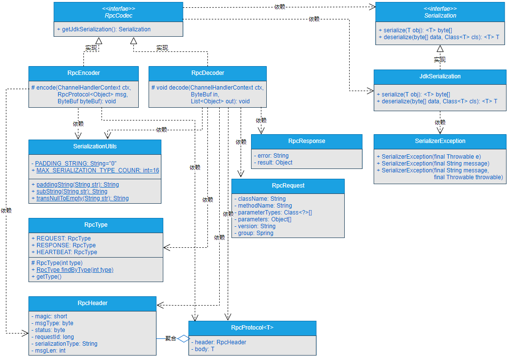
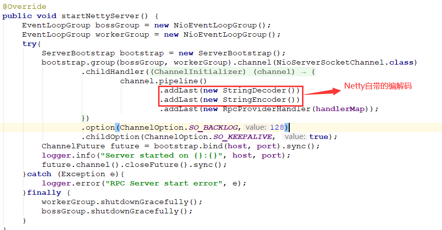
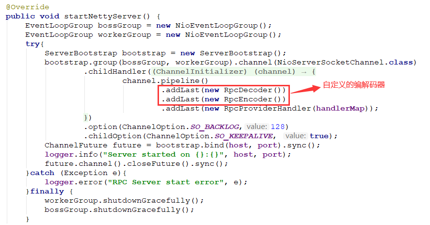

## 一、前言
> 自定义网络编解码是个什么鬼？

数据都会按照某种协议在网络中进行传输，比如可以按照HTTP协议进行传输、可以按照HTTPS协议进行传输、可以按照TCP协议进行传输、可以按照UDP协议进行传输等等。但是，只是有了协议是远远不够的。例如，我们需要将一个客户端的Java对象通过网络传输到服务端，只是有了协议的话，是不行的，我们还要思考：如何将Java对象转化成我们定义好的协议格式在网络中进行传输。其实，这就涉及到网络的编解码了。

RPC框架作为分布式系统底层通信的基础设施框架，本身就是为分布式远程过程调用而设计的，它的出现就是为解决高效的远程通信问题。和一些通用的网络协议一样，尽管RPC框架会自定义网络传输协议，但是只有网络传输协议是远远不够的，也同样需要数据的编解码功能。

## 二、目标
> 如何再设计好自定义的网络传输协议的基础上，实现数据的编解码功能呢？

在前面的章节中，为gxl-rpc框架实现了自定义的网络传输协议， 但是对于数据的编解码操作，还是使用的Netty自带的StringEncoder和StringDecoder。对于自定义的网络传输协议来说，使用Netty自带的数据编解码类已经不满足需求。此时，就需要我们自定义数据的编解码功能。

当数据由服务消费者通过网络发送到服务提供者之前，就需要对数据进行编码，将数据序列化成符合对应协议的二进制字节流。当数据的二进制字节流传输到服务提供者时，就需要对二进制字节流进行解码，将二进制字节流按照对应的协议反序列化成相应的数据。数据由服务提供者传输到服务消费者也是一样的流程。

说干就干，接下来，我们就一起设计和实现自定义的数据编解码功能。

## 三、设计
> 如果让你为gxl-rpc框架设计自定义的数据编解码功能，你会怎么做呢？

服务消费者与服务提供者之间的数据交互过程如图7-1所示。


由图7-1可以看出，服务消费者向服务提供者发送数据前，先通过编码器根据自定义的网络传输协议将数据编码成二进制字节流，二进制字节流通过网络由服务消费者传输到服务提供者，在服务提供者处理数据前，先由解码器根据自定义的网络传输协议对二进制流进行解码，解码出对应的数据后，再对数据进行进一步处理。

当服务提供者处理完数据时，向服务消费者响应数据之前，先通过编码器根据自定义的网络传输协议对数据进行编码，将数据编码成二进制字节流，二进制字节流通过网络由服务提供者传输到服务消费者，服务消费者接收到二进制流数据时，先通过解码器根据自定义的网络传输协议对二进制流数据进行解码，解码出对应的数据后做进一步的处理。

整个过程就需要实现数据的编解码器。

细心的读者可以发现，服务消费者端用一个虚线矩形锁包裹起来，这是因为在本章我们还是侧重实现服务提供者端，后续会使用单独一章来测试服务消费者和服务提供者之间的通信过程。

## 四、实现

> 说了这么多，自定义的网络编解码到底该如何实现呢？

### 1.工程结构
- gxl-rpc-annotation：实现gxl-rpc框架的核心注解工程。
- gxl-rpc-codec：实现gxl-rpc框架的自定义编解码功能。
- gxl-rpc-common：实现gxl-rpc框架的通用工具类，包含服务提供者注解与服务消费者注解的扫描器。
- gxl-rpc-constants：存放实现gxl-rpc框架通用的常量类。
- gxl-rpc-protocol：实现gxl-rpc框架的自定义网络传输协议的工程。
- gxl-rpc-provider：服务提供者父工程。
  - gxl-rpc-provider-common：服务提供者通用工程。
  - gxl-rpc-provider-native：以纯Java方式启动gxl-rpc框架的工程。
- gxl-rpc-serialization：实现gxl-rpc框架序列化与反序列化功能的父工程。
  - gxl-rpc-serialization-api：实现gxl-rpc框架序列化与反序列化功能的通用接口工程。
  - gxl-rpc-serialization-jdk：以JDK的方式实现序列化与反序列化功能。
- gxl-rpc-test：测试gxl-rpc框架的父工程。
  - gxl-rpc-test-provider：测试服务提供者的工程。
  - gxl-rpc-test-scanner：测试扫描器的工程。

### 2.核心实现类关系
核心实现类关系如图7-2所示。


其中，最主要的接口和类就是RpcCodec、RpcEncoder、RpcDecoder、SerializerException、SerializationUtils、Serialization和JdkSerialization。

- RpcCodec：数据的编解码接口，提供一个获取序列化对象的默认方法。
- RpcEncoder：数据的编码类，提供将数据编码成二进制字节流的功能，实现了RpcCodec接口。
- RpcDecoder：数据的解码类，提供将二进制流解码成对应数据的功能，实现了RpcCodec接口。
- SerializerException：自定义的序列化异常类。
- SerializationUtils：附带的序列化与反序列化工具类。
- Serialization：序列化与反序列化的接口。
- JdkSerialization：基于JDK实现的序列化与反序列化类，实现了Serialization接口。

### 3.实现SerializerException异常类。
SerializerException类的源码位于gxl-rpc-common工程下的io.gxl.rpc.common.exception.SerializerException，源码如下所示。
```java
public class SerializerException extends RuntimeException {
    private static final long serialVersionUID = -6783134254669118520L;
    public SerializerException(final Throwable e) {
        super(e);
    }
    public SerializerException(final String message) {
        super(message);
    }
    public SerializerException(final String message, final Throwable throwable) {
        super(message, throwable);
    }
}
```

### 4.实现SerializationUtils工具类
SerializationUtils类位于gxl-rpc-common工程下的io.gxl.rpc.common.utils.SerializationUtils，源码如下所示。

```java
private static final String PADDING_STRING = "0";

    /**
     * 约定序列化类型最大长度为16
     */
    public static final int MAX_SERIALIZATION_TYPE_COUNR = 16;

    /**
     * 为长度不足16的字符串后面补0
     * @param str 原始字符串
     * @return 补0后的字符串
     */
    public static String paddingString(String str){
        str = transNullToEmpty(str);
        if (str.length() >= MAX_SERIALIZATION_TYPE_COUNR) return str;
        int paddingCount = MAX_SERIALIZATION_TYPE_COUNR - str.length();
        StringBuilder paddingString = new StringBuilder(str);
        IntStream.range(0, paddingCount).forEach((i) -> {
            paddingString.append(PADDING_STRING);
        });
        return paddingString.toString();
    }

    /**
     * 字符串去0 操作
     * @param str 原始字符串
     * @return 去0后的字符串
     */
    public static String subString(String str){
        str = transNullToEmpty(str);
        return str.replace(PADDING_STRING, "");
    }

    public static String transNullToEmpty(String str){
        return str == null ? "" : str;
    }
```
SerializationUtils类主要是对消息头中的序列化类型进行处理，并约定了序列化类型最大长度为16，不足16的用0补齐。

### 5.实现Serialization接口
Serialization接口位于gxl-rpc-serialization-api工程下的io.gxl.rpc.serialization.api.Serialization，源码如下所示。
```java
public interface Serialization {
    /**
     * 序列化
     */
    <T> byte[] serialize(T obj);

    /**
     * 反序列化
     */
    <T> T deserialize(byte[] data, Class<T> cls);
}
```
在Serialization接口中定义了序列化与反序列化的方法。

### 6.实现JdkSerialization类
JdkSerialization类位于gxl-rpc-serialization-jdk工程下的io.gxl.rpc.serialization.jdk.JdkSerialization，源码如下所示。
```java
public class JdkSerialization implements Serialization {

    @Override
    public <T> byte[] serialize(T obj) {
        if (obj == null){
            throw new SerializerException("serialize object is null");
        }
        try{
            ByteArrayOutputStream os = new ByteArrayOutputStream();
            ObjectOutputStream out = new ObjectOutputStream(os);
            out.writeObject(obj);
            return os.toByteArray();
        }catch (IOException e){
            throw new SerializerException(e.getMessage(), e);
        }
    }

    @Override
    public <T> T deserialize(byte[] data, Class<T> cls) {
        if (data == null){
            throw new SerializerException("deserialize data is null");
        }
        try{
            ByteArrayInputStream is = new ByteArrayInputStream(data);
            ObjectInputStream in = new ObjectInputStream(is);
            return (T) in.readObject();
        }catch (Exception e){
            throw new SerializerException(e.getMessage(), e);
        }
    }
}
```
JdkSerialization类实现了Serialization接口，主要是基于JDK实现数据的序列化与反序列化工程。
### 7.实现RpcCodec接口
RpcCodec接口位于gxl-rpc-codec工程下的io.gxl.rpc.codec.RpcCodec，源码如下所示。
```java
public interface RpcCodec {
    default Serialization getJdkSerialization(){
        return new JdkSerialization();
    }
}
```
可以看到，在RpcCodec接口中，就只定义了一个获取JdkSerialization对象的默认方法getJdkSerialization()。

### 8.实现RpcEncoder类
RpcEncoder类位于gxl-rpc-codec工程下的io.gxl.rpc.codec.RpcEncoder，源码如下所示。
```java
public class RpcEncoder extends MessageToByteEncoder<RpcProtocol<Object>> implements RpcCodec {
    @Override
    protected void encode(ChannelHandlerContext ctx, RpcProtocol<Object> msg, 
                          ByteBuf byteBuf) throws Exception {
        RpcHeader header = msg.getHeader();
        byteBuf.writeShort(header.getMagic());
        byteBuf.writeByte(header.getMsgType());
        byteBuf.writeByte(header.getStatus());
        byteBuf.writeLong(header.getRequestId());
        String serializationType = header.getSerializationType();
        //TODO Serialization是扩展点
        Serialization serialization = getJdkSerialization();
        byteBuf.writeBytes(SerializationUtils.paddingString(serializationType)
                           .getBytes("UTF-8"));
        byte[] data = serialization.serialize(msg.getBody());
        byteBuf.writeInt(data.length);
        byteBuf.writeBytes(data);
    }
}
```
可以看到，在RpcEncoder类中预留了对于序列化与反序列化功能的扩展点。

### 9.实现RpcDecoder类
RpcDecoder类位于gxl-rpc-codec工程下的io.gxl.rpc.codec.RpcDecoder，源码如下所示。
```java
public class RpcDecoder  extends ByteToMessageDecoder implements RpcCodec {
    @Override
    public final void decode(ChannelHandlerContext ctx, ByteBuf in, List<Object> out) throws Exception {
        if (in.readableBytes() < RpcConstants.HEADER_TOTAL_LEN) {
            return;
        }
        in.markReaderIndex();

        short magic = in.readShort();
        if (magic != RpcConstants.MAGIC) {
            throw new IllegalArgumentException("magic number is illegal, " + magic);
        }

        byte msgType = in.readByte();
        byte status = in.readByte();
        long requestId = in.readLong();

        ByteBuf serializationTypeByteBuf = 
            in.readBytes(SerializationUtils.MAX_SERIALIZATION_TYPE_COUNR);
        String serializationType = SerializationUtils.subString(serializationTypeByteBuf.toString(CharsetUtil.UTF_8));

        int dataLength = in.readInt();
        if (in.readableBytes() < dataLength) {
            in.resetReaderIndex();
            return;
        }
        byte[] data = new byte[dataLength];
        in.readBytes(data);

        RpcType msgTypeEnum = RpcType.findByType(msgType);
        if (msgTypeEnum == null) {
            return;
        }

        RpcHeader header = new RpcHeader();
        header.setMagic(magic);
        header.setStatus(status);
        header.setRequestId(requestId);
        header.setMsgType(msgType);
        header.setSerializationType(serializationType);
        header.setMsgLen(dataLength);
        //TODO Serialization是扩展点
        Serialization serialization = getJdkSerialization();
        switch (msgTypeEnum) {
            case REQUEST:
                RpcRequest request = serialization.deserialize(data, RpcRequest.class);
                if (request != null) {
                    RpcProtocol<RpcRequest> protocol = new RpcProtocol<>();
                    protocol.setHeader(header);
                    protocol.setBody(request);
                    out.add(protocol);
                }
                break;
            case RESPONSE:
                RpcResponse response = serialization.deserialize(data, 
                                                                 RpcResponse.class);
                if (response != null) {
                    RpcProtocol<RpcResponse> protocol = new RpcProtocol<>();
                    protocol.setHeader(header);
                    protocol.setBody(response);
                    out.add(protocol);
                }
                break;
            case HEARTBEAT:
                // TODO
                break;
        }
    }
}
```
可以看到，RpcDecoder类比RpcEncoder类复杂些，因为在RpcDecoder类中，需要考虑当前的数据是请求数据、响应数据还是心跳数据。同时，在RpcDecoder类中，预留了序列化与反序列化的扩展点，并预留了心跳数据的处理方式。

### 10.修改BaseServer类
BaseServer类位于gxl-rpc-provider-common工程下的io.gxl.rpc.provider.common.server.base.BaseServer，修改前的代码如图7-3所示。


修改后的代码如图7-4所示。



可以看到，在BaseServer类中，将Netty自带的编解码器修改成本章自定义的编解码器。

## 六、总结
设计并实现了自定义的网络传输协议后，数据并不能自动在网络中进行传输，还需要根据自定义的网络传输协议实现数据的编解码功能，在数据发送到网络之前，需要对数据进行编码操作。在接收到数据并处理前，需要对数据进行解码操作。数据的编码和解码要成对出现。

本章，针对服务提供者实现了数据的编码与解码操作，后续会单独使用一章测试服务消费者与服务提供者之间的数据通信。