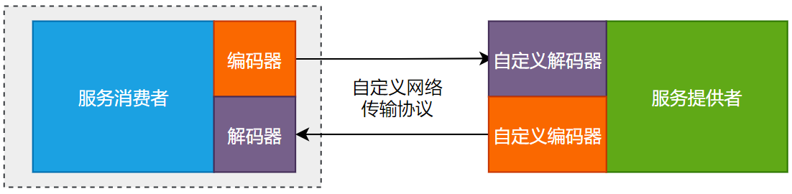
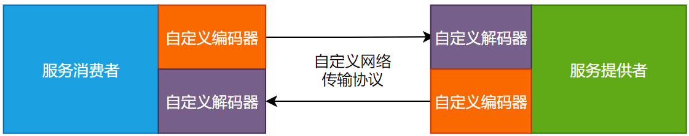
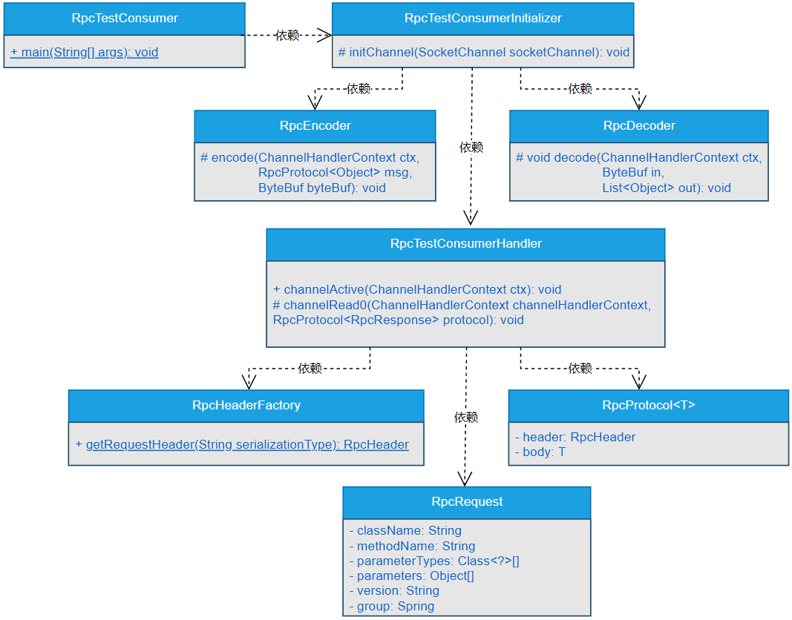

## 一、前言
> 如何模拟服务消费者与服务提供者之间的数据交互？

RPC框架最主要的功能就是要实现服务消费者与服务提供者之间高效的数据通信，服务消费者能够将数据高效的传输到服务提供者，服务提供者处理完数据后，又能够将处理结果高效的返回服务消费者，二者之间的数据交互才是RPC框架最核心，也是最基础的功能。

无论你用过何种RPC框架，无论RPC框架的性能多么优越，从本质上来讲，就是要实现分布式系统中各个子系统之间高效的数据通信。从这一点来说，我们自定义的网络通信协议和自定义的数据编解码都需要能够保证数据在服务消费者与服务提供者之间实现高效的数据通信。

那我们自定义的网络通信协议和自定义的数据编解码，到底能不能实现服务消费者与服务提供者之间的数据通信呢？这就需要我们进行进一步的验证和测试。

## 二、目标
> 基于自定义的网络传输协议和数据编解码，能实现服务消费者与服务提供者之间的数据通信吗？

在前面的章节中，实现了自定义的网络传输协议，并且基于自定义的网络传输协议实现了数据的编解码功能。在服务提供者中，使用自定义的数据编解码类替换了Netty自带的编解码类。至此，在服务提供者一侧就实现了自定义的网络通信协议和自定义的数据编解码，如图8-1所示。



由图8-1可以看出，此时仍使用一个虚线矩形将服务消费者圈起来了，这是由于截止到目前，我们主要是在不断完善服务提供者的功能，对于服务消费者，还未实现任何功能。

本章，我们就需要基于自定义的网络传输协议和自定义的数据编解码来模拟实现一个服务消费者，并实现服务消费者与服务提供者之间的数据交互。

## 三、设计
> 如果让你基于自定义的网络传输协议和数据编解码，实现服务消费者与服务提供者之间的数据通信，你会怎么做？

服务消费者与服务提供者之间都能够基于自定义的网络传输协议和数据编解码实现数据交互时，此时的通信过程就如图8-2所示。



此时，无论是服务消费者还是服务提供者，都会使用自定义的网路传输协议和自定义编解码进行数据通信。

很多读者可能不太清楚，搞一个RPC框架为何还要自定义网络传输协议和自定义数据编解码呢？总结起来，主要有如下原因。

- 通用的网络传输协议冗余字段太多，会造成网络通信不够高效，需要精简，传输的数据越少越好。
- RPC框架作为分布式系统底层通信的基础设施框架，对其性能的要求是非常高的，需要在协议设计和编解码设计上投入比较大的精力。
- 通用的网络传输协议难以结合具体场景实现自定义的传输格式与传输位标识。

接下来，就基于自定义的网络传输协议和数据编解码模拟实现一个服务消费者，并实现服务消费者与服务提供者之间的数据交互。

## 四、实现
说了这么多，如何实现服务消费者与服务提供者之间的数据交互呢？

### 1.工程结构
- gxl-rpc-annotation：实现gxl-rpc框架的核心注解工程。
- gxl-rpc-codec：实现gxl-rpc框架的自定义编解码功能。
- gxl-rpc-common：实现gxl-rpc框架的通用工具类，包含服务提供者注解与服务消费者注解的扫描器。
- gxl-rpc-constants：存放实现gxl-rpc框架通用的常量类。
- gxl-rpc-protocol：实现gxl-rpc框架的自定义网络传输协议的工程。
- gxl-rpc-provider：服务提供者父工程。
  - gxl-rpc-provider-common：服务提供者通用工程。
  - gxl-rpc-provider-native：以纯Java方式启动gxl-rpc框架的工程。
- gxl-rpc-serialization：实现gxl-rpc框架序列化与反序列化功能的父工程。
  - gxl-rpc-serialization-api：实现gxl-rpc框架序列化与反序列化功能的通用接口工程。
  - gxl-rpc-serialization-jdk：以JDK的方式实现序列化与反序列化功能。
- gxl-rpc-test：测试gxl-rpc框架的父工程。
  - gxl-rpc-test-provider：测试服务提供者的工程。
  - gxl-rpc-test-consumer：测试服务消费者的工程（第8章新增的项目工程）
  - gxl-rpc-test-consumer-codec：测试服务消费者基于自定义网络协议与编解码与服务提供者进行数据交互（第8章新增的项目工程）
  - gxl-rpc-test-scanner：测试扫描器的工程。

### 2.核心类实现关系
在模拟实现服务消费者与服务提供者之间的数据交互时，服务消费者实现类之间的关系如图8-3所示。



由8-3可以看出，在模拟实现服务消费者与服务提供者的数据通信过程中，服务消费者的核心实现类之间的关系基本都是依赖关系，逻辑关系比较简单，我就不赘述了。

### 3.修改服务提供者RpcProviderHandler数据处理器

RpcProviderHandler类位于gxl-rpc-provider-common工程下的io.gxl.rpc.provider.common.handler.RpcProviderHandler。

修改前的代码如下所示。
```java
public class RpcProviderHandler extends SimpleChannelInboundHandler<Object> {
    private final Logger logger = LoggerFactory.getLogger(RpcProviderHandler.class);
    private final Map<String, Object> handlerMap;

    public RpcProviderHandler(Map<String, Object> handlerMap){
        this.handlerMap = handlerMap;
    }
    @Override
    protected void channelRead0(ChannelHandlerContext ctx, Object o) throws Exception {
        logger.info("RPC提供者收到的数据为====>>> " + o.toString());
        logger.info("handlerMap中存放的数据如下所示：");
        for(Map.Entry<String, Object> entry : handlerMap.entrySet()){
            logger.info(entry.getKey() + " === " + entry.getValue());
        }
        //直接返回数据
        ctx.writeAndFlush(o);
   }
}
```
修改后的代码如下所示。
```java
public class RpcProviderHandler extends SimpleChannelInboundHandler<RpcProtocol<RpcRequest>> {
    private final Logger logger = LoggerFactory.getLogger(RpcProviderHandler.class);
    private final Map<String, Object> handlerMap;

    public RpcProviderHandler(Map<String, Object> handlerMap){
        this.handlerMap = handlerMap;
    }
    @Override
    protected void channelRead0(ChannelHandlerContext ctx, 
                                RpcProtocol<RpcRequest> protocol) throws Exception {
        logger.info("RPC提供者收到的数据为====>>> " + JSONObject.toJSONString(protocol));
        logger.info("handlerMap中存放的数据如下所示：");
        for(Map.Entry<String, Object> entry : handlerMap.entrySet()){
            logger.info(entry.getKey() + " === " + entry.getValue());
        }
        RpcHeader header = protocol.getHeader();
        RpcRequest request = protocol.getBody();
        //将header中的消息类型设置为响应类型的消息
        header.setMsgType((byte) RpcType.RESPONSE.getType());
        //构建响应协议数据
        RpcProtocol<RpcResponse> responseRpcProtocol = new RpcProtocol<RpcResponse>();
        RpcResponse response = new RpcResponse();
        response.setResult("数据交互成功");
        response.setAsync(request.getAsync());
        response.setOneway(request.getOneway());
        responseRpcProtocol.setHeader(header);
        responseRpcProtocol.setBody(response);
        ctx.writeAndFlush(responseRpcProtocol);
   }
}
```
可以看到，在RpcProviderHandler类中，首先将泛型类型由Object修改为RpcProtocol<RpcRequest>，并重新修改void channelRead0(ChannelHandlerContext ctx,  RpcProtocol<RpcRequest> protocol)方法。在void channelRead0(ChannelHandlerContext ctx,  RpcProtocol<RpcRequest> protocol)方法中，获取到消息头和请求体，将消息头中的消息类型设置为响应消息类型，构建响应消息的数据协议，并封装消息头和响应体，最终调用Netty中的ChannelHandlerContext类的writeAndFlush()方法将封装好的数据传输到服务消费者。

### 4.实现服务消费者的RpcTestConsumerHandler数据处理器

RpcTestConsumerHandler类位于gxl-rpc-test-consumer-codec工程下的io.gxl.rpc.test.consumer.codec.handler.RpcTestConsumerHandler，源码如下所示。
```java
public class RpcTestConsumerHandler extends SimpleChannelInboundHandler<RpcProtocol<RpcResponse>> {

  private final Logger logger = LoggerFactory.getLogger(RpcTestConsumerHandler.class);

  @Override
  public void channelActive(ChannelHandlerContext ctx) throws Exception {
    logger.info("发送数据开始...");
    //模拟发送数据
    RpcProtocol<RpcRequest> protocol = new RpcProtocol<RpcRequest>();
    protocol.setHeader(RpcHeaderFactory.getRpcRequestHeader("jdk"));
    RpcRequest request = new RpcRequest();
    request.setClassName("io.gxl.rpc.test.DemoService");
    request.setGroup("gxl");
    request.setMethodName("hello");
    request.setParameters(new Object[]{"gxl"});
    request.setParameterTypes(new Class[]{String.class});
    request.setVersion("1.0.0");
    request.setAsync(false);
    request.setOneway(false);
    protocol.setBody(request);
    logger.info("服务消费者发送的数据===>>>{}", JSONObject.toJSONString(protocol));
    ctx.writeAndFlush(protocol);
    logger.info("发送数据完毕...");
  }

  @Override
  protected void channelRead0(ChannelHandlerContext channelHandlerContext, RpcProtocol<RpcResponse> protocol) throws Exception {
    logger.info("服务消费者接收到的数据===>>>{}", JSONObject.toJSONString(protocol));
  }
}
```
在RpcTestConsumerHandler类中，覆写了SimpleChannelInboundHandler类的channelActive()方法与channelRead0()方法。channelRead0()方法会在服务消费者与服务提供者之间成功建立连接时触发，在channelRead0()方法中，模拟封装了请求数据协议，并将数据发送到服务提供者。在channelRead0()方法中，直接打印服务消费者接收到的从服务提供者响应过来的数据。

### 5.实现服务消费者的RpcTestConsumerInitializer类

RpcTestConsumerInitializer类位于gxl-rpc-test-consumer-codec工程下的io.gxl.rpc.test.consumer.codec.init.RpcTestConsumerInitializer，源码如下所示。

```java
public class RpcTestConsumerInitializer extends ChannelInitializer<SocketChannel> {
    @Override
    protected void initChannel(SocketChannel socketChannel) throws Exception {
        ChannelPipeline cp = socketChannel.pipeline();
        cp.addLast(new RpcEncoder());
        cp.addLast(new RpcDecoder());
        cp.addLast(new RpcTestConsumerHandler());
    }
}
```

在RpcTestConsumerInitializer类中，就是Netty的常规操作了，分别将RpcEncoder、RpcDecoder和RpcTestConsumerHandler放入数据处理链中。

### 6.实现服务消费者的RpcTestConsumer类

RpcTestConsumer类位于gxl-rpc-test-consumer-codec工程下的io.gxl.rpc.test.consumer.codec.RpcTestConsumer，源码如下所示。

```java
public class RpcTestConsumer {
    public static void main(String[] args) throws InterruptedException {
        Bootstrap bootstrap = new Bootstrap();
        EventLoopGroup eventLoopGroup = new NioEventLoopGroup(4);
        try{
            bootstrap.group(eventLoopGroup)
                    .channel(NioSocketChannel.class)
                    .handler(new RpcTestConsumerInitializer());
            bootstrap.connect("127.0.0.1", 27880).sync();
        }catch (Exception e){
            e.printStackTrace();
        } finally {
            Thread.sleep(2000);
            eventLoopGroup.shutdownGracefully();
        }
    }
}
```
可以看到，RpcTestConsumer类是模拟的服务消费者的启动类，主要就是启动服务消费者并连接到服务提供者，后续会自动触发RpcTestConsumerHandler类中的channelActive()方法，向服务提供者发送数据，并在RpcTestConsumerHandler类中的channelRead0()方法中接收服务提供者响应的数据。

**这里有个需要注意的地方：就是在RpcTestConsumer类的main()方法中的finally{}代码块中，首先让线程休眠2秒中后再优雅关闭服务提供者。如果不休眠一段时间，会造成服务消费者和服务提供者正在进行数据交互时，关闭服务消费者，此时会抛出异常。**

至此，模拟实现的服务消费者与服务提供者之前的数据交互逻辑实现完毕。

## 五、测试
（1）运行gxl-rpc-test-provider工程下的io.gxl.rpc.test.provider.single.RpcSingleServerTest类的startRpcSingleServer()方法启动服务提供者，输出的信息如下所示。
```shell
INFO BaseServer:81 - Server started on 127.0.0.1:27880
```
可以看到，服务提供者启动成功。

（2）运行gxl-rpc-test-consumer-codec工程下的io.gxl.rpc.test.consumer.codec.RpcTestConsumer启动服务消费者，并向服务提供者发送数据，服务消费者输出的信息如下所示。
```
14:53:33,516  INFO RpcTestConsumerHandler:24 - 发送数据开始...
14:53:33,614  INFO RpcTestConsumerHandler:38 - 服务消费者发送的数据===>>>{"body":{"async":false,"className":"io.gxl.rpc.test.DemoService","group":"gxl","methodName":"hello","oneway":false,"parameterTypes":["java.lang.String"],"parameters":["gxl"],"version":"1.0.0"},"header":{"magic":16,"msgLen":0,"msgType":1,"requestId":1,"serializationType":"jdk","status":1}}
14:53:33,639  INFO RpcTestConsumerHandler:40 - 发送数据完毕...
14:53:33,778  INFO RpcTestConsumerHandler:45 - 服务消费者接收到的数据===>>>{"body":{"async":false,"oneway":false,"result":"数据交互成功"},"header":{"magic":16,"msgLen":211,"msgType":2,"requestId":1,"serializationType":"jdk","status":1}}
```
说明服务消费者向服务提供者正确发送了数据，并成功接收到服务提供者响应的数据。

（3）查看服务提供者输出的信息，如下所示。
```
15:01:09,914  INFO BaseServer:65 - Server started on 127.0.0.1:27880
15:01:19,072  INFO RpcProviderHandler:31 - RPC提供者收到的数据为====>>> {"body":{"async":false,"className":"io.gxl.rpc.test.DemoService","group":"gxl","methodName":"hello","oneway":false,"parameterTypes":["java.lang.String"],"parameters":["gxl"],"version":"1.0.0"},"header":{"magic":16,"msgLen":449,"msgType":1,"requestId":1,"serializationType":"jdk","status":1}}
15:01:19,072  INFO RpcProviderHandler:32 - handlerMap中存放的数据如下所示：
15:01:19,072  INFO RpcProviderHandler:34 - io.gxl.rpc.test.provider.service.DemoService1.0.0gxl === io.gxl.rpc.test.provider.service.impl.ProviderDemoServiceImpl@49c45018
```
可以看到，服务提供者正确接收到服务消费者发送过来的数据，并成功向服务消费者响应了结果数据。同时，在服务提供者启动时，扫描到了类上标注了@RpcService注解的类。

## 六、总结

RPC框架一般都会使用自定义的网络传输协议和数据编解码来实现数据的交互过程。本章，就模拟实现了一个服务消费者，并基于自定义的网络传输协议和数据编解码实现了服务消费者和服务提供者之间的数据交互。

通过服务消费者和服务提供者之间数据的正常交互过程，也证明了自定义网络协议和数据编解码的可行性。