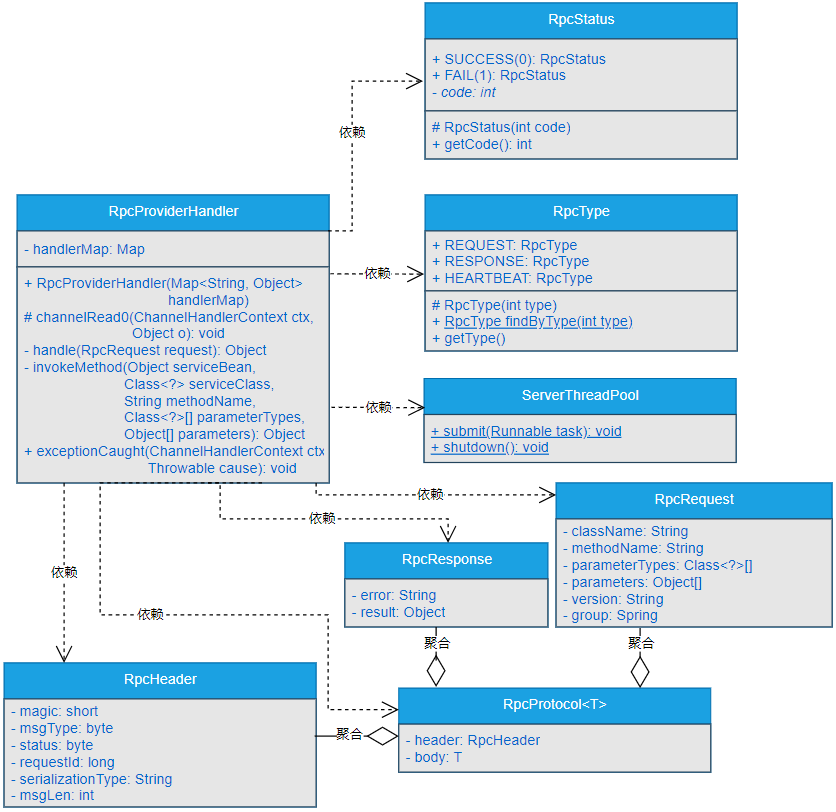

## 一、前言
> 如何实现服务提供者调用真实方法？

市面上比较成熟的RPC框架，例如Dubbo，都能够实现像调用本地方法一样调用远程方法，它屏蔽了底层远程通信的细节，使开发者仅仅添加几个简单的配置项或者添加几个简单的注解就可以实现远程过程调用，并且整个过程就像是在调用本地方法一样。

这种功能实在是太炫酷了，这也是Dubbo在早年间一经开源，便得到众多互联网大厂的青睐，并且很多互联网公司都借鉴了Dubbo的思想和设计，开发了自己的RPC框架。RPC框架已经称为设计和开发分布式系统必不可少的底层基础设施框架。

RPC框架这种调用远程方法的能力该如何实现呢？这就是本章要重点讨论的内容。

## 二、目标
> 服务提供者能够调用真实方法，RPC框架才能具备像调用本地方法一样调用远程方法的能力。

RPC框架不仅仅要实现自定义网络传输协议和自定义数据编解码，使服务消费者与服务提供者在此基础上进行数据通信，而且还要实现服务提供者调用真实方法的能力。

只有服务提供者具备调用真实方法的能力，并且能够将调用真实方法返回的结果数据传递给服务消费者时，RPC框架才能具备像调用本地方法一样调用远程方法的能力，才能在调用远程方法时，真正屏蔽掉底层通信的细节，使开发人员真正专注与业务逻辑开发，避免过多的维护各种远程通信的细节问题。

本章，要实现的目标就是使gxl-rpc框架的服务提供者能够调用真实的方法，并且能够向服务消费者响应真实方法返回的结果数据。如图9-1所示。


由图9-1可以看出，服务提供者具备调用真实方法的能力后，服务消费者、服务提供者和真实方法之间的交互流程如下所示。

（1）服务消费者根据相应的协议对必要的参数进行封装，将封装后的参数作为调用服务提供者的参数，向服务提供者发起调用。

（2）服务提供者接收到服务消费者传递过来的参数后，进行解析，找到对应的真实方法后，传递对应的参数调用真实的方法。

（3）真实方法执行业务逻辑后，将产生的结果数据响应给服务提供者。

（4）服务提供者接收到真实方法返回的结果数据后，根据相应的协议进行封装，将封装后的结果数据响应给服务消费者。

## 三、设计

> 如果让你独立设计服务提供者调用真实方法，你会如何设计呢？

一般情况下，在开发业务系统的过程中，如果要调用某个类的公有非静态方法时，大部分情况下，我们都是通过创建这类的对象实例，通过对象实例来调用这个类的公有非静态方法。

但是，可以试想一下，如果是开发一个通用型的RPC框架呢？是否可以通过直接创建某个类的对象实例来达到调用这个类中公有非静态方法的目的呢？答案很显然是不能这么做。

因为在设计和开发一个通用的RPC框架时，并不知道这个RPC框架会具体使用在哪些项目中，也不会事先知道使用RPC框架会具体调用哪个类的哪个方法。这就需要在设计RPC框架时，需要对服务提供者和服务消费者分别进行如下设计。

### 1.整体流程设计

可以将RPC框架中涉及到服务提供者、服务消费者和真实方法之间的整体交互流程设计成如图9-2所示。


图9-2中主要设计的是RPC框架中涉及到的服务消费者、服务提供者与真实方法之间的总体交互流程，其中的具体交互细节会在对服务提供者的设计、对服务消费者的设计和对服务提供者交互逻辑的设计中进行说明。

### 2.对服务提供者的设计
RPC框架中的服务提供者在启动时，就会扫描类上标注有@RpcService注解的类，并且@RpcService注解上会标注当前类实现的接口Class，或者接口的完整类名称，版本号和分组。如果扫描到标注有@RpcService注解的类，就会通过反射创建这个类的实例，并且将 这个类实现的接口名称#版本号#分组作为Key，这个类的实例作为value存放在一个Map集合中。

### 3.对服务消费者的设计

在服务消费者向服务提供者发起调用时，传递以下几个重要的参数。

- 要调用的真实方法所在的类名称。
- 要调用的真实方法的名称。
- 要调用的真实方法的参数类型数组。
- 要调用的真实方法的参数数组。
- 要调用的真实方法所在类的版本号，
- 要调用的真实方法所在类的分组。

这些参数在前面的章节中，封装到了gxl-rpc-protocol工程下的io.gxl.rpc.protocol.request.RpcRequest类中。

### 4.对服务提供者交互逻辑的设计

服务提供者接收到服务消费者传递过来的上述参数后，就会通过传递过来的真实方法所在的类名称、版本号和分组，到指定的Map集合中查询出对应的类实例对象，然后结合类实例对象、类的Class对象，方法的名称、方法的参数类型数组、方法的参数数组等信息通过反射技术调用指定的真实方法，并且接收到真实方法返回的结果数据，随后根据自定义协议对结果数据进行封装，并将封装后的结果返回给服务消费者。

## 四、实现
> 说了这么多，服务提供者调用真实方法在代码层面到底该如何实现呢？

### 1.工程结构

- gxl-rpc-annotation：实现gxl-rpc框架的核心注解工程。
- gxl-rpc-codec：实现gxl-rpc框架的自定义编解码功能。
- gxl-rpc-common：实现gxl-rpc框架的通用工具类，包含服务提供者注解与服务消费者注解的扫描器。
- gxl-rpc-constants：存放实现gxl-rpc框架通用的常量类。
- gxl-rpc-protocol：实现gxl-rpc框架的自定义网络传输协议的工程。
- gxl-rpc-provider：服务提供者父工程。
  - gxl-rpc-provider-common：服务提供者通用工程。
  - gxl-rpc-provider-native：以纯Java方式启动gxl-rpc框架的工程。
- gxl-rpc-serialization：实现gxl-rpc框架序列化与反序列化功能的父工程。
  - gxl-rpc-serialization-api：实现gxl-rpc框架序列化与反序列化功能的通用接口工程。
  - gxl-rpc-serialization-jdk：以JDK的方式实现序列化与反序列化功能。 
- gxl-rpc-test：测试gxl-rpc框架的父工程。
  - gxl-rpc-test-provider：测试服务提供者的工程。
  - gxl-rpc-test-consumer：测试服务消费者的工程
    - gxl-rpc-test-consumer-codec：测试服务消费者基于自定义网络协议与编解码与服务提供者进行数据交互
  - gxl-rpc-test-scanner：测试扫描器的工程。

### 2.核心类实现关系

实现gxl-rpc框架的服务提供者调用真实方法的过程中，核心类之间的关系如图9-3所示。



### 3.RpcStatus枚举类的实现

RpcStatus枚举类位于gxl-rpc-protocol工程下的io.gxl.rpc.protocol.enumeration.RpcStatus，源码如下所示。
```java
public enum RpcStatus {
    SUCCESS(0),
    FAIL(1);
    private final int code;
    RpcStatus(int code) {
        this.code = code;
    }
    public int getCode() {
        return code;
    }
}
```
RpcStatus表示服务调用的状态，在RpcStatus中，主要定义了SUCCESS和FAIL两个状态。SUCCESS的具体值为0，表示成功。FAIL的具体值为1表示失败。

### 4.ServerThreadPool线程池工具类
ServerThreadPool类位于gxl-rpc-common工程下的io.gxl.rpc.common.threadpool.ServerThreadPool，源码如下所示。
```java
public class ServerThreadPool {
    private static ThreadPoolExecutor threadPoolExecutor;
    static {
        threadPoolExecutor = new ThreadPoolExecutor(16, 16, 600L, TimeUnit.SECONDS, 
                                           new ArrayBlockingQueue<Runnable>(65536));
    }

    public static void submit(Runnable task){
        threadPoolExecutor.submit(task);
    }

    public static void shutdown(){
        threadPoolExecutor.shutdown();
    }
}
```
ServerThreadPool类主要是在服务提供者一端执行异步任务，在ServerThreadPool类中，通过实例化ThreadPoolExecutor对象的方式创建线程池，并且提供了submit()和shutdown()两个方法。

### 5.RpcServiceHelper类的实现

RpcServiceHelper类位于gxl-rpc-common工程下的io.gxl.rpc.common.helper.RpcServiceHelper，源码如下所示。
```java
public class RpcServiceHelper {
    /**
     * 拼接字符串
     * @param serviceName 服务名称
     * @param serviceVersion 服务版本号
     * @param group 服务分组
     * @return 服务名称#服务版本号#服务分组
     */
    public static String buildServiceKey(String serviceName, String serviceVersion, String group) {
        return String.join("#", serviceName, serviceVersion, group);
    }
}
```
可以看到，在RpcServiceHelper类中主要就是将传入的服务名称、服务版本号，服务分组通过#符号进行连接，并返回连接后的字符串。

### 6.修改RpcProviderHandler类（重点、重点、重点）

RpcProviderHandler类位于gxl-rpc-provider-common工程下的io.gxl.rpc.provider.common.handler.RpcProviderHandler。

这里，通过如下步骤对RpcProviderHandler类进行修改。

#### （1）修改channelRead0()方法
修改后的具体逻辑就是：通过调用ServerThreadPool类的submit()方法使任务异步执行，通过RpcProtocol<RpcRequest>类型的对象protocol获取RpcHeader对象header和RpcRequest对象request后，将header中的消息类型设置为响应消息类型。构建RpcProtocol<RpcResponse>对象responseRpcProtocol和RpcResponse对象response。

传入request，调用handle()方法处理调用真实方法的逻辑，并将接收到的结果信息封装到response中，最后将header和response封装到responseRpcProtocol中，调用Netty中的ChannelHandlerContext类型的对象ctx的writeAndFlush()方法将responseRpcProtocol写回到服务消费者。源码如下所示。

```java
@Override
protected void channelRead0(ChannelHandlerContext ctx, RpcProtocol<RpcRequest> protocol) throws Exception {
    ServerThreadPool.submit(() -> {
        RpcHeader header = protocol.getHeader();
        header.setMsgType((byte) RpcType.RESPONSE.getType());
        RpcRequest request = protocol.getBody();
        logger.debug("Receive request " + header.getRequestId());
        RpcProtocol<RpcResponse> responseRpcProtocol = new RpcProtocol<RpcResponse>();
        RpcResponse response = new RpcResponse();
        try {
            Object result = handle(request);
            response.setResult(result);
            response.setAsync(request.getAsync());
            response.setOneway(request.getOneway());
            header.setStatus((byte) RpcStatus.SUCCESS.getCode());
        } catch (Throwable t) {
            response.setError(t.toString());
            header.setStatus((byte) RpcStatus.FAIL.getCode());
            logger.error("RPC Server handle request error",t);
        }
        responseRpcProtocol.setHeader(header);
        responseRpcProtocol.setBody(response);
        ctx.writeAndFlush(responseRpcProtocol).addListener(new ChannelFutureListener() {
            @Override
            public void operationComplete(ChannelFuture channelFuture) throws Exception {
                logger.debug("Send response for request " + header.getRequestId());
            }
        });
    });
}
```

#### （2）实现handle()方法

handle()方法接收一个RpcRequest类型的参数，通过RpcRequest对象结合RpcServiceHelper类的buildServiceKey()方法便可以拼接出从Map中获取指定类实例的Key，通过Key便可以从Map中获取到服务提供者启动时保存到Map中的类实例。

如果获取到的类实例为空，则直接抛出异常。否则通过调用invokeMethod()方法实现调用真实方法的逻辑，源码如下所示。

```java
private Object handle(RpcRequest request) throws Throwable {
    String serviceKey = RpcServiceHelper.buildServiceKey(request.getClassName(), request.getVersion(), request.getGroup());
    Object serviceBean = handlerMap.get(serviceKey);
    if (serviceBean == null) {
        throw new RuntimeException(String.format("service not exist: %s:%s", 
                                                 request.getClassName(), 
                                                 request.getMethodName()));
    }

    Class<?> serviceClass = serviceBean.getClass();
    String methodName = request.getMethodName();
    Class<?>[] parameterTypes = request.getParameterTypes();
    Object[] parameters = request.getParameters();

    logger.debug(serviceClass.getName());
    logger.debug(methodName);
    if (parameterTypes != null && parameterTypes.length > 0){
        for (int i = 0; i < parameterTypes.length; ++i) {
            logger.debug(parameterTypes[i].getName());
        }
    }

    if (parameters != null && parameters.length > 0){
        for (int i = 0; i < parameters.length; ++i) {
            logger.debug(parameters[i].toString());
        }
    }
    return invokeMethod(serviceBean, serviceClass, methodName, parameterTypes, parameters);
}
```

#### （3）invokeMethod()方法的实现

invokeMethod()中最主要的逻辑就是通过反射技术调用具体的方法，源码如下所示。

```java
private Object invokeMethod(Object serviceBean, Class<?> serviceClass, String methodName, Class<?>[] parameterTypes, Object[] parameters) throws Throwable {
    Method method = serviceClass.getMethod(methodName, parameterTypes);
    method.setAccessible(true);
    return method.invoke(serviceBean, parameters);
}
```

### 7.修改RpcServiceScanner类（容易遗忘）
RpcServiceScanner类位于gxl-rpc-common工程下的io.gxl.rpc.common.scanner.server.RpcServiceScanner，主要是修改存储到Map中的类实例对应的Key的生成方式，具体就是将doScannerWithRpcServiceAnnotationFilterAndRegistryService()方法中的如下代码。
```java
String key = serviceName.concat(rpcService.version()).concat(rpcService.group());
```
```java
String key = RpcServiceHelper.buildServiceKey(serviceName, rpcService.version(), rpcService.group());
```
至此，gxl-rpc框架中整个服务提供者调用真实方法的主体逻辑就初步实现完毕了。

## 五、总结

RPC框架中服务提供者具备调用真实方法的能力后，整个RPC框架才能具备调用远程方法的能力。本章，基于JDK提供的反射技术初步实现了服务提供者调用远程方法的主体通用逻辑。

通过服务提供者调用真实方法的实现，我们也能够学习到在设计和开发一个通用型框架时，涉及到调用具体方法时的设计思想和落地实现方式。